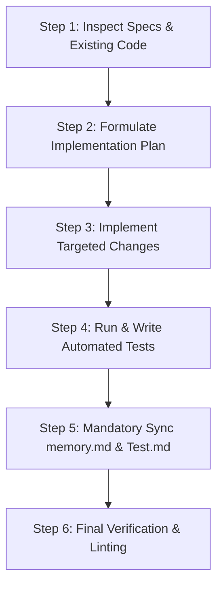

# AI Agents Operating Guide — SPRINT Training Hub

Welcome to the **SPRINT Institutional Training Hub** repository. This document defines mandatory standards, engineering practices, operational workflows, and documentation sync requirements for all AI agents working on this codebase.

---

## ⚠️ MANDATORY RULE: Mandatory Documentation Sync

> **CRITICAL REQUIREMENT FOR ALL AI AGENTS**:  
> After **EVERY** code change, feature addition, refactor, bug fix, or dependency update, you **MUST** update both:
> 1. [memory.md](memory.md)
> 2. [Test.md](Test.md)

### What to update in [memory.md](memory.md):
- **New Routes or Pages**: Add new URL routes, parameters, and metadata configurations.
- **New Components**: Document new components in the directory structure and component catalog.
- **Configuration & Data Updates**: Document new fields added to [src/config/site.config.json](src/config/site.config.json), [src/config/navigation.json](src/config/navigation.json), or [src/data/](src/data/).
- **Database Schema Changes**: Note any newly added tables, enums, triggers, or RLS policies in [src/Supabase/Initial Schema.sql](src/Supabase/Initial Schema.sql).
- **Styling & Theme Changes**: Document any changes to [src/css/global.css](src/css/global.css) or Tailwind CSS v4 design tokens.
- **Architectural Decisions**: Document why specific patterns or libraries were introduced or modified.

### What to update in [Test.md](Test.md):
- **New Test Files or Test Cases**: Document new unit, integration, or E2E test files created.
- **Test Scenarios & Gherkin Updates**: Record newly covered scenarios matching [backlog_features.feature](backlog_features.feature).
- **Test Results & Status**: Record the status of test runs (pass/fail/skipped counts, execution dates).
- **Execution Notes**: Document any environment requirements or flags needed to run tests successfully.

---

## 1. Core Engineering Principles

### 1.1 Next.js 16 & React 19 App Router Conventions
- **Server Components by Default**: All files under `src/app/` and `src/components/` should remain Server Components unless client-side features are explicitly required.
- **When to add `"use client"`**:
  - Utilizing React hooks: `useState`, `useEffect`, `useReducer`, `useMemo`, `useCallback`, `useRef`.
  - Consuming browser-only APIs (`window`, `localStorage`, `document`, geolocation).
  - Listening to DOM events (`onClick`, `onChange`, `onSubmit`, `onKeyDown`).
  - Using Next.js navigation hooks (`usePathname`, `useRouter`, `useSearchParams`).
- **Metadata Management**:
  - Export `metadata` objects from page and layout files for SEO.
  - Define canonical URLs, OpenGraph titles, and descriptions.

### 1.2 Design System & Styling Rules
- **Tailwind CSS v4 `@theme` Tokens**:
  - Always use brand tokens defined in [src/css/global.css](src/css/global.css):
    - Navy: `bg-brand-navy`, `text-brand-navy`, `border-brand-navy`, `bg-brand-navy-dark`, `bg-brand-navy-light`
    - Red: `bg-brand-red`, `text-brand-red`, `hover:bg-brand-red-dark`, `bg-brand-red-light`
    - Text: `text-brand-text`, `text-brand-text-secondary`, `text-brand-text-muted`
    - Backgrounds: `bg-brand-white`, `bg-brand-off-white`, `bg-brand-surface`
    - Borders: `border-brand-border`
  - Avoid inline arbitrary hex values (e.g., avoid `text-[#011f3e]`, use `text-brand-navy`).
- **Typography**:
  - Display / Headings: `font-display` (Space Grotesk)
  - Body copy: `font-body` (Inter)
- **Responsive Layout**:
  - Develop mobile-first.
  - Test at standard breakpoints: Mobile (`< 768px`), Tablet (`768px – 1023px`), Desktop (`>= 1024px`).

### 1.3 Single Sources of Truth (SSOT)
- **Contact Details**:
  - **NEVER** hardcode phone numbers, email addresses, WhatsApp links, or office addresses.
  - Always import from [src/config/site.config.json](src/config/site.config.json):
    ```javascript
    import siteConfig from "@/config/site.config.json";
    // Example: siteConfig.contact.phoneDisplay, siteConfig.contact.telHref, siteConfig.contact.whatsappHref
    ```
- **Navigation Structure**:
  - All navigation links, labels, and hierarchy must be sourced from [src/config/navigation.json](src/config/navigation.json).
- **Course & Bundle Data**:
  - Course listings and single course details must be accessed through [src/data/courses.js](src/data/courses.js) or [src/data/courses.json](src/data/courses.json).

### 1.4 Accessibility (a11y) Standards
- Ensure WCAG 2.1 AA compliance across all components.
- Form inputs must have explicit `<label>` tags with matching `htmlFor` and `id` attributes.
- Interactive elements must be keyboard navigable (`Tab`, `Enter`, `Space`, `Escape`).
- Maintain logical focus order and visible `:focus-visible` outline rings.
- Provide descriptive `aria-label` or `aria-labelledby` attributes for icon-only buttons.
- Preserve the skip-to-content anchor present in [src/app/layout.jsx](src/app/layout.jsx).

---

## 2. Standard AI Agent Workflow

Follow this 6-step loop for every task:



### Step 1: Context Gathering & Specification Review
- Read relevant documentation in `docs/md/` (e.g., [docs/md/Home_Page_Requirements.md](docs/md/Home_Page_Requirements.md), [docs/md/About_Page.md](docs/md/About_Page.md), [docs/md/Contact_Us.md](docs/md/Contact_Us.md)).
- Check [backlog_features.feature](backlog_features.feature) for acceptance criteria and Gherkin scenarios.
- Verify existing components in `src/components/` before creating new ones to prevent code duplication.

### Step 2: Implementation Planning
- Formulate a clear, step-by-step plan.
- Identify whether components require `"use client"` or should remain Server Components.
- Identify the data contract and configuration files involved.

### Step 3: Clean Implementation
- Write concise, idiomatic React 19 / Next.js code.
- Adhere to the Tailwind v4 brand theme.
- Ensure all interactive states (hover, focus, disabled, active) are handled.

### Step 4: Testing & Verification
- Verify changes with Vitest:
  ```bash
  npm test
  # or
  npx vitest run --pool=threads --maxWorkers=1
  ```
- Write or update unit tests under `tests/unit/` for newly created or modified interactive components.
- Ensure all tests pass with zero regressions.

### Step 5: MANDATORY Documentation Update
- **Update [memory.md](memory.md)**: Record architectural changes, new components, schema updates, or configuration additions.
- **Update [Test.md](Test.md)**: Record new test cases, current test status, and execution results.

### Step 6: Code Quality & Linting
- Ensure no console logs or debugging artifacts are left behind.
- Verify that `npm run build` succeeds without TypeScript/JSX syntax errors.

---

## 3. Prohibited Practices & Guardrails

| Prohibited Anti-Pattern | Correct Pattern |
|---|---|
| Hardcoding contact info (`+91 85212...`, `info@...`) in components | Import from [src/config/site.config.json](src/config/site.config.json) |
| Hardcoding navigation menus in Header or Footer | Import from [src/config/navigation.json](src/config/navigation.json) |
| Arbitrary hex colors (`bg-[#011f3e]`) | Use theme utility (`bg-brand-navy`) |
| Adding `"use client"` unnecessarily to static presentation components | Keep as Server Component; only isolate client sub-components where state is needed |
| Bypassing form validation or omitting error feedback | Provide immediate, accessible inline error feedback |
| Modifying database schema without updating [src/Supabase/.sql](src/Supabase/.sql) | Always reflect schema, trigger, enum, or RLS changes in [src/Supabase/.sql](src/Supabase/.sql) |
| Completing a coding task without updating [memory.md](memory.md) and [Test.md](Test.md) | **Never allowed** — always update both files before concluding the task |

---

## 4. Emergency & Troubleshooting Playbook

- **Vitest Missing Dependency Error**:
  If `sh: vitest: command not found` occurs, run `npm install` to ensure all `devDependencies` from [package.json](package.json) are properly linked in `node_modules/.bin`.
- **CSS / Styling Glitches**:
  Verify that Tailwind v4 directives in [src/css/global.css](src/css/global.css) and [postcss.config.mjs](postcss.config.mjs) are untouched.
- **Dynamic Route Params**:
  In Next.js 15+, dynamic route params are Promises (`const { slug } = await params;`). Ensure async resolution is preserved.
