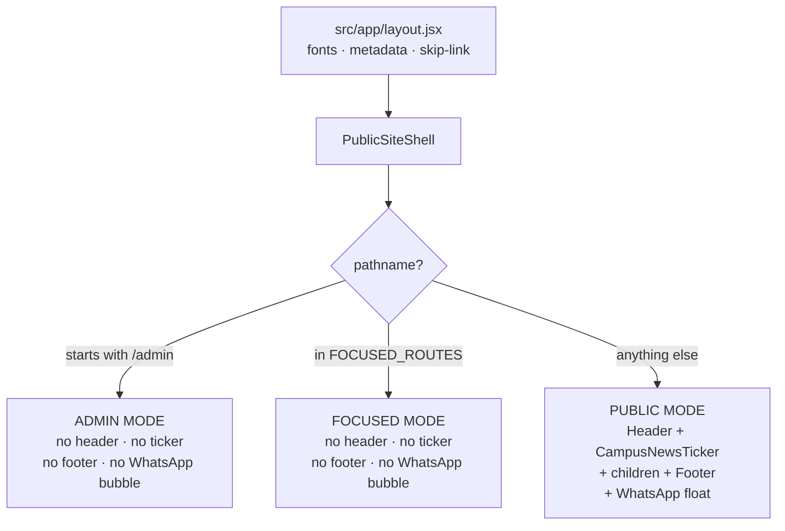
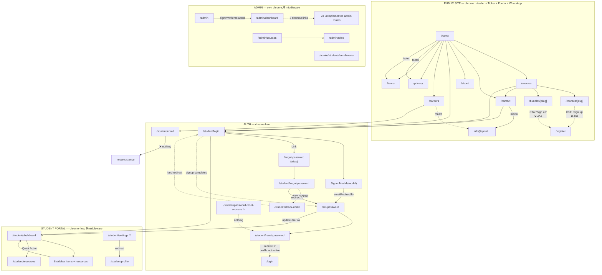
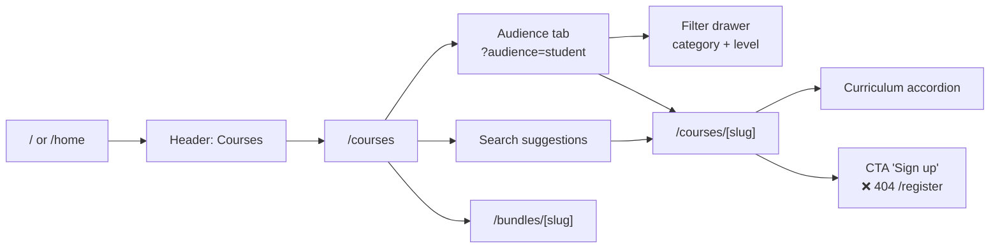
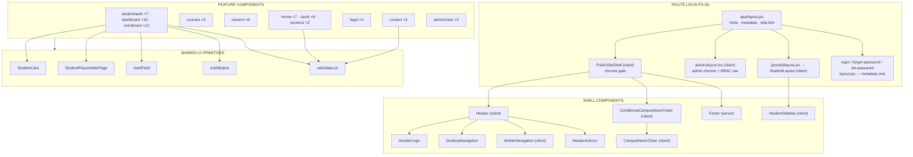

# SPRINT WEBSITE — CODEBASE AUDIT, INFORMATION ARCHITECTURE & WIREFRAMES

**Repository:** `D:\Sprint_HB`
**Product:** SPRINT Institutional Training Hub — Hazaribagh, Jharkhand, India
**Audit date:** 2026-10-03
**Branch / commit:** `main` @ `6df5ef4` ("Merge remote-tracking branch 'origin/main' into main")
**Document type:** Current-state documentation. Faithful structural representation of the site **as it exists today**. Not a redesign.

---

## 1. PROJECT OVERVIEW

SPRINT is a single Next.js App Router application serving three distinct experiences from one codebase:

| Experience | URL space | Audience |
| --- | --- | --- |
| **Public marketing site** | `/`, `/home`, `/about`, `/courses`, `/careers`, `/contact`, `/privacy`, `/terms` | Anonymous visitors |
| **Student Portal** | `/student/*` | Students with `profiles.role = 'student'` and `profiles.status = 'active'` |
| **Admin Console** | `/admin/*` | Users with `profiles.role = 'admin'` |

Public site content is **almost entirely hardcoded** (static JS/JSON modules under `src/data/`). The Student Portal is an **explicitly UI-only pass**: every dashboard widget reads from `src/data/student.js` mock exports. The Admin Console has **two fully database-backed areas** (`courses`, `roles`) and **two entirely hardcoded areas** (`dashboard`, `students/enrollments`).

The Supabase schema (`src/Supabase/*.sql`, 6 files) defines **18 tables and 10 enums** with RLS on every table, but application code references only **3 tables** (`profiles`, `roles`, `courses`) plus **1 RPC** (`admin_create_staff_user`). There are **no API routes and no server actions** anywhere in `src/`.

---

## 2. AUDIT SCOPE & METHODOLOGY

### 2.1 What was inspected

| Area | Files / method |
| --- | --- |
| Manifests & config | `package.json`, `jsconfig.json`, `tsconfig.json`, `next.config.mjs`, `postcss.config.mjs`, `.editorconfig`, `.gitignore` |
| Route tree | Full recursive enumeration of `src/app/**` (39 files, 34 route directories) |
| Layouts | All 6 `layout.*` files read in full |
| Middleware | `src/middleware.ts`, `src/lib/supabase/middleware.ts` |
| Auth | All 5 `/student/*` auth pages + 3 alias pages + `src/components/student/auth/**` (7 files) |
| Components | All 84 modules under `src/components/**` |
| Data | `src/data/data.js`, `about.json`, `courses.js`, `careers.js`, `student.js`; `src/config/*.json` |
| Database | All 6 `src/Supabase/*.sql` files (1,108 lines) + full cross-reference of all 25 `.from()` and 1 `.rpc()` call sites in `src/` |
| Design system | `src/css/global.css` (6,322 lines), `header.css`, `footer.css`, `contact.css` (0 bytes) |
| Tests | All 41 test files + `tests/vitest.config.mjs` + `tests/setup.tsx` |
| Infra | `.github/workflows/*` (both 0 bytes), `scripts/*`, `config/*`, `.vscode/*`, `docs/**`, `memory.md`, `Test.md` |
| Assets | Full `public/` tree (56 files) vs all 68 asset reference sites in `src/` |
| Env | `.env` — **variable names only** recorded (`NEXT_PUBLIC_SUPABASE_URL`, `NEXT_PUBLIC_SUPABASE_PUBLISHABLE_KEY`) |

### 2.2 Method

1. Enumerate every file under `src/` and `public/`.
2. For each route, read the `page` file in full and recursively resolve its import graph to the component leaf level.
3. For each interactive element, trace the event handler to its terminal effect (state write, `supabase.*` call, `window.location.*`, `<Link href>`, `console.log`).
4. Classify behaviour only when a concrete handler or query exists. Naming alone was never treated as evidence.
5. Cross-reference every `.from()` / `.rpc()` / `supabase.storage` call in `src/` against the SQL schema.

### 2.3 Evidence-grade labels used throughout

| Label | Meaning |
| --- | --- |
| **Confirmed** | A handler, query, or route definition was read directly; file + line cited |
| **Inferred** | Behaviour follows from confirmed code but no runtime verification was performed (e.g. Tailwind breakpoint math) |
| **Unclear** | Evidence insufficient; the gap is stated explicitly |
| **Referenced but Not Implemented** | A link/config target exists with no corresponding route file |
| **Not Connected** | Code exists and builds, but nothing reachable renders or invokes it |

---

## 3. TECHNOLOGY STACK

Evidence: `package.json`, `next.config.mjs`, `postcss.config.mjs`, `jsconfig.json`.

### 3.1 Runtime & framework

| Package | Version (declared) | Role |
| --- | --- | --- |
| `next` | `^16.3.5` | App Router, React Server Components, Middleware, Metadata API |
| `react` / `react-dom` | `^19.1.0` | UI runtime |
| `typescript` | `7.0.2` | Type checking — **TS/TSX only**; `.jsx`/`.js` excluded by `tsconfig.json` `include` |

### 3.2 Data & auth

| Package | Version | Role |
| --- | --- | --- |
| `@supabase/ssr` | `^0.12.7` | Cookie-based session bridging in middleware (`src/lib/supabase/middleware.ts:1`) |
| `@supabase/supabase-js` | `^2.117.2` | Browser client (`src/lib/supabase/client.ts:12`) |

There is **no ORM, no query builder, no HTTP client library and no state-management library** (no Redux/Zustand/Jotai/React Query). All data access is raw `supabase.from()`. All shared state is React `useState` in the owning client component.

### 3.3 Styling

| Package | Version | Role |
| --- | --- | --- |
| `tailwindcss` | `^4.1.0` (lockfile 4.3.3) | **CSS-first config** — no `tailwind.config.*` file exists anywhere in the repo |
| `@tailwindcss/postcss` | `^4.1.0` | PostCSS plugin (`postcss.config.mjs:5`) |

Design tokens live in a single `@theme` block at `src/css/global.css:7–46`. Beyond that, `global.css` is a 6,322-line hand-authored stylesheet containing BEM-ish page sections for Contact, Courses, Location, FAQ, Final CTA, and the Courses detail page.

### 3.4 Icons & fonts

| Package | Version | Role |
| --- | --- | --- |
| `lucide-react` | `^0.525.0` | Primary icon set (header, cards, dashboards, admin, auth) |
| `react-icons` | `^5.7.0` | **Footer social icons only** (`Footer.jsx:4–6`) |
| `next/font/google` | bundled with Next | `Space_Grotesk` → `--font-display`; `Inter` → `--font-body` (`src/app/layout.jsx:4–17`) |

Two different icon libraries are in active use; this is not unified.

### 3.5 Testing

| Package | Version |
| --- | --- |
| `vitest` | `^5.0.1` |
| `@vitejs/plugin-react` | `^6.1.1` |
| `@testing-library/react` | `^16.3.3` |
| `@testing-library/jest-dom` | `^7.0.1` |
| `@testing-library/user-event` | `^14.6.7` |
| `happy-dom` | `^20.14.5` |
| `jsdom` | `^29.1.1` (used only by the shadowed legacy config) |

Config in effect: `tests/vitest.config.mjs` (happy-dom, `setupFiles: ["./tests/setup.tsx"]`).

### 3.6 Build & runtime config

- `next.config.mjs` — `reactStrictMode: true`, `devIndicators: false`, `images.formats: ["image/avif","image/webp"]`, **no `remotePatterns`** (all images are local).
- Path alias `@/*` → `./src/*`, declared in **both** `jsconfig.json:5–7` and `tsconfig.json`.
- `package.json` scripts: `dev`, `build`, `start`, `lint`, `test`, `test:run`, `test:ui`.

> **Infra note (Confirmed):** `npm test` (`package.json:12`) runs `vitest run` with **no `--config` flag**, and there is no root `vitest.config.*`. It therefore cannot discover `tests/vitest.config.mjs`. Every recorded green run in `Test.md` used a manual `npx vitest run --config tests/vitest.config.mjs`. `npm run lint` runs `next lint`, which **no longer exists in Next 16**, and the repo ships **no ESLint config**.

### 3.7 Deployment

**No deployment configuration exists.** `.github/workflows/ci.yml` and `.github/workflows/deploy.yml` are both **0 bytes**. There is no `vercel.json`, `netlify.toml`, `Dockerfile`, `fly.toml`, `railway.json` or `Procfile`. `.gitignore:32–33` anticipates Vercel (`.vercel` ignored) but nothing configures it.

---

## 4. APPLICATIONS & PACKAGES

### 4.1 Monorepo status: **Not a monorepo**

Confirmed: no `pnpm-workspace.yaml`, no `turbo.json`, no `nx.json`, no `lerna.json`, no `workspaces` key in `package.json`. There is exactly **one** application package (`sprint-hb`) and **no** internal shared packages. All sharing is by direct file import via the `@/*` alias.

### 4.2 Source tree (complete, 143 files)

```
src/
├── app/                                  # App Router — 34 route directories, 6 layouts
│   ├── layout.jsx                        # ROOT LAYOUT (all routes)
│   ├── page.jsx                          # / → permanentRedirect("/home")
│   ├── home/page.jsx
│   ├── about/page.jsx
│   ├── courses/page.jsx  +  .gitkeep
│   ├── courses/[slug]/page.jsx
│   ├── bundles/[slug]/page.jsx
│   ├── careers/page.jsx
│   ├── contact/page.jsx  +  .gitkeep
│   ├── privacy/page.jsx
│   ├── terms/page.jsx
│   ├── login/{page.jsx, layout.jsx}      # alias → student/login
│   ├── forgot-password/{page.jsx, layout.jsx}
│   ├── set-password/{page.jsx, layout.jsx}
│   ├── updates/.gitkeep                  # ← NO PAGE (referenced, not implemented)
│   ├── register/.gitkeep                 # ← NO PAGE (referenced, not implemented)
│   ├── admin/
│   │   ├── layout.tsx                    # ADMIN SHELL
│   │   ├── page.tsx                      # /admin = sign-in
│   │   ├── dashboard/page.tsx
│   │   ├── courses/page.tsx
│   │   ├── roles/page.tsx
│   │   ├── students/enrollments/page.tsx
│   │   └── login/.gitkeep                # ← NO PAGE
│   └── student/
│       ├── login/page.jsx + login.css
│       ├── forgot-password/page.jsx + .css
│       ├── check-email/page.jsx + .css
│       ├── reset-password/page.jsx + .css
│       ├── password-reset-success/page.jsx + .css
│       ├── enroll/page.jsx
│       └── (portal)/                     # route group — no URL segment
│           ├── layout.jsx                # PORTAL SHELL
│           ├── dashboard/page.jsx
│           ├── profile/page.jsx
│           ├── apply-course/page.jsx
│           ├── my-course/page.jsx
│           ├── assignments/page.jsx
│           ├── certificates/page.jsx
│           ├── resources/page.jsx
│           ├── result/page.jsx
│           ├── settings/page.jsx
│           └── help-support/page.jsx
├── components/                           # 84 component modules
│   ├── cards/         (6)  CourseCard ProfileCard Reveal* SkillCard StatCounter* VisionMissionCard
│   ├── careers/       (6)  ApplicationForm CareerHero HiringProcess OpenPositions RoleDetailModal WhyJoinSprint
│   ├── contact/       (9)  CompanyForm ContactHero ContactMethods EnquirySection FAQSection
│   │                        InstituteForm LocationSection StudentForm WorkingProfessionalForm
│   ├── courses/       (3)  CourseCatalogue CourseDetail DetailPage
│   ├── footer/        (1)  Footer
│   ├── header/        (5)  Header HeaderActions HeaderLogo DesktopNavigation MobileNavigation
│   ├── Home/          (7)  ContactCTA FAQSection FeaturedProgram Hero MoreCourses PartnerCarousel Testimonials
│   ├── layout/        (3)  CampusNewsTicker ConditionalCampusNewsTicker PublicSiteShell
│   ├── legal/         (4)  LegalLayout LegalNotice LegalSection LegalTableOfContents*
│   ├── sections/      (2)  FacultyExperts StoryVisionMission
│   ├── admin/roles/   (3)  CreateUserModal RoleModal types
│   └── student/
│       ├── auth/         (7)  AuthButton AuthField PasswordInput PasswordRequirements
│       │                      SignupModal auth-validation.js signup-modal.css
│       ├── dashboard/     (10) AnnouncementsCard CurrentEnrollment* DashboardCalendar* InfoCards*
│       │                      LearningProgress OfferLettersCard* QuickActions ShareExperienceCard*
│       │                      UpcomingLiveClasses WelcomeBanner
│       ├── enrollment/    (12) EnrollmentComingSoon* EnrollmentProgress EnrollmentStepFooter
│       │                      EnrollmentStepPanel EnrollmentSuccessPanel EnrollmentWizard
│       │                      enrollment-course-options enrollment-locations enrollment-steps
│       │                      enrollment-validation steps/{AccountStep,EducationStep,PersonalInformationStep}
│       └── StudentCard StudentLayout StudentPlaceholderPage StudentSidebar
├── config/            (3)  navigation.json site.config.json student-navigation.json
├── css/               (4)  global.css (6,322 ln) header.css footer.css contact.css (0 bytes)
├── data/              (5)  about.json careers.js courses.js data.js student.js
├── lib/supabase/      (2)  client.ts middleware.ts
├── middleware.ts
├── utils/dates.js
├── layouts.jsx*                     # ← DEAD (imports non-existent ./globals.css)
└── Supabase/         (6 SQL files)
```

`*` = has **zero importers** anywhere in `src/`. See §18.2.

### 4.3 Layer contracts (Confirmed)

| Layer | Contract |
| --- | --- |
| **Root layout** (`src/app/layout.jsx`) | Imports 3 global CSS files; declares Google fonts; sets `metadata` + `openGraph`; renders skip link + `<PublicSiteShell>` |
| **`PublicSiteShell`** (`src/components/layout/PublicSiteShell.jsx`) | `"use client"`. Sole owner of public chrome visibility. Decides header / ticker / footer / WhatsApp bubble per route (`:14–24`, `:34–36`) |
| **Admin layout** (`src/app/admin/layout.tsx`) | `"use client"`. Renders the admin chrome **only when `pathname !== "/admin"`** (`:220`) |
| **Portal layout** (`src/app/student/(portal)/layout.jsx`) | Server component. Delegates entirely to `<StudentLayout>` (`:1`) |
| **Alias layouts** (`login`, `forgot-password`, `set-password`) | Metadata-only pass-throughs (`return children`). Set `robots: { index: false, follow: false }` |

### 4.4 Server / Client component split

Client components (`"use client"`): 24 modules — all 5 `/student/*` auth pages, `Header`, `MobileNavigation`, `PublicSiteShell`, `ConditionalCampusNewsTicker`, `CampusNewsTicker`, `CourseCatalogue`, `DetailPage`, `CourseDetail`, all 9 Contact components, `ContactHero`, `EnquirySection`, `OpenPositions`, `RoleDetailModal`, `FeaturedProgram`, `Testimonials`, `StoryVisionMission`, `StudentLayout`, `StudentSidebar`, `DashboardCalendar`, `UpcomingLiveClasses`, `SignupModal`, `PasswordInput`, `EnrollmentWizard` (+ its 5 sub-components), `admin/layout.tsx`, `admin/courses/page.tsx`, `admin/roles/page.tsx`.

Everything else renders on the server. Notably **`admin/dashboard/page.tsx` and `admin/students/enrollments/page.tsx` are server components that contain zero data fetching** — they render hardcoded module-level arrays.

---

## 5. WEBSITE ARCHITECTURE

### 5.1 Chrome modes

`PublicSiteShell` computes a single boolean, `showPublicChrome` (`PublicSiteShell.jsx:36`), producing exactly **three** shell modes:



`FOCUSED_ROUTES` (`PublicSiteShell.jsx:14–24`) — 9 entries:

`/login`, `/forgot-password`, `/set-password`, `/student/login`, `/student/forgot-password`, `/student/check-email`, `/student/reset-password`, `/student/password-reset-success`, `/student/enroll`

A fourth, narrower override exists inside PUBLIC MODE: `ConditionalCampusNewsTicker` suppresses **only the ticker** on `/privacy` and `/terms` (`ConditionalCampusNewsTicker.jsx:6,11–13`). Header, footer and the WhatsApp bubble still render on legal pages.

### 5.2 Authentication & authorization model

**There is no Next.js auth library.** Authorization is a bespoke two-part system.

**Part A — Edge middleware** (`src/middleware.ts:8–15` matcher):

```
"/admin", "/admin/:path*", "/student/login", "/student/dashboard", "/student/:path*"
```

**Part B — `updateSession`** (`src/lib/supabase/middleware.ts:22–125`). It calls `supabase.auth.getUser()` (server-validated, `:53`), then reads `profiles.role` and `profiles.status` (`:80–84`). Decision table:

| # | Condition | Outcome | Line |
| --- | --- | --- | --- |
| 1 | `!user` && path is `/admin/*` (not `/admin`) | → redirect `/admin` | `65–69` |
| 2 | `!user` && path in `PORTAL_ROUTE_PREFIXES` (10) | → redirect `/student/login` | `72–76` |
| 3 | `user` && `role !== 'admin'` && (`/admin` or `/admin/*`) | → redirect `/home` | `91–95` |
| 4 | `user` && `role === 'admin'` && path === `/admin` | → redirect `/admin/dashboard` | `98–102` |
| 5 | `user` && portal route && **not** (`role==='student'` && `status==='active'`) | → redirect `/student/login` | `111–115` |
| 6 | `user` && active student && path === `/student/login` | → redirect `/student/dashboard` | `117–121` |

`PORTAL_ROUTE_PREFIXES` (`:9–20`) lists 10 prefixes and **exactly covers** all 10 portal pages. `/student/enroll` and the auth screens are deliberately unprotected (public entry points).

> **Confirmed asymmetry:** rule 5 redirects an already-signed-in but *non-active* student to `/student/login`, where the Sign In screen's own session pre-check (`src/app/student/login/page.jsx:44–85`) calls `supabase.auth.signOut()` (`:74`) to clear the stale session. The two halves only work together.

**Part C — Database RLS.** 18/18 tables have RLS enabled (`Initial Schema.sql:501–517`). Helper functions `is_admin()` and `is_staff()` are `SECURITY DEFINER`. 11 policies are declared `FOR ALL` **without `WITH CHECK`**, so `UPDATE` through them permits arbitrary column values.

### 5.3 Data-layer architecture

```
┌─ PUBLIC SITE ──────────────────────────────────────────────┐
│  src/data/data.js   stats, partners, featuredProgram,      │
│                      testimonials, faqs                    │
│  src/data/about.json  story, vision, mission, leadership,  │
│                      faculty, stats, channels  [PLACEHOLDER]│
│  src/data/courses.js 20 courses + 5 bundles (static)       │
│  src/data/careers.js  roles, process, why-join            │
└────────────────────────────────────────────────────────────┘
                            ▲
        ONE live query: CourseCatalogue.jsx:228
        from("courses").select("*").eq("is_published",true)
        → merges with local catalogue, falls back on error

┌─ STUDENT PORTAL ───────────────────────────────────────────┐
│  src/data/student.js  9 exports, ALL prefixed `mock`       │
│  ZERO supabase calls in any portal page or dashboard card  │
└────────────────────────────────────────────────────────────┘

┌─ AUTH + ENROLLMENT ── LIVE ────────────────────────────────┐
│  auth.signInWithPassword / signUp / signOut /              │
│  resetPasswordForEmail / updateUser / getSession           │
│  profiles.upsert (SignupModal.jsx:216)                    │
│  courses SELECT ×2 (read-only)                            │
│  EnrollmentWizard persists NOTHING                        │
└────────────────────────────────────────────────────────────┘

┌─ ADMIN CONSOLE ────────────────────────────────────────────┐
│  LIVE:  courses  → select/insert/update/delete  (7 calls)  │
│  LIVE:  roles    → select/insert/update/delete  (4 calls)  │
│  LIVE:  profiles → select/update/delete      (5 calls)     │
│  LIVE:  rpc("admin_create_staff_user")         (1 call)    │
│  MOCK:  dashboard      → 0 queries                          │
│  MOCK:  students/enrollments → 0 queries                   │
└────────────────────────────────────────────────────────────┘
```

**Complete `.from()` inventory — 3 distinct tables, 25 call sites:**

| Table | Call sites |
| --- | --- |
| `profiles` | 14 — `middleware.ts:81`, `admin/page.tsx:42`, `admin/layout.tsx:194,206`, `admin/roles/page.tsx:44,61,68,87`, `Header.tsx:36`, `student/login/page.jsx:59,144`, `reset-password/page.jsx:278`, `SignupModal.jsx:216` |
| `courses` | 9 — `admin/courses/page.tsx:108,147,148,167,180,193`, `CourseCatalogue.jsx:228`, `EducationStep.jsx:63`, `AccountStep.jsx:34` |
| `roles` | 5 — `admin/roles/page.tsx:43`, `RoleModal.tsx:50` (×2 branches) |

**`.rpc()`:** 1 — `admin_create_staff_user` (`CreateUserModal.tsx:27`), matching `RBAC Schema.sql:77` exactly.
**`supabase.storage`:** 0. No bucket is ever created and no upload path exists.

**15 of 18 DB tables are never touched by application code:** `students`, `course_bundles`, `bundle_courses`, `batches`, `registrations`, `enrollments`, `assessments`, `assessment_results`, `enquiries`, `career_openings`, `job_applications`, `campus_updates`, `instructors`, `testimonials`, `partners`.

### 5.4 Server-side infrastructure: **none**

Confirmed: no `src/app/api/**` directory, no `route.ts`/`route.js` handler anywhere, zero `"use server"` directives. Every network call is made client-side from a `"use client"` component.

---

## 6. SITEMAP & NAVIGATION MODEL

### 6.1 Sitemap tree

Legend: `[P]` public · `[A]` auth · `[S]` student portal · `[ADM]` admin · `🔒` protected by middleware · `⚠` referenced but not implemented · `🔀` programmatic redirect

```
SPRINT
│
├── [P] / ──🔀 permanentRedirect → /home                          src/app/page.jsx:4
│
├── PUBLIC MARKETING SITE  (Header + CampusNewsTicker + Footer + WhatsApp float)
│   ├── [P] /home                    ← PRIMARY LANDING
│   ├── [P] /about
│   ├── [P] /courses                 ← catalogue
│   ├── [P] /courses/[slug]          ← 23 static params (generateStaticParams)
│   ├── [P] /bundles/[slug]          ← 5 static params
│   ├── [P] /careers                 ← footer-only entry
│   ├── [P] /contact                 ← 4 audience enquiry forms
│   ├── [P] /privacy                 ← footer legal only; ticker suppressed
│   └── [P] /terms                   ← footer legal only; ticker suppressed
│
├── [A] AUTHENTICATION  (chrome-free "FOCUSED" mode)
│   ├── [A] /student/login           ← PRIMARY entry from header + footer
│   │   └── (modal) SignupModal      ← "Enroll Now", no password field
│   ├── [A] /student/forgot-password  ← NO link points here (see §6.4)
│   ├── [A] /student/check-email      ← reached by hard redirect only
│   ├── [A] /student/reset-password   ← reached by emailed link only
│   ├── [A] /student/password-reset-success  ⚠ ORPHAN — nothing navigates here
│   ├── [A] /student/enroll           ← 3-step enrollment wizard; footer "New Enrollment"
│   │
│   └── [A] TOP-LEVEL ALIASES (each has its own metadata-only layout, robots:noindex)
│       ├── [A] /login                → re-exports student/login    (page.jsx:8)
│       ├── [A] /forgot-password      → re-exports student/forgot-password (page.jsx:8)
│       └── [A] /set-password         → re-exports student/reset-password  (page.jsx:11)
│           ⚠ /set-password is the ACTUAL emailed-link destination and has
│             zero <Link href> anywhere in src/ — reachable only from email.
│
├── [S] STUDENT PORTAL  (route group (portal), chrome-free, StudentLayout)
│   ├── [S]🔒 /student/dashboard        ← sidebar item 1 — ONLY fully built page
│   ├── [S]🔒 /student/profile          ← sidebar item 2 — placeholder + 1 static card
│   ├── [S]🔒 /student/apply-course     ← sidebar item 3 — placeholder
│   ├── [S]🔒 /student/my-course        ← sidebar item 4 — placeholder
│   ├── [S]🔒 /student/assignments      ← sidebar item 5 — placeholder, badge "2"
│   ├── [S]🔒 /student/certificates     ← sidebar item 6 — placeholder
│   ├── [S]🔒 /student/result           ← sidebar item 7 — placeholder
│   ├── [S]🔒 /student/help-support     ← sidebar item 8 — placeholder
│   ├── [S]🔒 /student/resources        ← OFF-SIDEBAR (dashboard Quick Action only)
│   └── [S]🔒 /student/settings ──🔀 redirect → /student/profile#settings
│
└── [ADM] ADMIN CONSOLE  (admin layout, own chrome)
    ├── [ADM] /admin                    ← sign-in (layout returns children, no sidebar)
    ├── [ADM]🔒 /admin/dashboard         ← sidebar "Dashboard" — 100% hardcoded
    ├── [ADM]🔒 /admin/courses           ← sidebar "Course Management" — full CRUD
    ├── [ADM]🔒 /admin/roles             ← sidebar "Roles & Permissions" — full RBAC
    ├── [ADM]🔒 /admin/students/enrollments ← sidebar, badge "7" — 100% hardcoded
    │
    └── ⚠ 23 SIDEBAR ITEMS + 5 DASHBOARD SHORTCUTS WITH NO PAGE
        ├── /admin/admissions/students        (badge "14")
        ├── /admin/admissions/companies
        ├── /admin/admissions/colleges
        ├── /admin/cms/home | about | courses | contact | careers
        │   | announcements | legal           (7 CMS links)
        ├── /admin/scholarships
        ├── /admin/students/list
        ├── /admin/academics/assessments/assign
        ├── /admin/academics/assessments/results
        ├── /admin/academics/mocks/results
        ├── /admin/partners/companies/list
        ├── /admin/partners/colleges/list
        ├── /admin/trainers/list | assignments | batches
        ├── /admin/updates
        ├── /admin/login                     (.gitkeep only)
        └── /register                        (.gitkeep only — linked from 5 sites)
```

### 6.2 Navigation graph



### 6.3 Navigation sources of truth

There are **five independent navigation definitions** and they disagree:

| Source | Items | Divergence |
| --- | --- | --- |
| `DesktopNavigation.tsx:7–12` | Home, Courses, About Us, Contact | **Hardcoded array.** Does NOT read `navigation.json` |
| `MobileNavigation.tsx:14–19` | Home, Courses, About Us, Contact | **Duplicated array**, not imported from DesktopNavigation or the JSON |
| `src/config/navigation.json` | Home, Courses, About Us, **Updates**, Contact | ⚠ **Consumed by nothing.** `Updates → /updates` has no page and is never rendered |
| `Footer.jsx:15–31` | exploreLinks (5), portalLinks (3), legalLinks (2) | Adds `/careers`, `/student/enroll`, `/courses#scholarship`, `/privacy`, `/terms` — none in the header |
| `student-navigation.json` | 8 portal items | Read by `StudentSidebar.jsx:36` — the only nav config actually wired to a renderer |
| `admin/layout.tsx` | 27 items in 9 collapsible groups | 23 point to non-existent pages |

`src/config/site.config.json` **is** the single source of truth for contact details — imported by `Footer.jsx:8` and used by `siteConfig.contact.*` and `siteConfig.socials` (`:95–119`, `:175`, `:180`, `:196`).

### 6.4 Unreachable / orphaned routes

| Route | Status | Evidence |
| --- | --- | --- |
| `/register` | **Referenced but Not Implemented** | 5 link sites: `HeaderActions.tsx:18`, `MobileNavigation.tsx:54,120`, `DetailPage.jsx:77,160`. Directory holds only `.gitkeep`. → **404** |
| `/updates` | **Referenced but Not Implemented** | Only in `navigation.json:5`, which no component imports. Directory holds only `.gitkeep`. → **404** |
| `/admin/login` | **Referenced but Not Implemented** | `.gitkeep` only. Admin sign-in lives at `/admin`. → **404** |
| `/courses#scholarship` | **Anchor has no target** | `Footer.jsx:26`. No `id="scholarship"` exists in `CourseCatalogue.jsx`. Link loads the page but scrolls nowhere |
| `/student/password-reset-success` | **Orphan (page exists, unreachable)** | Only refs: `PublicSiteShell.jsx:22`, `tests/unit/layout/PublicSiteShell.test.jsx:56`. `reset-password/page.jsx:287,292` redirects to `/student/dashboard` or `/login`, never here |
| `/student/settings` | **Orphan (page exists, no inbound link)** | Only refs: `PORTAL_ROUTE_PREFIXES` + `StudentPortalNavIntegrity.test.js` allow-list. It is a pure redirect to `/student/profile#settings` |
| `/student/forgot-password` | **Unreachable via UI** | No `href="/student/forgot-password"` anywhere. `/student/login` links to the alias `/forgot-password` instead (`login/page.jsx:356`) |
| `/set-password` | **Email-only entry** | 0 `<Link href>`. Reached solely via `redirectTo` in `forgot-password:51`, `check-email:82`, `SignupModal:180,249` |
| 23 admin nav targets | **Referenced but Not Implemented** | `admin/layout.tsx` sidebar; 5 more from `admin/dashboard/page.tsx` |
| `Layouts.jsx`, `Reveal.jsx`, `StatCounter.jsx`, `EnrollmentComingSoon.jsx`, `LegalTableOfContents.jsx`, `PasswordRequirements.jsx`, `PasswordInput.jsx`, `CurrentEnrollment.jsx`, `DashboardCalendar.jsx`, `InfoCards.jsx`, `OfferLettersCard.jsx`, `ShareExperienceCard.jsx` | **Not Connected** | 0 production importers. See §18.2 |

---

## 7. COMPLETE ROUTE INVENTORY

**34 route patterns · 60 concrete addressable pages** (34 patterns − 2 dynamic + 23 course params + 5 bundle params).

### 7.1 Public marketing routes

| # | Pattern | Page name | Implementation | Layout | Purpose | Status | Access | Data source |
| --- | --- | --- | --- | --- | --- | --- | --- | --- |
| 1 | `/` | Root redirect | `src/app/page.jsx:3–5` | root + PublicSiteShell | `permanentRedirect("/home")` | **Implemented** | Public | none |
| 2 | `/home` | Home | `src/app/home/page.jsx:24` | root + PublicSiteShell | Main landing page | **Implemented** | Public | `src/data/data.js` (static) |
| 3 | `/about` | About Us | `src/app/about/page.jsx:88` | root + PublicSiteShell | Story, vision/mission, leadership, faculty | **Implemented** | Public | `src/data/about.json` (flagged `SAMPLE / PLACEHOLDER`) |
| 4 | `/courses` | Course catalogue | `src/app/courses/page.jsx:10` | root + PublicSiteShell | Filterable catalogue w/ live DB merge | **Implemented** | Public | **Hybrid**: `courses` table (`:228`) + `src/data/courses.js` fallback |
| 5 | `/courses/[slug]` | Course detail | `src/app/courses/[slug]/page.jsx:11` | root + PublicSiteShell | Curriculum, outcomes, aside CTA | **Implemented** | Public | `src/data/courses.js` via `getCourse(slug)` |
| 6 | `/bundles/[slug]` | Bundle detail | `src/app/bundles/[slug]/page.jsx:11` | root + PublicSiteShell | Multi-course package detail | **Implemented** | Public | `src/data/courses.js` via `getBundle(slug)` |
| 7 | `/careers` | Careers | `src/app/careers/page.jsx:21` | root + PublicSiteShell | Open roles + role modal | **Implemented** | Public | `src/data/careers.js` (static, 2 roles) |
| 8 | `/contact` | Contact | `src/app/contact/page.jsx:7` | root + PublicSiteShell | 4 audience enquiry forms, map, FAQ | **Partially Implemented** | Public | Static arrays in components |
| 9 | `/privacy` | Privacy Policy | `src/app/privacy/page.jsx:161` | root + PublicSiteShell (ticker suppressed) | 13 legal sections | **Placeholder** | Public | Inline `sections` array — explicitly demo content |
| 10 | `/terms` | Terms & Conditions | `src/app/terms/page.jsx` | root + PublicSiteShell (ticker suppressed) | 14 legal sections | **Placeholder** | Public | Inline `sections` array — explicitly demo content |

**Dynamic route detail:**

| Property | `/courses/[slug]` | `/bundles/[slug]` |
| --- | --- | --- |
| `generateStaticParams` | `:5` — 23 slugs | `:5` — 5 slugs |
| `generateMetadata` | `:6–10` | `:6–10` |
| `await params` | `:12` | `:12` |
| `notFound()` | `:14` (getCourse → undefined) | `:14` |
| `loading.tsx` / `error.tsx` | **none** | **none** |

**Public route — access notes:** all public. No protected boundaries. No metadata export on `/contact` (only route in the group missing one).

### 7.2 Authentication routes

All 8 auth pages are `"use client"`, **chrome-free** (`PublicSiteShell.jsx:14–24`), and perform **full-page hard navigation** via `window.location.href` — none use `useRouter`, `router.push`, or `redirect()`.

| # | Pattern | Page name | Implementation | Own layout | Purpose | Status | Supabase calls |
| --- | --- | --- | --- | --- | --- | --- | --- |
| 11 | `/student/login` | Student Sign In | `src/app/student/login/page.jsx:19` | ✗ (root only) | Sign in + role/status gate | **Implemented** | `getUser`, `signInWithPassword`, `profiles.select`, `signOut` ×4 |
| 12 | `/student/forgot-password` | Forgot Password | `.../student/forgot-password/page.jsx:16` | ✗ | Request reset link | **Implemented** | `resetPasswordForEmail` |
| 13 | `/student/check-email` | Check Your Email | `.../student/check-email/page.jsx:20` | ✗ | Resend w/ 30s cooldown | **Implemented** | `resetPasswordForEmail` (resend) |
| 14 | `/student/reset-password` | Create New Password | `.../student/reset-password/page.jsx:47` | ✗ | Set new password | **Implemented** | `getSession` ×2, `onAuthStateChange`, `updateUser`, `profiles.select` |
| 15 | `/student/password-reset-success` | Reset Success | `.../student/password-reset-success/page.jsx:14` | ✗ | Static success screen | **Not Connected** | none |
| 16 | `/login` | Alias → Sign In | `src/app/login/page.jsx:8` | ✓ `robots:noindex` | Duplicate of #11 | **Implemented** | inherits |
| 17 | `/forgot-password` | Alias | `src/app/forgot-password/page.jsx:8` | ✓ `robots:noindex` | Duplicate of #12 | **Implemented** | inherits |
| 18 | `/set-password` | Alias | `src/app/set-password/page.jsx:11` | ✓ `robots:noindex` | Duplicate of #14 — **the actual email target** | **Implemented** | inherits |
| 19 | `/student/enroll` | Enrollment Wizard | `.../student/enroll/page.jsx:12` | ✗ | 3-step wizard | **Partially Implemented** | 2 read-only `courses` selects |

**Auth route — access notes:**
- `/student/login` is the **only** auth route inside the middleware matcher as a specific entry (`:12`). `/login` (the alias) is **not** matched.
- `#11`–`#18` are unprotected by design — they must be reachable to sign in.
- `#19` (`/student/enroll`) is public; middleware matcher includes `/student/:path*` but `PORTAL_ROUTE_PREFIXES` (`:9–20`) does not list it, so no rule fires.
- Duplicate metadata: `#11–15,19` declare **no** `metadata` export, so they inherit the root template `"SPRINT"` with `%s | SPRINT` and remain indexable. The aliases `#16–18` set `robots: noindex`.

### 7.3 Student Portal routes

Route group `(portal)` contributes **no URL segment**. All 10 render into `<StudentLayout>`.

| # | Pattern | Page name | Implementation | Sidebar item | Purpose | Status | Supabase |
| --- | --- | --- | --- | --- | --- | --- | --- |
| 20 | `/student/dashboard` | Student Dashboard | `.../(portal)/dashboard/page.jsx` | 1 · Dashboard | Welcome, progress, classes, quick actions, announcements | **Implemented** (mock data) | **0** |
| 21 | `/student/profile` | Profile | `.../(portal)/profile/page.jsx` | 2 · Profile | Profile stub + inert Settings card | **Placeholder** | **0** |
| 22 | `/student/apply-course` | Apply Courses | `.../(portal)/apply-course/page.jsx` | 3 · Apply Courses | Stub — note: does NOT host the wizard | **Placeholder** | **0** |
| 23 | `/student/my-course` | My Course | `.../(portal)/my-course/page.jsx` | 4 · My Course | Stub | **Placeholder** | **0** |
| 24 | `/student/assignments` | Assignment | `.../(portal)/assignments/page.jsx` | 5 · Assignment (badge `2`) | Stub | **Placeholder** | **0** |
| 25 | `/student/certificates` | Certificate | `.../(portal)/certificates/page.jsx` | 6 · Certificate | Stub | **Placeholder** | **0** |
| 26 | `/student/resources` | Resources | `.../(portal)/resources/page.jsx` | **off-sidebar** | Stub; dashboard Quick Action target | **Placeholder** | **0** |
| 27 | `/student/result` | Result | `.../(portal)/result/page.jsx` | 7 · Result | Stub | **Placeholder** | **0** |
| 28 | `/student/settings` | Settings | `.../(portal)/settings/page.jsx:4` | **off-sidebar** | `redirect("/student/profile#settings")` | **Implemented** (redirect) | **0** |
| 29 | `/student/help-support` | Help & Support | `.../(portal)/help-support/page.jsx` | 8 · Help & Support | Stub | **Placeholder** | **0** |

**Portal access requirements (identical for all 10):**
- **Authentication:** required (`supabase.auth.getUser()` must return a user — `middleware.ts:53`).
- **Authorization:** `profiles.role === 'student'` **AND** `profiles.status === 'active'` (`:86–88`, `:111–115`).
- **Unauthorized behaviour:** redirect to `/student/login`. **No unauthorized UI state is ever rendered.**
- All 10 covered by `PORTAL_ROUTE_PREFIXES`.

### 7.4 Admin Console routes

| # | Pattern | Page name | Implementation | Sidebar item | Purpose | Status | Supabase |
| --- | --- | --- | --- | --- | --- | --- | --- |
| 30 | `/admin` | Admin Sign In | `src/app/admin/page.tsx` | — (layout bypasses sidebar) | Email+password sign-in with `role==='admin'` gate | **Implemented** | `signInWithPassword`, `profiles.select`, `signOut` ×2 |
| 31 | `/admin/dashboard` | Admin Dashboard | `.../admin/dashboard/page.tsx` | Dashboard | 4 metrics + 2 tables + 3 shortcuts | **Placeholder** | **0** — 100% hardcoded |
| 32 | `/admin/courses` | Course Management | `.../admin/courses/page.tsx` | Course Management | Full course CRUD + publish/feature toggles | **Implemented** | 6 `courses` calls |
| 33 | `/admin/roles` | Roles & Permissions | `.../admin/roles/page.tsx` | Roles & Permissions | RBAC roles, user assignment, staff provisioning | **Implemented** | 6 `profiles`/`roles` calls + 1 RPC |
| 34 | `/admin/students/enrollments` | Enrollment Applications | `.../admin/students/enrollments/page.tsx` | badge `7` | Application review table | **Placeholder** | **0** — action buttons have no handlers |

**Admin access requirements (identical for #31–34):**
- **Authentication:** required. Unauthenticated → redirect `/admin` (`middleware.ts:65–69`).
- **Authorization:** `profiles.role === 'admin'`. Non-admin authenticated user → redirect `/home` (`:91–95`).
- Admin visiting `/admin` → redirect `/admin/dashboard` (`:98–102`).
- **Note:** middleware requires strictly `role === 'admin'`. The RBAC layer in the database (`current_user_has_permission`) is **never exercised for route access** — a `staff` or `instructor` user with granular permissions is still locked out of `/admin/*` entirely.

### 7.5 Route-level cross-cutting facts

| Fact | Value | Evidence |
| --- | --- | --- |
| `error.tsx` files | **0** across the entire app | recursive glob of `src/app/**` |
| `loading.tsx` files | **0** | same |
| `not-found.tsx` | **0** — Next.js framework default 404 only | same |
| `template.tsx` | 0 | same |
| `route.ts` / API handlers | **0** | same |
| `sitemap.ts` / `robots.ts` | **0** | same |
| `icon.*` / favicon | **0** — `/favicon.ico` will 404 (no `icons` key in metadata) | `src/app/layout.jsx:18–31` |
| `<Suspense>` boundaries | **0** in `src/` | grep |
| Loading indicators | Only 2 hand-rolled: admin courses table/grid (`page.tsx:274,280`) and the enrollment course select | see §7.6 |
| Metadata exports | Present on 9 routes; **absent** on `/contact`, `/admin`, and all 5 `/student/*` auth routes + `/student/enroll` | per-file read |

### 7.6 Implemented loading / empty / error states (exhaustive)

| State | Where | Evidence |
| --- | --- | --- |
| **Loading** | `/admin/courses` table + grid | "Loading courses…" `page.tsx:274,280` |
| **Loading** | Enrollment course `<select>` | `COURSE_STATUS.LOADING` → disabled select, "Loading courses…" `EducationStep.jsx:50–51,88–90` |
| **Loading (SSR-safe)** | Dashboard calendar "today" | `useState(null)` + `useEffect` `DashboardCalendar.jsx:41–49` |
| **Loading** | All 5 auth submit buttons | "Signing In…" / "Sending Reset Link…" / "Resetting Password…" / "Sending…" |
| **Empty** | `/courses` no results | "No matching learning options" `CourseCatalogue.jsx:579–587` |
| **Empty** | `/careers` filter no match | "No roles match the selected filter" + Show-all `OpenPositions.jsx:147–158` |
| **Empty** | Dashboard live classes | `mockUpcomingClasses` is `[]` → always renders empty state `UpcomingLiveClasses.jsx:49–61` |
| **Empty** | `/admin/courses` no rows | "No courses have been added yet." / "No courses match these filters." `:275` |
| **Empty** | Enrollment course select | `COURSE_STATUS.EMPTY` → "No courses available" `enrollment-course-options.js:24` |
| **Error** | `/courses` Supabase failure | caught → silent fallback to static catalogue `CourseCatalogue.jsx:235–237` |
| **Error** | Enrollment course select | `COURSE_STATUS.ERROR` → "Unable to load courses. Please try again." `enrollment-course-options.js:26` |
| **Error** | All 4 contact forms | **NONE** — `console.log` only, no error surface |
| **Error** | `/admin/courses` | `NoticeBanner` toast, `role="alert"` `:219,297–302` |
| **Error** | `/admin/roles` | inline banner + modal-local error `:108` |
| **Success** | `/admin/courses`, `/admin/roles` | `NoticeBanner` green, `role="status"` `:297–302` |
| **Unauthorized** | All 10 portal routes | middleware redirect — **no UI state** |
| **Unauthorized** | All 4 admin sub-routes | middleware redirect — **no UI state** |
| **Not found** | `/courses/[slug]`, `/bundles/[slug]` | `notFound()` `:14` → framework 404 |

---

## 8. PUBLIC WEBSITE WIREFRAMES

All public pages share the shell below. Individual wireframes show only page-specific content.

### 8.0 Public shell (common to §8.1–8.9)

```
┌────────────────────────────────────────────────────────────────────────────────┐
│ [skip-to-main link — visually hidden until focused]        src/app/layout.jsx:42│
├────────────────────────────────────────────────────────────────────────────────┤
│ ⌂ SPRINT        ( Home  Courses  About Us  Contact )   [Student Portal][Enroll Now│
│  logo+wordmark  └─ DesktopNavigation, lg:flex only ─┘     └─ HeaderActions ─┘      │
│ sticky top-0 h-20 · .sprint-site-header · blurs on scroll    [☰] ← MobileNav (lg:hidden)
├────────────────────────────────────────────────────────────────────────────────┤
│ 📣 Updates  (● ANNOUNCEMENT …) (● MAINTENANCE …) (● DEADLINE …)  ← scrolling   │
│    CampusNewsTicker · min-h-12 · brand-navy gradient        marquee (RTL loop)   │
│    ⚠ SUPPRESSED on /privacy and /terms only                                       │
├────────────────────────────────────────────────────────────────────────────────┤
│                                                                                │
│                         <main id="main">{children}</main>                       │
│                                                                                │
├────────────────────────────────────────────────────────────────────────────────┤
│ ⬤ SPRINT     │ Explore      │ Portals      │ Visit & Contact                   │
│ mission copy  │ Home         │ Student Login↗│ 📍 address                        │
│               │ All Courses  │ New Enrollmnt │ 📞 +91 85212 83184/85            │
│               │ About+Faculty│ Scholarship   │ ✉ info@sprint…                    │
│               │ Careers      │ Aid          │                                   │
│               │ Contact      │              │                                   │
│               ├──────────────┴──────────────┴───────────────────────────────────┤
│               │ © {year} SPRINT   Privacy Policy   Terms & Conditions           │
├────────────────────────────────────────────────────────────────────────────────┤
│                                                          (●) ← WhatsApp float   │
└────────────────────────────────────────────────────────────────────────────────┘
```

**Shell behaviour**

| Concern | Behaviour | Evidence |
| --- | --- | --- |
| Logo | `/home`, image `sprintlogo.png` 56×56, wordmark "SPRINT" red, red 8×2 rule | `HeaderLogo.tsx:12–30` |
| Active nav item | `bg-brand-navy text-white`, `aria-current="page"`; Home matches **exactly** `/home` | `DesktopNavigation.tsx:17–18,33–37` |
| Header actions | **Non-admin:** `Student Portal` (ghost) + `Enroll Now` (red, `.sprint-enroll-button`). **Admin:** single `Go to Dashboard` → `/admin/dashboard` | `HeaderActions.tsx:7–24` |
| Mobile drawer | Slide-down panel below header; closes on link click, Escape, resize ≥1024px, pathname change; `aria-expanded`/`aria-controls` | `MobileNavigation.tsx:27–45,75–131` |
| Role detection | `Header.tsx` calls `getUser()` then `profiles.select("role")` on mount + `onAuthStateChange`; bails out entirely if env vars absent (`:19–24`) | `Header.tsx:29–61` |
| Footer grid | `grid-cols-2` → `lg:grid-cols-[2fr_1fr_1fr_1.4fr]`; brand col spans 2 on mobile | `Footer.jsx:55,57,164` |
| WhatsApp float | Fixed bottom-right, `#25d366` (**hardcoded, not a token**); shrinks to 3.25rem and respects `env(safe-area-inset-bottom)` ≤767px | `global.css:195–237,161` |

---

### 8.1 `/home` — Home Page

```
┌──────────────────────── HEADER (shell 8.0) ────────────────────────┐
├──────────────────────── TICKER ───────────────────────────────────┤
│ ╔══════════════════════════════════════════════════════════════╗ │
│ ║  We do not teach,                                            ║ │
│ ║  We #Empower                                                 ║ │
│ ║  Hands-on, production-level AI/ML, Cloud & DevOps training.  ║ │
│ ║  [ Explore Programs →  /courses ]                             ║ │
│ ║                                                              ║ │
│ ║  ┌────────┐ ┌────────┐ ┌────────┐ ┌────────┐                 ║ │
│ ║  │200+    │ │30+     │ │82%     │ │40+     │  ← 4 stat tiles  ║ │
│ ║  │Learners│ │Mentors │ │Place.  │ │Partners│    (mock data.js)║ │
│ ║  └────────┘ └────────┘ └────────┘ └────────┘                 ║ │
│ ║  [bg: /images/home/home-hero.jpg + navy gradient overlay]     ║ │
│ ╚══════════════════════════════════════════════════════════════╝ │
├──────────────────────────────────────────────────────────────────┤
│   ── marquee row: 22 partner logos, CSS-only, NOT clickable ──   │
│   [Accenture][Google][Microsoft][TCS][Infosys][Capgemini] …     │
├──────────────────────────────────────────────────────────────────┤
│   SPRINT RISE Program                    01 ●─── Foundations   │  ← scroll-tracked
│   Four stages that take a learner …        02 ──── Specialization│    (IntersectionObserver)
│                                              03 ──── Capstone    │    activeIndex state
│                                              04 ──── Placement   │
├──────────────────────────────────────────────────────────────────┤
│   More Courses                                    [View All →]   │  ← sticky on lg
│   ┌──────────────┐ ┌──────────────┐ ┌──────────────┐            │
│   │ CourseCard   │ │ CourseCard   │ │ CourseCard   │            │  ← grid-cols-1
│   │ python&ai    │ │ docker&k8s   │ │ cybersecurity│            │    sm:2  lg:3
│   └──────────────┘ └──────────────┘ └──────────────┘            │
│                              [View All Courses →] ← mobile only │
├──────────────────────────────────────────────────────────────────┤
│   Faculty & Experts                       (4 × ProfileCard)      │
│   ┌────────┐ ┌────────┐ ┌────────┐ ┌────────┐                   │
│   │ (AS)   │ │ (AS)   │ │ (NV)   │ │ (AR)   │  LinkedIn href="#" │  ← 7 dead links
│   └────────┘ └────────┘ └────────┘ └────────┘                   │
├──────────────────────────────────────────────────────────────────┤
│   What our learners say                        ‹  ● ● ● ● ●  ›   │  ← snap-scroll
│   ┌────────────┐ ┌────────────┐ ┌────────────┐                  │    + pointer drag
│   │ (AS) quote │ │ …          │ │ …          │                  │    prev/next buttons
│   └────────────┘ └────────────┘ └────────────┘                  │
├──────────────────────────────────────────────────────────────────┤
│   Frequently Asked Questions   <details>/<summary> accordion ×5  │
│   ▸ Who are the programs for?                                   │
│   ▸ Do I need prior experience?                                 │
├──────────────────────────────────────────────────────────────────┤
│   Ready to Take the Next Step?      [ Get in Touch → /contact ] │
├──────────────────────── FOOTER (shell 8.0) ──────────────────────┘
```

| Aspect | Detail |
| --- | --- |
| **Component tree** | `page.jsx:24` → `Hero` → `PartnerCarousel` → `FeaturedProgram`(client) → `MoreCourses` → `FacultyExperts` → `Testimonials`(client) → `FAQSection` → `ContactCTA` |
| **Data** | `src/data/data.js` — `stats` (`:12–17`), `partners` 22 (`:24–66`), `featuredProgramStages` 4 (`:70–101`), `featuredCourse` (`:104–120`), `testimonials` 5 (`:124–165`), `faqs` 5 (`:168–198`). File header: *"Placeholder content for the home page"* |
| **Forms** | **None** |
| **Interactive state** | `FeaturedProgram` `activeIndex` + IntersectionObserver; `Testimonials` `trackRef`/`dragRef` + prev/next; `Header` `isScrolled`/`isMobileMenuOpen`/`isAdmin`; `PartnerCarousel` CSS marquee (JS sets `--marquee-duration`, `PartnerCarousel.jsx:77`) |
| **Outbound links** | `/courses` ×3 (`Hero.jsx:60`, `MoreCourses.jsx:38,56`), `/contact` (`ContactCTA.jsx:23`), `#` ×7 (`ProfileCard.jsx:73`) |
| **Prev / Next** | Prev: none (entry point). Next: `/courses` via Hero CTA |
| **Desktop** | Max-width `max-w-7xl`; 3-col course grid; sticky "View All" rail |
| **Tablet** | 2-col course grid; hero `md:text-6xl`; ticker shows label at `sm:` |
| **Mobile** | 1-col; hero overlay switches to a bottom-weighted mobile variant (`Hero.jsx` `md:hidden` / `hidden md:block`); testimonials 1-up; "View All" becomes an inline CTA; drawer nav replaces the pill nav |
| **Access** | Public |
| **States** | **No loading, empty, or error states.** Static data throughout |

---

### 8.2 `/about` — About Us

```
┌──────────────────────── HEADER + TICKER ────────────────────────┐
├──────────────────────────────────────────────────────────────────┤
│  Home › About Us                                               │
│  ╔══════════════════════════════════════════════════════════════╗ │
│  ║  Who is SPRINT?            ← "SPRINT" in red                ║ │
│  ║  [ Explore Courses → ]  [ Our Story ↓ (#our-story) ]        ║ │
│  ║  ┌────────┐┌────────┐┌────────┐┌────────┐   ← impact band  ║ │
│  ║  │82%     ││200+    ││40+     ││20+     │   verified:true ║ │
│  ║  └────────┘└────────┘└────────┘└────────┘                  ║ │
│  ╚══════════════════════════════════════════════════════════════╝ │
├──────────────────────────────────────────────────────────────────┤
│  #our-story                                                    │
│  ┌────────────────────────┐  ┌──────────────────────────┐        │
│  │ Our Story              │  │  ● Vision  ● Mission     │  ← 4s  │
│  │ ¶ ¶ ¶                  │  │  ┌────────────────────┐  │  auto-  │
│  │ • Founded 2021         │  │  │ (active pane)      │  │  swap;  │
│  │ • 3 tracks             │  │  └────────────────────┘  │  pauses │
│  │ • 40+ projects         │  │      ‹ dots ›  ← swipe  │  on     │
│  └────────────────────────┘  └──────────────────────────┘  hover/ │
│                                                          offscreen│
├──────────────────────────────────────────────────────────────────┤
│  #leadership       ┌────────┐ ┌────────┐ ┌────────┐             │
│                    │ (AR)   │ │ (PV)   │ │ (RK)   │  3 ProfileCard│
│                    └────────┘ └────────┘ └────────┘             │
├──────────────────────────────────────────────────────────────────┤
│  #faculty           ┌────────┐ ┌────────┐ ┌────────┐ ┌────────┐ │
│                     │ (SG)   │ │ (AS)   │ │ (NV)   │ │ (AR)   │ │ 4 cards
│                     └────────┘ └────────┘ └────────┘ └────────┘ │
├──────────────────────────────────────────────────────────────────┤
│  #industry-connection                                            │
│  ┌──────────────────────┐  ┌────────┐ ┌────────┐ ┌────────┐    │
│  │ ¶ ¶                  │  │ (AI/ML)│ │ (Cloud)│ │(DevOps)│    │  3 SkillCard
│  │ [highlighted box]    │  └────────┘ └────────┘ └────────┘    │
│  │ [ View Courses → ]   │                                        │
│  └──────────────────────┘                                        │
├──────────────────────────────────────────────────────────────────┤
│  #connect   Connect With SPRINT                                  │
│   📞 Call   ✉ Email   💬 WhatsApp     [ Request a Callback → ]  │
├──────────────────────── FOOTER ──────────────────────────────────┘
```

| Aspect | Detail |
| --- | --- |
| **Component tree** | `page.jsx:88` → JSON-LD `<script>` (`:35`) → inline Hero (`:97–191`) → `StoryVisionMission`(client) → `VisionMissionCard` ×2 → `ProfileCard` ×3 → `FacultyExperts` → `ProfileCard` ×4 → inline Industry section + `SkillCard` ×3 → inline CTA |
| **Data** | `src/data/about.json`. **Self-flagged placeholder**: `_meta.contentStatus: "SAMPLE / PLACEHOLDER"` (`:1–5`) |
| **Forms** | **None** |
| **Interactive state** | `StoryVisionMission` — `index` (0/1), `touchStartX/Y` refs, `pointerRef`/`focusRef`/`visibleRef`/`pausedRef`, IntersectionObserver (`:93–100`), 4000 ms swap timer (`:103–109`) |
| **Outbound links** | `/home` breadcrumb (`:120`), `/courses` ×2 (`:142,257`), `#our-story` (`:153`), `/contact` (`:296`), `#` ×7 socials (`ProfileCard.jsx:73`) |
| **Dead data** | `about.json:260,266,272` — Call `tel:+919876543210`, Email `admissions@sprint.institute`, WhatsApp `919876543210`. **None match `site.config.json`** (`+918521283184`, `info@sprint.naturalelements.co.in`) |
| **Prev / Next** | Prev: `/home`. Next: `/courses` (primary CTA), `#our-story` (in-page) |
| **Desktop** | 2-col story/vision; 3-col leadership; 4-col faculty; skills stack 1-col in right rail |
| **Tablet** | `md:grid-cols-2`; hero padding `md:py-11` |
| **Mobile** | Single column; story above swap cards; dots remain the only control (no prev/next arrows — asserted by `StoryVisionMission.test.jsx`) |
| **Access** | Public |
| **States** | **None** — no loading, empty, or error state |

---

### 8.3 `/courses` — Course Catalogue

```
┌──────────────────────── HEADER + TICKER ────────────────────────┐
├──────────────────────────────────────────────────────────────────┤
│ ╔══════════════════════════════════════════════════════════════╗ │
│ ║  [ SLIDE 1 ]  Tailored pathways for every career stage       ║ │
│ ║  [ SLIDE 2 ]  (full-bleed /images/courses/courses-hero.png)  ║ │
│ ║                  ● ○     [ ⏸ pause ]        ← hero carousel  ║ │
│ ╚══════════════════════════════════════════════════════════════╝ │
├──────────────────────────────────────────────────────────────────┤
│  [ Students | IT Professionals | Non-IT Professionals ]   ← sticky│  tabs on lg
│  [ ▾ Students ▼ ]                            ← <select> on mob│  syncs ?audience=
├──────────────────────────────────────────────────────────────────┤
│ ┌────────────┐ ┌───────────────────────────────────────────┐   │
│ │[Filter &   │ │ [🔍 Search courses…                 ]     │   │
│ │ sort] (mob)│ │   ▾ suggestion 1                          │   │
│ │            │ │   ▾ suggestion 2  (max 5)                 │   │
│ │ Category   │ ├───────────────────────────────────────────┤   │
│ │ ☐ AI/ML    │ │ 8 results (audience: student)             │   │
│ │ ☐ Cloud    │ │ ┌─────────┐ ┌─────────┐ ┌─────────┐        │   │
│ │ ☐ DevOps … │ │ │▨art    │ │▨art    │ │▨art    │        │   │
│ │            │ │ │CATEGORY│ │CATEGORY│ │CATEGORY│        │   │
│ │ Level      │ │ │Title   │ │Title   │ │Title   │        │   │
│ │ ○ Any      │ │ │2-line ↓ │ │2-line ↓│ │2-line ↓│        │   │
│ │ ○ Beginner │ │ │⌛ 🏅 📜🎚 │ │…      │ │…      │        │   │
│ │ ○ Intermed │ │ │[Know →]│ │[Know →]│ │[Know →]│        │   │
│ │ ○ Advanced │ │ └─────────┘ └─────────┘ └─────────┘        │   │
│ └────────────┘ └───────────────────────────────────────────┘   │
│                                                                  │
│  ┌ ─ ─ ─ ─ ─ ─ ─ ─ ─ ─ ─ ─ ─ ─ ─ ─ ─ ─ ─ ─ ─ ─ ─ ─ ─ ─ ─ ─ ┐ │
│  │  No matching learning options                              │ │ ← empty state
│  └ ─ ─ ─ ─ ─ ─ ─ ─ ─ ─ ─ ─ ─ ─ ─ ─ ─ ─ ─ ─ ─ ─ ─ ─ ─ ─ ─ ─ ┘ │
│                                                                  │
│  ███ Not sure which pathway is right? [ Connect With An Expert ]│
└──────────────────────────────────────────────────────────────────┘
```

| Aspect | Detail |
| --- | --- |
| **Component tree** | `page.jsx:10` → `CourseCatalogue`(client) → inline `CourseTile` → inline `CourseArt` (per-category SVG) |
| **Data** | **Hybrid.** `useEffect` `:226–246` fetches `from("courses").select("*").eq("is_published", true).order("created_at",{ascending:false})`. On error **or** empty result it silently falls back to the static `items` prop from `src/data/courses.js` |
| **⚠ Schema drift** | `normalizeDatabaseCourse` reads `course.difficulty` (`:54,55`), `course.mode` (`:56`), `course.image` (`:61`) — **none of these columns exist**. Real columns are `difficulty_level`, `delivery_method`, `thumbnail_url` (`Initial Schema.sql:146,149,153`). Each is `\|\|`-guarded so the UI degrades, but the reads are dead |
| **Forms / inputs** | Search text input (`query` state, live suggestions capped at 5, `:379–385`); audience `<select>` on mobile; category checkboxes; level radios; 3 filter `<select>`s in admin (n/a here) |
| **Validation** | None. No form submit — filters apply live |
| **Interactive state** | 9 `useState` (`:208–216`): `catalogueItems`, `audience`, `query`, `selectedCategories`, `selectedLevel`, `drawerOpen`, `heroSlide`, `heroPaused`, `prefersReducedMotion` |
| **URL sync** | `window.history.replaceState` (`:456–471`, `:478–492`) writes `?audience=` — no router navigation |
| **Outbound links** | `/courses/[slug]?audience=` (`:118`, `:379–385`), `/bundles/[slug]` for bundles (`:118`), `/contact` (`:634`) |
| **Prev / Next** | Prev: `/home`, `/about`, `/contact`. Next: `/courses/[slug]` |
| **Desktop** | 2-col layout `235px minmax(0,1fr)`; filter `<aside>` sticky at `top:155px`; 3-col tile grid; audience tabs sticky at `top:80px` |
| **Tablet** | ≤1023px → 2-col tile grid; aside narrows to `250px` |
| **Mobile** | ≤767px → audience becomes a `<select>`; `.course-filter-trigger` button reveals a `position: fixed` bottom sheet (`z-index:100`, `max-height:82vh`); 1-col tile grid |
| **Access** | Public |
| **States** | Loading: silent (no indicator — the static catalogue renders immediately). Empty: implemented (`:579–587`). Error: swallowed → static fallback (`:235–237`) |
| **Breakpoints** | `sm:640px`, `md:768px`, `lg:1024px` Tailwind + CSS `max-width:767px / 900px / 1023px / 1100px` |

---

### 8.4 `/courses/[slug]` and `/bundles/[slug]` — Detail (shared component)

Both routes render the **identical** `DetailPage` component.

```
┌──────────────────────── HEADER + TICKER ────────────────────────┐
├──────────────────────────────────────────────────────────────────┤
│  Home › Courses › [Audience] › [Category] › Course Title        │  ← breadcrumb
│  ╔═══════════════════════════════════════════╗ ┌──────────────┐  │
│  ║ LEARNING PACKAGE · Career Package        ║ │              │  │
│  ║ Course Title (long description …)        ║ │   [ ART ]    │  │  ← priority image
│  ║ ⌛ 12 weeks  🎓 Intermediate  🏅 Cert     ║ │              │  │
│  ║ [ Sign up for this course/package ]      ║ └──────────────┘  │
│  ╚═══════════════════════════════════════════╝                   │
├───────────────────────────────────┬──────────────────────────────┤
│  Pathway                          │ AT A GLANCE                 │
│  ¶ pathway description            │  Format       Hybrid        │
│                                   │  Duration     12 weeks      │
│  ─────────────────────────────    │  Prerequisites  None        │
│  Curriculum        ▾ Module 1     │  Price        Enquire       │
│                   ▸ Module 2      │  ────────────────────────   │
│                   ▸ Module 3      │  [ Sign up ]  ← CTA → /register
│                     · topic       │  "Explore the full pathway" │
│                     · topic       │                              │
│                   ▸ Module 4      │                              │
│  ─────────────────────────────    │  (sticky at top:155px on lg)│
│  Outcomes                          │                              │
│  ✔ outcome 1                       │                              │
│  ✔ outcome 2                       │                              │
└───────────────────────────────────┴──────────────────────────────┘
```

| Aspect | `/courses/[slug]` | `/bundles/[slug]` |
| --- | --- | --- |
| `generateStaticParams` | 23 slugs (`:5`) | 5 slugs (`:5`) |
| Data source | `getCourse(slug)` from `src/data/courses.js` | `getBundle(slug)` |
| Breadcrumb depth | Home › Courses › Audience › Category › Title | Home › Courses › Learning package › Title |
| Eyebrow | category | `Learning package · Career Package` |
| CTA label | "Sign up for this course/package" | "Sign up for this package" |
| Aside curriculum | item curriculum | bundle's constituent courses |
| **Forms** | **None** | **None** |
| **Interactive state** | `open` index in `CourseCurriculum` (`CourseDetail.jsx:7`) | same |
| **Outbound links** | `/courses` (`:30`), `/register` ×2 (`:75,160`) | same |
| **Prev / Next** | Prev: `/courses`. Next: `/register` → **404** | same |
| **Desktop** | `lg:grid-cols-[1fr_350px]`; hero `md:grid-cols-2`; aside sticky | same |
| **Tablet** | ≤1023px aside → `250px`; hero gap 2rem | same |
| **Mobile** | ≤768px hero single-col with **art reordered first** (`order:-1`, `min-height:240px`); layout blocks; aside static — **first aside card becomes a fixed bottom sheet** (`z-index:45`) with a 3.35rem red apply button | same |
| **Access** | Public | Public |
| **States** | Not-found via `notFound()` (`:14`). No loading/error states | same |

> ⚠ **Broken destination:** both detail pages' primary CTA points at `/register`, which has no page. Every course and bundle conversion CTA is a dead link.

---

### 8.5 `/careers` — Careers

```
┌──────────────────────── HEADER + TICKER ────────────────────────┐
├──────────────────────────────────────────────────────────────────┤
│  Home › Careers                                                │
│  ╔══════════════════════════════════════════════════════════════╗ │
│  ║  Build the Future of Tech Education                        ║ │
│  ║  ¶ ¶ [ View Open Roles ↓ (#open-positions) ]               ║ │
│  ╚══════════════════════════════════════════════════════════════╝ │
├──────────────────────────────────────────────────────────────────┤
│  Why Join SPRINT                                                │
│  ┌────────────────────┐  ┌────────┐ ┌────────┐ ┌────────┐       │
│  │ ¶ ¶ ¶              │  │ ▢ img  │ │ ▢ img  │ │ ▢ img  │       │  ← 3 EMPTY boxes
│  └────────────────────┘  └────────┘ └────────┘ └────────┘       │    (WhyJoinSprint:52–75)
├──────────────────────────────────────────────────────────────────┤
│  #open-positions                                                │
│  [ All Roles | Internships | Full-time ]     ← filter tabs      │
│  ┌──────────────────────┐  ┌──────────────────────┐            │
│  │ [Agentic AI          │  │ [Business Dev        │            │  2 roles only
│  │  Developer]  ←BTN   │  │  Executive]  ←BTN   │            │
│  │ Hazaribagh · INTERNSHIP│ │ Hazaribagh · FULL-TIME│          │
│  │ ¶ truncated desc…   │  │ ¶ truncated desc…   │            │
│  │ ⌛ 6mo  💰 ₹15k       │  │ ⌛ Full-time 💰 ₹…    │            │
│  │ Posted 20 Sep        │  │ Posted 15 Sep        │            │
│  │ [Apply →]            │  │ [Apply →]            │            │
│  └──────────────────────┘  └──────────────────────┘            │
│  ┌ ─ ─ ─ ─ ─ ─ ─ ─ ─ ─ ─ ─ ─ ─ ─ ─ ─ ─ ─ ─ ─ ─ ─ ─ ─ ─ ─ ─ ┐ │
│  │  No roles match the selected filter   [ Show all roles ]   │ │ ← empty state
│  └ ─ ─ ─ ─ ─ ─ ─ ─ ─ ─ ─ ─ ─ ─ ─ ─ ─ ─ ─ ─ ─ ─ ─ ─ ─ ─ ─ ─ ┘ │
├──────────────────────────────────────────────────────────────────┤
│  Hiring Process                                                 │
│    ①────②                                                      │
│    Apply  Screening                                            │
│           ③────④                                               │
│           Interview  Onboarding                                 │
│  [ Start Your Application ↓ #application-form ]                │
├──────────────────────────────────────────────────────────────────┤
│  #application-form                                              │
│  ██ Email your resume →                                        │
│     (mailto: with pre-filled subject — NO FORM FIELDS)          │
├──────────────────────── FOOTER ──────────────────────────────────┘
```

**Role detail modal** (opened from card title button or Apply button — `RoleDetailModal.jsx`):

```
        ╔══════════════════════════════════════════════╗   ← desktop: centred
        ║  [INTERNSHIP]                       [ ✕ ]   ║     max-h-88vh
        ║  Agentic AI Developer Intern                ║
        ║  Hazaribagh, Jharkhand                      ║
        ║  ┌─────────┬─────────┬─────────┐            ║
        ║  │Duration │Stipend  │Posted   │  meta grid ║
        ║  └─────────┴─────────┴─────────┘            ║
        ║  About the role                             ║
        ║  ¶                                          ║
        ║  Responsibilities                           ║
        ║  •  •  •                                    ║
        ║  Requirements                                ║
        ║  •  •  •                                    ║
        ║  ────────────────────────────────────────── ║
        ║  [ Apply for this role → mailto: ]          ║
        ╚══════════════════════════════════════════════╝
   ‖ ‖ ‖ ‖ ‖ ‖ ‖ ‖ ‖ ‖ ‖ ‖ ‖  backdrop ‖ ‖ ‖ ‖ ‖ ‖ ‖ ‖ ‖ ‖ ‖ ‖ ‖ ‖
   ‖ ‖ ‖ mobile: bottom sheet, rounded-b-3xl      ‖ ‖ ‖ ‖ ‖ ‖ ‖ ‖ ‖ ‖
```

| Aspect | Detail |
| --- | --- |
| **Component tree** | `page.jsx:21` → `CareerHero` → `WhyJoinSprint` → `OpenPositions`(client) → `RoleDetailModal`(client) → `HiringProcess` → `ApplicationForm` |
| **Data** | `src/data/careers.js` — `careerRoles` **2 roles** (`:6–53`), `whyJoinContent` (`:55–71`), `hiringProcessSteps` 4 (`:73–102`). File header says *"Replace with CMS/API data when available"* |
| **⚠ DB table `career_openings` + `job_applications` exist** (`Initial Schema.sql:320,337`) with full RLS — **never queried** |
| **Forms** | `ApplicationForm` has **zero fields** — a single `mailto:` link (`ApplicationForm.jsx:28`). `RoleDetailModal` CTA is also `mailto:` (`:230`) |
| **Interactive state** | `OpenPositions`: `selectedType` (`:27`), `activeRole` (`:28`). `RoleDetailModal`: `panelRef`, `closeButtonRef` (`:81–82`), Escape + Tab trap (`:95–126`), `document.body.style.overflow` lock (`:129–140`) |
| **Outbound links** | `#open-positions`, `#application-form`, `mailto:info@sprint.naturalelements.co.in?subject=…` ×2 |
| **Prev / Next** | Prev: `/home` (footer only entry). Next: `mailto:` |
| **Desktop** | `lg:grid-cols-3` roles; `lg:h-[760px]` collage; centred modal |
| **Tablet** | `sm:grid-cols-2`; `sm:h-[700px]` |
| **Mobile** | 1-col; modal → bottom sheet (`items-end`, no radius) |
| **Access** | Public |
| **States** | Empty: implemented (`:147–158`). No loading/error states |
| **Nav visibility** | **Footer-only.** `/careers` is absent from `DesktopNavigation` and `MobileNavigation` |

---

### 8.6 `/contact` — Contact

```
┌──────────────────────── HEADER + TICKER ────────────────────────┐
├──────────────────────────────────────────────────────────────────┤
│  Home › Contact                                                 │
│  ╔══════════════════════════════════════════════════════════════╗ │
│  ║  Let's Build Your Future Together      ← "SPRINT" red       ║ │
│  ║  ¶ ¶                                                   ║ │
│  ║  ✓ Quick Response  ✓ Expert Guidance  ✓ Trusted by Thousands║ │
│  ║  [in] [ig] [yt]                                       ║ │
│  ║  [ Start an Enquiry ↓ #enquiry ]                      ║ │
│  ╚══════════════════════════════════════════════════════════════╝ │
├──────────────────────────────────────────────────────────────────┤
│  #enquiry                                                       │
│  ┌──────────────────┐  ┌──────────────────────────────────────┐ │
│  │ Contact Methods  │  │ [Student|Working Prof|Institute|      │ │  ← 5 audience
│  │ 📞 Call Us       │  │  Company|Enterprise]   ← segmented    │ │    tabs
│  │ ✉ Email Us       │  ├──────────────────────────────────────┤ │
│  │ 🕐 Office Hours  │  │  ◉ ACTIVE FORM (4 variants)           │ │
│  └──────────────────┘  │                                      │ │
│                        │  First Name* │ Last Name*             │ │
│                        │  Email*       │ Phone*                 │ │
│                        │  Course(s)* ▾ [multi-select dropdown]│ │
│                        │  Message [textarea, 1000 char counter] │ │
│                        │  ☐ By submitting… I agree*            │ │
│                        │  [ Submit ]                            │ │
│                        └──────────────────────────────────────┘ │
├──────────────────────────────────────────────────────────────────┤
│  Find Us                                                       │
│  ┌──────────────┐ ┌──────────────┐ ┌──────────────────────────┐ │
│  │ 📍 address   │ │ ▨ office img │ │  [ Google Maps iframe ]  │ │
│  │ [Get Directions]│ │ overlay     │ │  ┌─ Open in Maps ─┐     │ │
│  │ [Contact Team] │ │ +badge      │ │  └────────────────┘     │ │
│  └──────────────┘ └──────────────┘ └──────────────────────────┘ │
├──────────────────────────────────────────────────────────────────┤
│  FAQ  [Students|Working Profs|Institutes|Companies]  ← 4 tabs   │
│  ▾ Q1 …  A1 (accordion, one open at a time)                     │
│  ▸ Q2 …                                                         │
│         [ View All 8 FAQs ⌃ ]                                    │  ← show/hide per tab
├──────────────────────── FOOTER ──────────────────────────────────┘
```

**The 4 audience forms (all render inside the same panel):**

| Form | Fields | Submit handler |
| --- | --- | --- |
| `StudentForm` | `fullName`*, `email`*, `phone`*, `courses`*(multi), `message`(max 1000), `privacy`*(checkbox) | **`console.log("Student enquiry:", formData)`** `:107` |
| `WorkingProfessionalForm` | `fullName`*, `company`, `designation`*, `experience`(select), `email`*, `phone`*, `programs`*(multi), `message`, `privacy`* | **`console.log("Working professional enquiry:", …)`** `:108` |
| `InstituteForm` | `instituteName`*, `contactPerson`*, `designation`, `email`*, `phone`*, `website`, `services`*(multi), `contactTime`*(select), `message`, `privacy`* | **`console.log("Institute enquiry:", …)`** `:106` |
| `CompanyForm` | `companyName`*, `domain`, `contactPerson`*, `role`, `email`*, `phone`*, `website`, `availableTime`*(select), `purposes`*(multi), `message`, `privacy`* | **`console.log("Company / Enterprise enquiry:", …)`** `:109` |

> **Critical finding:** all four forms are HTML-validated only (`required`, `type=email`), log to the browser console, and do nothing else. **No `supabase` insert, no API call, no mailto, no success state, no error state.** The `enquiries` table (`Initial Schema.sql:294–317`) has exactly the columns these forms collect, plus an open `Anyone can submit an enquiry` INSERT policy (`:660–662`), and is never written to.

| Aspect | Detail |
| --- | --- |
| **Component tree** | `page.jsx:7` → `ContactHero`(client) → `EnquirySection`(client) → [`ContactMethods` + one of `StudentForm` / `WorkingProfessionalForm` / `InstituteForm` / `CompanyForm`] → `LocationSection` → `FAQSection`(client) |
| **Data** | Fully static: `FAQ_DATA` **30 FAQs** (8+8+7+7, `FAQSection.jsx:13–269`), option arrays in each form, `contactMethods` (`ContactMethods.jsx:9–28`) |
| **Validation** | HTML `required` + `type=email` only. `courses`/`programs`/`services`/`purposes` are marked required in the label but have **no JS enforcement** — the form submits with zero selections |
| **Interactive state** | `EnquirySection.audience` (`:30`); each form: dropdown `open` flag, `messageEdited`, `formData`; `FAQSection`: `activeId` (`:299`), `showAll` (`:300`), `activeCategory` (`:301`) |
| **Auto-generated message** | Selecting multiple options auto-fills the message textarea; disabled once the user edits it manually (tested in `StudentForm.test.jsx`) |
| **Outbound links** | `tel:+918521283184`, `mailto:info@sprint.naturalelements.co.in`, Google Maps short link + embed iframe, 3 socials |
| **Prev / Next** | Prev: any public page (header). Next: `/student/login` (not linked from here), `/home` (breadcrumb) |
| **Desktop** | 2-col `0.4fr / 0.6fr`; 4-col audience segmented control; location grid `0.9fr / 1.2fr / 0.9fr` |
| **Tablet** | ≤900px → 1-col; ≤768px → tighter paddings; ≤380px → compressed cards |
| **Mobile** | ≤767px → audience tabs 2-col grid; forms 1-col; location stacks; FAQ categories 2-col |
| **Access** | Public |
| **States** | **No loading, no success, no error, no validation-message state.** FAQ accordion open/close only |
| **Metadata** | **No `metadata` export** — the only public route missing one |

---

### 8.7 `/privacy` — Privacy Policy  ·  8.8 `/terms` — Terms & Conditions

Both share one wireframe; only the section list differs.

```
┌──────────────────────── HEADER (no ticker) + FOOTER ───────────┐
├──────────────────────────────────────────────────────────────────┤
│  Privacy Policy                                    [max-w-4xl] │
│  ┌──────────────────────────────────────────────────────────┐  │
│  │  ℹ NOTICE — demo/sample content notice (LegalNotice)    │  │
│  ├──────────────────────────────────────────────────────────┤  │
│  │  ## Introduction                              ¶ ¶       │  │
│  │  ## Information We Collect                      • •      │  │
│  │  ## Information You Provide                     • •      │  │
│  │  ## Automatically Collected Information          •        │  │
│  │  ## How We Use Your Information                  •        │  │
│  │  ## Cookies                                     ¶        │  │
│  │  ## How We Share Information                     ¶        │  │
│  │  ## Data Security                               ¶        │  │
│  │  ## Data Retention                              ¶        │  │
│  │  ## Third-Party Services                        •        │  │
│  │  ## Children's Privacy                          ¶        │  │
│  │  ## Your Privacy Rights                         •        │  │
│  │  ## Educational Demo Disclaimer                 ¶        │  │
│  │  ## Changes                                     ¶        │  │
│  │  ## Contact Us      → mailto:privacy@example.com       │  │
│  └──────────────────────────────────────────────────────────┘  │
└──────────────────────────────────────────────────────────────────┘
   ↑ compact single-column document — NO sidebar, NO table of contents
     (asserted by tests/unit/legal/LegalLayout.test.jsx)
```

| Aspect | `/privacy` | `/terms` |
| --- | --- | --- |
| Component tree | `page.jsx:161` → `LegalLayout` → `LegalNotice` + `LegalSection` ×13 | `page.jsx` → same, ×14 |
| Section IDs | 14 declared, 13 rendered | 15 declared, 14 rendered |
| Data | Inline `sections` array (`:8–159`) | Inline `sections` array (`:8–146`) |
| Forms | **None** | **None** |
| Interactive state | **None** | **None** |
| Content status | **Placeholder.** `privacy/page.jsx:155` — *"This is dummy contact information for educational use."* | **Placeholder.** `terms/page.jsx:133` — *"disputes are imagined to be governed by the laws of the fictional state of Example State"*; `:159` — *"dummy/sample terms for an educational website project"* |
| Dead contact | `mailto:privacy@example.com` (`:128,155`) | `mailto:privacy@example.com` (`:142`) |
| Chrome | Header + Footer + WhatsApp; **ticker suppressed** | same |
| Desktop / Mobile | Single column, `max-w-4xl`, `p-5 sm:p-7 lg:p-8` | same |
| Access | Public | Public |
| States | None | None |
| Metadata | `{ absolute: "Privacy Policy \| SPRINT" }` (`:3–6`) | `{ absolute: "Terms & Conditions \| SPRINT" }` |
| **Entry point** | **Footer legal bar only** | **Footer legal bar only** |

> `LegalTableOfContents.jsx` exists with **zero importers** — a sidebar ToC was built and not wired. `LegalLayout.test.jsx` explicitly asserts the ToC is absent.

---

## 9. AUTHENTICATION WIREFRAMES

All 9 auth screens are **chrome-free** (`PublicSiteShell.jsx:14–24`) and share a split-panel layout: `grid-template-columns: 42% 58%`, collapsing at `max-width: 767px` where the visual panel is `display:none` and a mobile logo appears. Each has its own hand-written BEM CSS file with **hardcoded hex values and zero `@theme` token usage** (tokens exist at `global.css:7–46` but these sheets bypass them entirely). Shared hero image: `/images/student/sprint-auth-shared-hero.webp`.

### 9.0 Shared auth shell

```
 DESKTOP / TABLET (≥768px)                MOBILE (<768px)
┌──────────────────┬────────────────────┐  ┌────────────────────┐
│                  │  [logo → /]        │  │ [logo → /]         │
│   ▓▓▓ HERO ▓▓▓   │  ← Back to Sign In │  │  ← Back to Sign In │
│   (auth-shared-  │                    │  │                    │
│    hero.webp)    │     [ FORM ]       │  │     [ FORM ]       │
│                  │                    │  │                    │
│                  │                    │  │                    │
└──────────────────┴────────────────────┘  └────────────────────┘
   42%                        58%          hero hidden below 767px
   + 1024px → 40/60, min-h 650px            safe-area-inset padding
```

### 9.1 `/student/login` — Student Sign In  (alias: `/login`)

```
┌──────────────────┬──────────────────────────────────────────────┐
│                  │  [SPRINT logo → /]          Don't have a    │
│                  │                            SPRINT account?  │
│   ▓▓▓ HERO ▓▓▓   │                            [ Enroll Now →] │ ← opens SignupModal
│                  │  ──────────────────────────                 │
│                  │  STUDENT PORTAL                             │
│                  │  Welcome Back!                              │
│                  │  Sign in to your account and continue your  │
│                  │  learning journey with SPRINT.              │
│                  │  ┌────────────────────────────────────────┐  │
│                  │  │ Email Address                           │  │
│                  │  │ [✉ ______________________________________]│ │
│                  │  ├────────────────────────────────────────┤  │
│                  │  │ Password                     [👁 Show]  │  │
│                  │  │ [🔒 ______________________________________]│ │
│                  │  ├────────────────────────────────────────┤  │
│                  │  │ ☑ Remember me      Forgot Password?     │  │ ← /forgot-password
│                  │  ├────────────────────────────────────────┤  │
│                  │  │ ⚠ Invalid email or password.            │  │ ← error, role=alert
│                  │  │   [ Sign In  → ]                       │  │   / "Signing In…"
│                  │  └────────────────────────────────────────┘  │
│                  │              ── OR ──                       │
│                  │  Don't have an account?  [ Enroll Now ]     │ ← 2nd entry to modal
│                  │  🔒 Your account and learning information    │
│                  │     are securely protected.                 │
│                  │  © {year} SPRINT. All rights reserved.       │
└──────────────────┴──────────────────────────────────────────────┘
        ╔═══════════════════════════════════════════════════════╗
        ║  SignupModal — overlay, aria-modal, focus-trapped     ║ ← see 9.6
        ║  backdrop click / ✕ / Escape close; body scroll locked║
        ╚═══════════════════════════════════════════════════════╝
```

| Aspect | Detail |
| --- | --- |
| **Evidence** | `src/app/student/login/page.jsx` (440 lines), aliased by `src/app/login/page.jsx:8` |
| **Fields** | `email` → id `student-login-email`, `type=email`, `autoComplete=email` (`:270–279`); `password` → id `student-login-password`, `autoComplete=current-password`, show/hide toggle with `aria-pressed` (`:301–325`); "Remember me" checkbox — **no `name`, no `id`**, state only (`:340–347`) |
| **Validation** | `handleSubmit:87–179`. Empty email → *"Please enter your email address."*; empty password → *"Please enter your password."*. **No email-format check** — form is `noValidate` (`:254`), so `type="email"` never fires. Error banner is form-level only (`role="alert" aria-live="polite"`, `:362–370`); no per-field error, no `aria-invalid` |
| **Supabase** | `signInWithPassword({ email, password })` `:109–113` → `profiles.select("role, status").maybeSingle()` `:143–147` |
| **Error mapping** | `email not confirmed` → *"Please confirm your email before signing in…"*; `rate limit` → *"Too many attempts. Please try again in a moment."*; else *"Invalid email or password. Please try again."* (`:115–130`) |
| **Gates** | No profile → `signOut()` + *"We couldn't find your student profile."*; role ≠ student → `signOut()` + *"This account does not have Student Portal access."*; status ≠ active → `signOut()` + *"Your account is currently inactive."* (`:149–171`) |
| **Success** | `window.location.href = "/student/dashboard"` `:173` |
| **Session pre-check** | `useEffect:44–85` — `getUser()` → `profiles.select` → if active student redirect `:69`; else `signOut()` `:74`. Mirrors middleware rule 6 |
| **Loading** | Button label *"Signing In…"*, arrow hidden, all inputs + both Enroll buttons disabled (`:227,280,311,326,346,376,405`) |
| **Prev / Next** | Prev: any public page (`HeaderActions.tsx:14`, `MobileNavigation.tsx:113`, `Footer.jsx:24` all link here). Next: `/student/dashboard`; `/forgot-password`; SignupModal |
| **Desktop / Mobile** | Split 42/58 → hero hidden <768px, mobile logo shown |
| **Access** | Public. If an active student is already signed in → middleware redirects to `/student/dashboard` |
| **⚠ Defects** | Links to the **alias** `/forgot-password` (`:356`) while sibling pages link back to `/student/login`; `document.body.classList.add("student-auth-page")` (`:30`) has **no CSS rule anywhere** |

---

### 9.2 `/student/forgot-password` — Forgot Password  (alias: `/forgot-password`)

```
┌──────────────────┬──────────────────────────────────────────────┐
│                  │  [SPRINT logo → /]                          │
│   ▓▓▓ HERO ▓▓▓   │  ← Back to Sign In          → /student/login │
│                  │                                              │
│                  │   ┌───┐                                      │
│                  │   │ ✉ │   ACCOUNT RECOVERY                   │
│                  │   └───┘   Forgot Password?                   │
│                  │            Enter your registered email and   │
│                  │            we'll send you a secure link to  │
│                  │            reset your password.             │
│                  │  ┌────────────────────────────────────────┐  │
│                  │  │ Email Address                           │  │
│                  │  │ [✉ ______________________________________]│ │  ← autoFocus
│                  │  ├────────────────────────────────────────┤  │
│                  │  │ ⚠ Please enter a valid email address.   │  │
│                  │  │ [ Send Reset Link  → ]                 │  │  / "Sending…"
│                  │  └────────────────────────────────────────┘  │
│                  │  🔒 For your security, you'll receive        │
│                  │     instructions by email…                  │
│                  │  © {year} SPRINT                            │
└──────────────────┴──────────────────────────────────────────────┘
```

| Aspect | Detail |
| --- | --- |
| **Evidence** | `.../student/forgot-password/page.jsx` (258 lines), alias `src/app/forgot-password/page.jsx:8` |
| **Fields** | `email` → id `student-forgot-email`, `autoComplete=email`, **`autoFocus`** (`:190–200`) |
| **Validation** | `handleSubmit:29–98`. Empty → *"Please enter your email address."*; inline regex `/^[^\s@]+@[^\s@]+\.[^\s@]+$/` (`:41`) → *"Please enter a valid email address."* ⚠ **Weaker than the shared `EMAIL_PATTERN`** (`auth-validation.js:15` requires `\.[^\s@]{2,}`) |
| **Supabase** | `resetPasswordForEmail(trimmedEmail, { redirectTo: \`${origin}/set-password\` })` `:51–56` |
| **Storage** | `sessionStorage.setItem("student_recovery_email", …)` `:64` in a swallowed try/catch |
| **Enumeration-safe** | Any `resetError` is only `console.warn`ed (`:77–82`) — never surfaced. Same redirect on success **and** error |
| **Success** | `window.location.href = "/student/check-email"` `:84` (also `:94` on throw) |
| **Loading** | *"Sending Reset Link…"*, arrow hidden, input + button disabled |
| **Prev / Next** | Prev: `/student/login` (`:140`). Next: `/student/check-email` |
| **Desktop / Mobile** | Same shared shell |
| **Access** | Public. **No `<Link>` anywhere points to `/student/forgot-password`** — reachable only via the `/forgot-password` alias |
| **States** | Loading, error. **No success state** (immediate redirect) |

---

### 9.3 `/student/check-email` — Check Your Email

```
┌──────────────────┬──────────────────────────────────────────────┐
│                  │  [SPRINT logo → /]                          │
│   ▓▓▓ HERO ▓▓▓   │  ← Back to Sign In                          │
│                  │   ┌───┐                                      │
│                  │   │ ✉ │   PASSWORD RECOVERY                   │
│                  │   └───┘   Check Your Email                   │
│                  │            We've sent a password reset link │
│                  │            to your registered email address.│
│                  │  ┌────────────────────────────────────────┐  │
│                  │  │ ✉  a••••@example.com                    │  │ ← masked address
│                  │  └────────────────────────────────────────┘  │
│                  │  ┌────────────────────────────────────────┐  │
│                  │  │ 🕐 Didn't receive the email?             │  │
│                  │  │    Check your spam or junk folder…      │  │
│                  │  └────────────────────────────────────────┘  │
│                  │  Still haven't received it?                  │
│                  │        [ ⟳ Resend Email ]  ← 3 states:      │
│                  │                                          │
│                  │  ✓ A new password reset link has been sent. │  ← role=status
│                  │  ⚠ We couldn't resend the email right now.  │  ← role=alert
│                  │  ← Back to Sign In                          │  ← duplicate control
│                  │  © {year} SPRINT                            │
└──────────────────┴──────────────────────────────────────────────┘
```

| Aspect | Detail |
| --- | --- |
| **Evidence** | `.../student/check-email/page.jsx` (326 lines). `RESEND_COOLDOWN = 30` (`:18`). **No alias, no `metadata` export** |
| **Form fields** | **None.** No `<form>` element at all — only a `type="button"` resend control (`:246–277`) |
| **Email source** | `useEffect:28–40` reads `sessionStorage.getItem("student_recovery_email")`. ⚠ `memory.md:502` and `Test.md:426` still document a `?email=` query-param flow — the code no longer does this |
| **Masking** | `maskEmail` `:121–137` — no email → *"your registered email address"*; no `@` → raw; local part ≤2 chars → `x•••@domain`; else `xx•••@domain` |
| **Cooldown** | `useEffect:42–59` 1 s `setInterval`; button label switches to `"Resend in {secondsLeft}s"` (`:266`). ⚠ The cooldown arms at `:106` **even when the resend errored** |
| **Supabase** | `resetPasswordForEmail(email, { redirectTo: \`${origin}/set-password\` })` `:82–89` |
| **Loading** | `⟳` spinner + `"Sending..."`, button disabled while `resending \|\| secondsLeft > 0` (`:249`) |
| **Prev / Next** | Prev: `/student/login` (`:179` and again `:310` — **two visible copies of the same link**). Next: `/set-password` via emailed link |
| **Desktop / Mobile** | Shared shell |
| **Access** | Public, but **effectively unreachable without prior navigation** — it depends entirely on `sessionStorage` state set by the forgot-password step |
| **States** | Loading, cooldown, success (`role=status`), error (`role=alert`) |

---

### 9.4 `/student/reset-password` — Create New Password  (alias: `/set-password` ← the actual email target)

```
┌──────────────────┬──────────────────────────────────────────────┐
│                  │  [SPRINT logo → /]                          │
│   ▓▓▓ HERO ▓▓▓   │  ← Back to Sign In                          │
│                  │                                              │
│                  │   ACCOUNT SECURITY                           │
│                  │   Create a new password                      │
│                  │   Choose a strong password to keep your      │
│                  │   SPRINT account secure.                     │
│                  │  ┌────────────────────────────────────────┐  │
│                  │  │ New Password              [Hide]      │  │ ← autoFocus
│                  │  │ [🔒 ______________________________________]│ │
│                  │  │ Password requirements:                  │  │
│                  │  │  ✓ At least 8 characters                │  │
│                  │  │  ✓ One uppercase letter                 │  │  live checklist
│                  │  │  ○ One lowercase letter                 │  │  (module-level
│                  │  │  ○ One number                           │  │   PASSWORD_RULES
│                  │  │  ○ One special character                │  │   :19–45)
│                  │  ├────────────────────────────────────────┤  │
│                  │  │ Confirm New Password        [Hide]      │  │
│                  │  │ [🔒 ______________________________________]│ │
│                  │  │  ⚠ Passwords do not match.              │  │  inline field error
│                  │  │  ✓ Passwords match.                     │  │  inline field success
│                  │  ├────────────────────────────────────────┤  │
│                  │  │ ⚠ <form-level error>                    │  │  role=alert
│                  │  ├────────────────────────────────────────┤  │
│                  │  │ ⏳ LINK-EXPIRED RESCUE BLOCK:           │  │  conditional
│                  │  │   Password links are single-use…        │  │
│                  │  │   [ Request a new link ]  [ Sign In ]   │  │
│                  │  ├────────────────────────────────────────┤  │
│                  │  │ [ Reset Password  → ]                   │  │
│                  │  └────────────────────────────────────────┘  │
│                  │  🔒 Your password is securely encrypted…     │
│                  │  © {year} SPRINT                            │
└──────────────────┴──────────────────────────────────────────────┘
```

| Aspect | Detail |
| --- | --- |
| **Evidence** | `.../student/reset-password/page.jsx` (642 lines), alias `src/app/set-password/page.jsx:11` |
| **Fields** | `newPassword` → id `student-new-password`, `autoComplete=new-password`, `autoFocus`, `aria-describedby="password-requirements"` (`:392–411`); `confirmPassword` → id `student-confirm-password`, `aria-invalid` (`:490–512`). Both toggles are text buttons `"Hide"`/`"Show"` whose visible label and `aria-label` disagree (`:422–427`, `:523–535`) |
| **Validation** | `handleSubmit:169–305`. Rules not met → *"Please meet all password requirements before continuing."*; mismatch → *"Your passwords do not match."* ⚠ **Duplicates `PASSWORD_RULES`** — different key names (`special` vs `symbol`), different order, different label text vs `auth-validation.js:18–44`. Two sources of truth |
| **Supabase** | `getSession()` `:201` (verify at submit) → `updateUser({ password })` `:237–240` → `getSession()` again `:272` → `profiles.select("role, status")` `:277–281` |
| **Session strategy** | `useEffect:109–162` — background `getSession()` + `onAuthStateChange` subscribing to `PASSWORD_RECOVERY` **and** `SIGNED_IN`. Comments `:59–65` and `:98–108` state the form is **never hidden** while verifying; there is deliberately no "Verifying link" screen |
| **Link-expired path** | `sessionError` or `!session` → `setLinkExpired(true)` (`:206–229`) revealing *"Request a new link"* (→ `/forgot-password`) and *"Back to Sign In"* (→ `/login`) |
| **Storage** | `sessionStorage.removeItem("student_recovery_email")` `:258` |
| **Success** | Active student → `/student/dashboard` `:287`; otherwise → **`/login`** `:292` (the alias, not `/student/login`) |
| **Loading** | *"Resetting Password…"*, arrow hidden, inputs/toggles/submit disabled |
| **Prev / Next** | Prev: `/student/login` (`:347`), `/forgot-password` (`:578`), `/login` (`:586`). Next: `/student/dashboard` |
| **Desktop / Mobile** | Shared shell |
| **Access** | Public, but **requires a valid Supabase recovery session** — the form renders regardless |
| **⚠ Reachability** | `/set-password` has **0 `<Link href>` in the entire repo**. It is reached only via `emailRedirectTo` / `redirectTo` from `SignupModal.jsx:180,249`, `forgot-password:51`, `check-email:82` |

---

### 9.5 `/student/password-reset-success` — Reset Success  ⚠ ORPHAN

```
┌──────────────────┬──────────────────────────────────────────────┐
│                  │  [SPRINT logo → /]                          │
│   ▓▓▓ HERO ▓▓▓   │        ┌───┐                                 │
│                  │        │ ✓ │   (green check)                  │
│                  │        └───┘                                 │
│                  │   ACCOUNT SECURITY                           │
│                  │   Password Reset Successfully!               │
│                  │   Your password has been updated             │
│                  │   successfully. You can now sign in to your  │
│                  │   SPRINT Student Portal using your new       │
│                  │   password.                                  │
│                  │                                              │
│                  │  [ Sign In to Student Portal → ]            │
│                  │  [ Go to Homepage ]                          │
│                  │                                              │
│                  │  🔒 Keep your account secure                 │
│                  │     Never share your password…               │
│                  │  © {year} SPRINT                            │
└──────────────────┴──────────────────────────────────────────────┘
```

| Aspect | Detail |
| --- | --- |
| **Evidence** | `.../student/password-reset-success/page.jsx` (144 lines) |
| **Form fields** | **None.** No `<form>`, no inputs, no submit handler, **no Supabase import at all** |
| **Interactive state** | Only `useEffect:15–21` toggling the dead `student-auth-page` body class |
| **Outbound links** | `/` (logo `:50`), `/student/login` (`:91`), `/` (`:105`) |
| **Access** | Public |
| **Status** | **Not Connected.** No code path reaches it. `reset-password` redirects to `/student/dashboard` or `/login` instead. Only references: `PublicSiteShell.jsx:22` and `tests/unit/layout/PublicSiteShell.test.jsx:56` |
| **States** | The success state *is* the page. No loading/error |

---

### 9.6 `/student/enroll` — Enrollment Wizard (3 steps)

```
┌──────────────────────────────────────────────────────────────────┐
│ [SPRINT logo → /]              Already enrolled? Sign in →      │
├──────────────────────────────────────────────────────────────────┤
│  Student Enrollment                                              │
│  ══════════════════════════════════════════════════════════════  │  progress bar
│  ●━━━━●━━━━○━━━━○   ①Personal ─ ②Education ─ ③Account            │  mobile: "Step N of 3"
│   ✓      ·      ·    (click completed steps only)               │
│  ┌────────────────────────────────────────────────────────────┐ │
│  │  ⓘ role=status notice (only after Skip)                    │ │
│  │  "You can complete this step later from your Student Dash…" │ │
│  └────────────────────────────────────────────────────────────┘ │
│  ┌────────────────────────────────────────────────────────────┐ │
│  │  STEP 01 OF 03                                              │ │
│  │  Personal Information                        [Optional]    │ │  ← step 2 only
│  │  ¶ description                                              │ │
│  │  ┌──────────────────┐ ┌──────────────────┐                  │ │
│  │  │ First Name *     │ │ Last Name *      │                  │ │
│  │  ├──────────────────┤ ├──────────────────┤                  │ │
│  │  │ Email Address *  │ │ Date of Birth *  │                  │ │
│  │  ├──────────────────┤ ├──────────────────┤                  │ │
│  │  │ Country *        │ │ State *          │ │                  │ │
│  │  │ [Select…    ▾]   │ │ [Select…    ▾]   │                  │ │
│  │  ├──────────────────┤ ├──────────────────┤                  │ │
│  │  │ +91 │ Mobile *   │ │                  │                  │ │  prefix box
│  │  └──────────────────┘ └──────────────────┘                  │ │
│  │  ⚠ inline field errors (role=alert)                         │ │
│  └────────────────────────────────────────────────────────────┘ │
│  ┌────────────────────────────────────────────────────────────┐ │
│  │ [ Back ]        [ Skip for now ]    [ Continue → ]         │ │  desktop: in-card
│  └────────────────────────────────────────────────────────────┘ │  mobile: FIXED bar
└──────────────────────────────────────────────────────────────────┘

STEP 2 — Education & Career Profile  [Optional]
┌──────────────────────────────────────────────────────────────┐
│  Course / Degree (opt)   │ Semester / Year (opt)              │
│  Current Role (opt)      │ Course (opt) [Loading courses… ▾]  │
└──────────────────────────────────────────────────────────────┘

STEP 3 — Account  (read-only summary; NO fields)
┌──────────────────────────────────────────────────────────────┐
│  STEP 03                                                    │
│  Create Your SPRINT Account                                 │
│  Account creation will be connected to the secure SPRINT     │
│  authentication flow.                                       │
│  ┌────────────────────────────────────────────────────────┐  │
│  │  Enrollment Summary                                   │  │
│  │   Full name      Ananya Sharma                        │  │
│  │   Email          a•••@example.com                     │  │
│  │   Phone          +91 98765 43210                      │  │
│  │   State          Jharkhand                            │  │
│  │   Learning Path  Agentic AI & Cloud Engineering        │  │
│  └────────────────────────────────────────────────────────┘  │
│  Account creation — the next phase will add:                 │
│   · password creation  · ToS + Privacy consent              │
│   · account creation    · email verification                │
│   · enrollment confirmation                                 │
└──────────────────────────────────────────────────────────────┘
       [ Back ]  [ Skip for now ]   [ Submit Enrollment → ]

SUCCESS PANEL (replaces the form entirely)
┌──────────────────────────────────────────────────────────────┐
│  ┌───┐                                                     │
│  │ ✓ │  Enrollment complete                                │
│  └───┘                                                     │
│  Your enrollment details are ready                           │
│  In the live portal this is the moment your application      │
│  reaches the admissions team. For now everything you entered │
│  is captured below.                                         │
│  ┌────────────────────────────────────────────────────────┐  │
│  │ First name    Ananya                                   │  │
│  │ Email address  a•••@example.com                        │  │
│  │ Date of birth  2004-03-11                              │  │
│  │ Country        India                                   │  │
│  │ State          Jharkhand                               │  │
│  │ Phone number   +91 98765 43210                         │  │
│  └────────────────────────────────────────────────────────┘  │
│  ⚠ Preview build — nothing has been submitted and no         │
│    account has been created yet.                            │
│  [ Review my details ]      [ Back to the homepage → ]       │
└──────────────────────────────────────────────────────────────┘
```

| Aspect | Detail |
| --- | --- |
| **Evidence** | `.../student/enroll/page.jsx:12` → `EnrollmentWizard` (242 lines) |
| **Route metadata** | `title: "Student Enrollment"`, `robots: noindex` (`:4,8`). Not in `PORTAL_ROUTE_PREFIXES` → **unprotected by design** |
| **Steps** | `enrollment-steps.js`: `personal` (`:36`) → `education` (`:56`, `isOptional:true`, skip notice `:77–78`) → `account` (`:81`, `isScaffolded:true`) |
| **Step 1 fields** | `firstName`*, `lastName`*, `email`*, `dob`*, `country`*, `state`*, `phone`*. 7 fields, ids `${step.id}-${fieldName}` |
| **Step 1 validation** | `validatePersonalInformation` `enrollment-validation.js:86–96`: name ≥2 chars + `/^[A-Za-z][A-Za-z\s.'-]*$/`; email via shared `validateAuthEmailField`; DOB presence only; country/state required; phone `/^[6-9]\d{9}$/` after `normalizeMobile` |
| **Step 2 fields** | `courseDegree`, `semesterYear`, `currentRole` (4 options), `course`. **All optional, zero JS validation** |
| **Step 2 data** | `from("courses").select("id, title, slug").eq("is_published", true).order("title")` (`EducationStep.jsx:63`). Falls back to the local catalogue (slug-valued options) on error/empty via `resolveCourseOptions` (`enrollment-course-options.js:52–64`) |
| **Step 3** | **No fields.** Read-only summary. Second read-only query `from("courses").select("title").eq("id", …).maybeSingle()` (`AccountStep.jsx:34`) resolves the display title only when the value is a DB id, not a local slug |
| **State** | 5 `useState` (`:42–48`): `stepIndex`, `values` (one object, 3 slices), `errors`, `isComplete`, `statusNotice`. No context, no reducer, **no `localStorage`/`sessionStorage`** |
| **Submit** | `handleSubmit:79–98` → `compactErrors(step.validate(values[step.id]))` → focus first invalid field by id (`:88`) → if last step, `setIsComplete(true)` (`:92–95`). **No network call, no redirect, no storage write** |
| **Focus mgmt** | `useEffect:118–133` — scrolls to top, focuses `#enrollment-step-heading` or `#enrollment-success-heading` |
| **Progress nav** | `EnrollmentProgress` — completed steps are clickable, future steps `disabled` (`:81`); `aria-current="step"`; SR-only state text, never colour-only |
| **Dead code** | `EnrollmentComingSoon.jsx` has **0 importers**. `EnrollmentWizard.jsx:37–39` — *"There is no backend, no persistence and no URL sync, so a browser refresh restarts the wizard by design."* `:236` — *"Preview build — answers stay in this browser tab."* |
| **Dead rule** | `validateEducationProfile` returns only `{ graduationYear }` (`:131`) but the step has **no `graduationYear` field** — `MIN_GRADUATION_YEAR`/`YEARS_AHEAD_LIMIT`/`validateGraduationYearField` (`:99–126`) are unreachable from the UI |
| **Dead badge** | The `"Scaffolded"` chip renders only when `!isAccountStep` (`EnrollmentStepPanel.jsx:27,33–37`), but the only `isScaffolded:true` step *is* the account step → **can never appear** |
| **Prev / Next** | Prev: `/student/login` (`:145`). Next: success panel → `/home`; review → step 1 |
| **Desktop** | Progress `ol` (md+); footer in-card (`md:static`) |
| **Mobile** | Progress collapses to "Step N of 3" + bar; footer becomes `fixed inset-x-0 bottom-0 z-30`; container gets `pb-44` to clear it |
| **Access** | **Public.** No auth, no profile check |
| **States** | Loading (course select), empty (no courses), error (course select failed), `role=status` skip notice, success panel. **No submit error state** because nothing is submitted |
| **Footer entry** | `Footer.jsx:25` — "New Enrollment" |

### 9.7 SignupModal — modal overlay on `/student/login`

```
╔═══════════════════════════════════════════════════════════════╗
║  STUDENT PORTAL                                      [ ✕ ]    ║
║  Create your account                                          ║
║  Enroll in seconds — we'll email you a secure link to set    ║
║  your password.                                               ║
║  ┌────────────────────┐ ┌────────────────────────────────┐    ║
║  │ First Name *       │ │ Last Name *                   │    ║
║  ├────────────────────┤ ├────────────────────────────────┤    ║
║  │ Email Address *    │ │ Mobile Number *                │    ║
║  ├────────────────────┴────────────────────────────────┤    ║
║  │ ⚠ field error (role=alert)                          │    ║
║  └─────────────────────────────────────────────────────┘    ║
║  ┌─────────────────────────────────────────────────────────┐ ║
║  │           ⚠ form-level error                            │ ║
║  └─────────────────────────────────────────────────────────┘ ║
║  [ Create Account ]   (becomes "Creating Account…")          ║
║  🔒 Your password is set after account creation.             ║
║                     [ Close ]                                ║
╚═══════════════════════════════════════════════════════════════╝
║ backdrop (click closes · Escape closes · body scroll locked)║

SUCCESS STATE (replaces fields)
╔═══════════════════════════════════════════════════════════════╗
║  ┌───┐  Account created successfully!                        ║
║  │ ✓ │  Check your email to set your password.              ║
║  └───┘  We've sent a secure link to set up your password…    ║
║         [ Back to Sign In ]  [ Close ]                      ║
╚═══════════════════════════════════════════════════════════════╝
```

| Aspect | Detail |
| --- | --- |
| **Evidence** | `src/components/student/auth/SignupModal.jsx` (488 lines). Rendered only at `login/page.jsx:434–437`; `isOpen` owned by the login page (`:15`) |
| **⚠ No password field by design** (`:44–52`). The student sets a password via the emailed `/set-password` link |
| **Fields** | `firstName`*, `lastName`*, `email`*, `mobile`* — ids `student-signup-{first-name,last-name,email,mobile}`, `autoComplete` given-name/family-name/email/tel, `inputMode` email/tel, `maxLength={15}` on mobile, `aria-invalid` + `aria-describedby` per field (`:338–453`) |
| **Validation** | `validate:116–144` — required messages + shared `EMAIL_PATTERN` + local `MOBILE_PATTERN = /^(\+91\|0)?[6-9]\d{9}$/` (`:23`). Bails before any network call (`:153–155`) |
| **Supabase** | `auth.signUp({ email, password: generateTemporaryPassword(), options: { data: { first_name, last_name, full_name, mobile_number, role: "student" }, emailRedirectTo: \`${origin}/set-password\` } })` `:167–182` → `auth.signOut()` `:207` → `profiles.upsert({...}, { onConflict: "id" })` `:215–228` |
| **Temporary password** | `generateTemporaryPassword()` `:32–42` — 24 chars from a 67-char alphabet via `crypto.getRandomValues` |
| **⚠ Schema conflict** | The upsert omits `full_name`, but `Initial Schema.sql:111` declares it `NOT NULL`. `Admin Auth Schema.sql:14` declares it nullable. **Run order determines whether signup silently fails** — and the error is only `console.warn`ed (`:230–237`) |
| **⚠ Copy defect** | Success text `:290–292` says the student *"will be signed in to your Student Dashboard automatically"* — contradicted by `signOut()` at `:207` |
| **Auto-confirm branch** | If `data.user.email_confirmed_at` is already set (`:246–251`), it calls `resetPasswordForEmail` so a `/set-password` link is still delivered |
| **Modal a11y** | `role="dialog" aria-modal="true"`, labelled + described (`:266–269`); Escape listener suppressed while loading (`:106`); focus to first field on open (`:78–97`) and restored on close; `document.body.style.overflow` saved/locked |
| **Entry points** | 2 — top-right "Enroll Now" (`login/page.jsx:226`) and below the divider (`:404`) |
| **Prev / Next** | Prev: none (overlay). Next: `/set-password` via email |

---

## 10. STUDENT PORTAL WIREFRAMES

### 10.1 Portal shell (common to §10.3–10.12)

```
DESKTOP (≥1024px)
┌────────────┬────────────────────────────────────────────────────────┐
│ ◀ SIDEBAR  │  ┌──────────────────────────────────────────────────┐  │
│  264px     │  │ (no top bar — mobile bar is lg:hidden)           │  │
│  sticky    │  │                                                   │  │
│  top-24    │  │   {children}                                       │  │
│            │  │                                                   │  │
│ [◀ collapse]│  │                                                   │  │
│            │  │                                                   │  │
│  ▣ Dashboard│                                                          │
│  👤 Profile │   collapsed → 76px rail, labels become sr-only            │
│  📘 Apply   │                                                          │
│  📖 MyCourse│                                                          │
│  📋 Assign ②│                                                          │
│  🏅 Certif. │                                                          │
│  🎓 Result  │                                                          │
│  🛟 Help    │                                                          │
│            │                                                          │
│ ┌────────┐ │                                                          │
│ │(AS)    │ │  ← mockStudent.initials / fullName / id                 │
│ │Ananya  │ │     "Ananya Sharma" / "SPR-2026-0148"                  │
│ │SPR-…   │ │  ⚠ NO LOGOUT CONTROL                                    │
│ └────────┘ │                                                          │
└────────────┴────────────────────────────────────────────────────────┘
   max-w-7xl · px-4 py-6 · sm:px-6 · lg:gap-6 lg:px-8 lg:py-8

MOBILE / TABLET (<1024px)
┌────────────────────────────────────────┐
│ ☰ │ (AS) │  Student Portal             │  ← compact bar, sticky top-20
├────────────────────────────────────────┤
│                                        │
│              {children}                │
│                                        │
└────────────────────────────────────────┘
   tap ☰ → ┌──────────────────────────┐
            │ ▣ Dashboard   Navigation │
            │ 👤 Profile               │
            │ 📘 Apply Courses         │
            │ 📖 My Course             │
            │ 📋 Assignment        ②   │
            │ 🏅 Certificate            │
            │ 🎓 Result                 │
            │ 🛟 Help & Support         │
            │ ┌──────────────────────┐ │
            │ │(AS) Ananya Sharma    │ │
            │ └──────────────────────┘ │
            └──────────────────────────┘  fixed inset-0 z-[95]
            ‖ ‖ backdrop ‖ ‖ (click closes)
```

| Concern | Behaviour | Evidence |
| --- | --- | --- |
| Sidebar items | Exactly the 8 in `student-navigation.json` | `StudentSidebar.jsx:36` |
| Icons | Hardcoded typed `ICONS` map (8 keys), fallback `LayoutDashboard` | `StudentSidebar.jsx:22–31,82` |
| Active state | `pathname === href \|\| pathname.startsWith(href + "/")` → navy bg, white text, `aria-current="page"`, icon → `brand-red-light` | `:49–50,95,102` |
| Badge | Rendered only when expanded and `item.badge` present — Assignment `2` | `:112–122` |
| Collapse | `PanelLeftOpen`/`PanelLeftClose` toggle, sidebar only (not drawer) | `:57,70–74` |
| Drawer close | Escape, backdrop click, resize ≥1024px, `onNavigate` on link click | `StudentLayout.jsx:31–51,88` |
| Scroll lock | `document.body.style.overflow = "hidden"` while drawer open | `:54–62` |
| Portal label | "Student Portal" heading suppressed on `/student/dashboard` | `:26,79–83` |
| User identity | `mockStudent` — **not** the signed-in user | `:85`, `StudentSidebar.jsx:136,141,144` |
| **Logout** | **Does not exist.** No `signOut()` in `StudentLayout` or `StudentSidebar` | grep — `signOut` appears only in `student/login/page.jsx` and `SignupModal.jsx` |

> **Cross-cutting finding:** the portal has **zero Supabase calls**. No page imports `createClient`. No forms exist. All 10 routes render from `src/data/student.js`.

---

### 10.2 `src/data/student.js` — the entire portal data source

| Export | Shape |
| --- | --- |
| `mockStudent` | `{ id: "SPR-2026-0148", firstName: "Ananya", fullName: "Ananya Sharma", initials: "AS", email, phone, city, program, cohort, joinedOn, greetingQuote }` (`:10–23`) |
| `mockEnrollment` | `{ courseTitle, domain, cohortName, cohortStart, cohortEnd, mentorName, modulesPassed: 6, modulesTotal: 10, progressPercent: 62, nextMilestone, mode }` (`:25–37`) |
| `mockLearningProgress` | `{ completionPercent: 68, status: "On track", statusTone, attendedSessions: 24, missedSessions: 3, totalSessions: 27, streakDays: 12, lastUpdated }` (`:39–48`) |
| `mockMentors` | 2 entries (`:50–53`) |
| `mockCalendar` | `{ classDays: [4,11,18,25], holidayDays: [2] }` (`:56–59`) |
| `mockUpcomingClasses` | **`[]`** — deliberately empty (`:62`) |
| `mockAnnouncements` | 3 items, 2 unread (`:64–89`) |
| `mockOfferLetters` | 1 item, "Pending acceptance" (`:91–100`) |
| `mockQuickActions` | 4 entries → assignments, resources, result, certificates (`:102–106`) |

Docblock `:2–4`: *"mock data for the UI-only dashboard pass… Every export is prefixed `mock` on purpose."*

---

### 10.3 `/student/dashboard` — Student Dashboard ★ only fully built portal page

```
┌────────────┬──────────────────────────────────────────────────────────┐
│            │  ╔════════════════════════════════════════════════════╗ │
│  SIDEBAR   │  ║  Welcome back, Ananya!              ┌─────────────┐ ║ │
│            │  ║                                       │ MY LEARNING │ ║ │
│  ▣ Dash    │  ║                                       │  PROGRESS   │ ║ │
│  👤 Profile│  ║  [banner bg: home-hero.jpg +         │   ◯ 68%    │ ║ │
│  📘 Apply  │  ║   navy gradient overlay]             │  (ring)     │ ║ │
│  📖 MyCourse  ║                                       │ On track    │ ║ │
│  📋 Assign ②│  ║                                       │ Jul–Jan     │ ║ │
│  🏅 Cert    │  ║                                       └─────────────┘ ║ │
│  🎓 Result  │  ╚════════════════════════════════════════════════════╝ │
│  🛟 Help    │                                                          │
│            │  [🔔 Announcements — 2 new]        ← Link to #dashboard-  │
│ ┌────────┐ │                                            announcements │
│ │(AS)    │ │  ┌────────────────────────────────────────────────────┐ │
│ │Ananya  │ │  │ 📹 Upcoming Live Classes                          │ │
│ └────────┘ │  │   ⓘ No live classes scheduled yet                 │ │  ← always empty
│            │  │      Your mentor publishes sessions here…         │ │    (mock = [])
│            │  └────────────────────────────────────────────────────┘ │
│            │  Quick Actions                                         │
│            │  ┌────────┐┌────────┐┌────────┐┌────────┐              │
│            │  │📋 View││📖 View││🎓 View││🏅 View│              │
│            │  │Assign-││Resour-││Result ││Certifi-│              │
│            │  │ments  ││ces    ││       ││cates   │              │
│            │  └────────┘└────────┘└────────┘└────────┘              │
│            │  ┌────────────────────────────────────────────────────┐ │
│            │  │ 🔔 Announcements                       [2 new]     │ │
│            │  │ ────────────────────────────────────────────────── │ │
│            │  │ ● Capstone review            [TAG] 26 Sep         │ │
│            │  │   Submission window opens…                         │ │
│            │  │ ● Cloud lab credits          [TAG] 25 Sep         │ │
│            │  │   Credit top-ups for…                               │ │
│            │  │ ○ Placement drive           [TAG] 20 Sep         │ │
│            │  │ ────────────────────────────────────────────────── │ │
│            │  └────────────────────────────────────────────────────┘ │
└────────────┴──────────────────────────────────────────────────────────┘
```

| Aspect | Detail |
| --- | --- |
| **Evidence** | `.../(portal)/dashboard/page.jsx` (54 lines) |
| **Tree** | `WelcomeBanner` (contains `LearningProgress compact`) → announcement shortcut `<Link href="#dashboard-announcements">` → `UpcomingLiveClasses` → `QuickActions` → `AnnouncementsCard` |
| **Forms** | **None** — the only interactive element is the announcement anchor link |
| **Interactive state** | None in the page itself. `DashboardCalendar` uses `today` state but is **not rendered** |
| **Unread count** | Computed at `:24` = 2 |
| **Supabase** | **0 calls.** Page comment `:6` — *"All values come from `src/data/student.js` mock data."* |
| **Rendered cards** | 5 of the 10 dashboard components. **5 are built but not rendered:** `CurrentEnrollment`, `DashboardCalendar`, `InfoCards`, `OfferLettersCard`, `ShareExperienceCard` — all have 0 importers, and `StudentDashboard.test.jsx` asserts they are gone |
| **Prev / Next** | Prev: `/student/login` (post-signin). Next: any of 4 Quick Actions |
| **Desktop** | Banner `lg:grid-cols-[1fr_0.9fr]` (text | compact progress ring); 4-col Quick Actions at `sm:` |
| **Tablet** | `sm:grid-cols-4` Quick Actions |
| **Mobile** | 2-col Quick Actions; drawer nav; banner stacks |
| **Access** | Authenticated + `role='student'` + `status='active'`. Unauthorized → redirect `/student/login` |
| **States** | **Empty** state implemented (`UpcomingLiveClasses.jsx:49–61`). No loading, no error, no unauthorized UI |

---

### 10.4–10.10 Shared portal placeholder wireframe

Seven routes render **one shared component** (`StudentPlaceholderPage`) with a different icon and note.

```
┌────────────┬──────────────────────────────────────────────────────────┐
│            │                                                          │
│  SIDEBAR   │   ┌─ STUDENT PORTAL ─────────┐                          │
│            │   │                          │                          │
│  ▣ Dash    │   │  My Course               │   ← h1                   │
│  👤 Profile│   │                          │                          │
│  📘 Apply  │   │  ┌────────────────────┐  │                          │
│  📖 MyCourse ◀ │  │      (icon tile)   │  │                          │
│  📋 Assign ②│   │  │   This section is  │  │                          │
│  🏅 Cert    │   │  │    being built     │  │                          │
│  🎓 Result  │   │  │                    │  │                          │
│  🛟 Help    │   │  │  <route-specific   │  │                          │
│            │   │  │  note text>        │  │                          │
│ ┌────────┐ │   │  └────────────────────┘  │                          │
│ │(AS)    │ │   └──────────────────────────┘                          │
│ └────────┘ │   [ ← Back to Dashboard ]                                │
│            │                                                          │
└────────────┴──────────────────────────────────────────────────────────┘
   No forms · No Supabase · No interactive state · No loading/empty/error state
```

| § | Route | Icon | Exact `note` prop | Sidebar item |
| --- | --- | --- | --- | --- |
| 10.4 | `/student/my-course` | `BookOpen` | *"Course records appear here once the enrollment module is connected."* | 4 |
| 10.5 | `/student/apply-course` | `BookPlus` | *"The application form reuses the public enquiry components once enrollment is connected."* | 3 |
| 10.6 | `/student/assignments` | `ClipboardList` | *"Assignment drops and grading appear here once the academics module is connected."* | 5 · badge `2` |
| 10.7 | `/student/certificates` | `Award` | *"Certificates are generated after each module sign-off."* | 6 |
| 10.8 | `/student/resources` | `BookOpen` | *"Resources are published by mentors after each live session."* | **off-sidebar** |
| 10.9 | `/student/result` | `GraduationCap` | *"Results are published by the academics team and appear here automatically."* | 7 |
| 10.10 | `/student/help-support` | `LifeBuoy` | *"Ticket history and support response times come with the authenticated account."* | 8 |

**Common to all 7:** `StudentPlaceholderPage` renders a red `Student Portal` pill (`:19`), the `h1`, an optional description, a centred `StudentCard` with an icon tile, the literal heading *"This section is being built"*, the note, and a **"← Back to Dashboard"** link to `/student/dashboard` (`:46–52`). Default note if none passed: *"The layout is in place. Records and workflows are wired in a later sprint."*

**Specific notes per route:**
- `/student/resources` (`:7–10`) carries a comment stating it is deliberately off-sidebar, reachable only via the dashboard Quick Action.
- `/student/apply-course` is a stub that **does not** host the enrollment wizard — the wizard lives at a separate route (`/student/enroll`) outside the `(portal)` group and outside the sidebar.

---

### 10.11 `/student/profile` — Profile (placeholder + 1 inert card)

```
┌────────────┬──────────────────────────────────────────────────────────┐
│            │   ┌─ STUDENT PORTAL ─────────┐                          │
│  SIDEBAR   │   │                          │                          │
│            │   │  Profile                 │                          │
│  ▣ Dash    │   │  ┌────────────────────┐  │                          │
│  👤 Profile◀│   │  │      (icon tile)   │  │                          │
│  📘 Apply  │   │  │   This section is  │  │                          │
│  📖 MyCourse│   │  │    being built     │  │                          │
│  📋 Assign ②│   │  │  Profile records    │  │                          │
│  🏅 Cert    │   │  │  and edit controls  │  │                          │
│  🎓 Result  │   │  │  arrive with the    │  │                          │
│  🛟 Help    │   │  │  authenticated …    │  │                          │
│            │   │  └────────────────────┘  │                          │
│            │   └──────────────────────────┘                          │
│            │   ┌────────────────────────────────────────────────────┐ │
│            │   │ ⚙ Settings                                             │ │
│            │   │ Account preferences, notification channels, password │ │
│            │   │ and privacy controls for your learner account.        │ │
│            │   │ Preference storage is wired with the authenticated    │ │
│            │   │ student account.                                      │ │
│            │   └────────────────────────────────────────────────────┘ │
│            │   [ ← Back to Dashboard ]                                │
└────────────┴──────────────────────────────────────────────────────────┘
```

| Aspect | Detail |
| --- | --- |
| **Evidence** | `.../(portal)/profile/page.jsx` (29 lines) |
| **Tree** | `StudentPlaceholderPage` + `StudentCard id="settings" icon={Settings}` |
| **Forms** | **None.** The Settings card body is a single static `<p>`. No inputs, no save control |
| **Supabase** | **0** |
| **Anchor** | Carries `id="settings"` — the redirect target of `/student/settings` |
| **Prev / Next** | Prev: `/student/dashboard`. Next: `/student/dashboard` (only link on the page) |
| **Desktop / Mobile** | Shared portal shell |
| **Access** | Authenticated + active student |
| **States** | **None** — no loading, empty, error, or success |

---

### 10.12 `/student/settings` — Settings (redirect only)

```
┌────────────────────────────────────────────────────────┐
│                                                        │
│   (renders nothing — server component)                  │
│                                                        │
│   redirect("/student/profile#settings")   ← page.jsx:4 │
│                                                        │
└────────────────────────────────────────────────────────┘
```

| Aspect | Detail |
| --- | --- |
| **Evidence** | `.../(portal)/settings/page.jsx` — 7 lines, `redirect()` from `next/navigation` |
| **Status** | **Implemented as a redirect.** Covered by `PORTAL_ROUTE_PREFIXES` (`:18`) but has **zero inbound links** anywhere |
| **Access** | Would require auth, but the request never renders |

---

### 10.13 Built-but-unrendered dashboard components

Five components exist in full, are covered by unit tests, and are **not imported by any page**. `StudentDashboard.test.jsx` asserts each is *absent* from the DOM.

| Component | Lines | Contents | Data |
| --- | --- | --- | --- |
| `CurrentEnrollment` | 113 | Course title, domain + cohort chips, 4-item `<dl>` (cohort dates, modules passed, mentor, next milestone), mode, `role="progressbar"` bar, "View My Course" → `/student/my-course` | `mockEnrollment` |
| `DashboardCalendar` | 164 | Month nav (prev/next), "Today" button, 7-col grid, class-day dots + red today, legend; SSR-safe `today` via `useEffect` | `mockCalendar` |
| `InfoCards` | 70 | 4 cards: Current Course, Cohort, Learning Status, Mentors (`sm:grid-cols-2`) | `mockEnrollment`, `mockLearningProgress`, `mockMentors` |
| `OfferLettersCard` | 83 | List w/ role, company, status pill, stipend, issued date, "View in Certificates" → `/student/certificates`; **empty state implemented** | `mockOfferLetters` |
| `ShareExperienceCard` | 35 | 5 stars, "Share Feedback" → `/contact` | none |

---

## 11. ADMIN CONSOLE WIREFRAMES

### 11.1 Admin shell (common to §11.3–11.5)

```
DESKTOP (≥1024px)
┌──────────────┬──────────────────────────────────────────────────────────┐
│ ▣ SPRINT     │ ┌────────────────────────────────────────────────────┐   │
│   Admin      │ │ [Admin > Page Title]         [🔍Search][🔔•][View   │ │
│   Console    │ │  ┌──────────┐                 Website] [AD│admin…] │ │
│              │ │  │ h1 Page Title              ● Active   [Sign Out]│   │
│ ───────────  │ │  └─────────────────────────────────────────────────┘ │   │
│  DASHBOARD   │ │                                                     │   │
│ ▾ Admissions │ │                                                     │   │
│    Std/Emp ¹⁴│ │              {children}                              │   │
│    Partner C…│ │                                                     │   │
│    Partner C…│ │                                                     │   │
│ ▸ Website CMS│ │                                                     │   │
│ ▸ Training   │ │                                                     │   │
│    Courses ◀ │ │                                                     │   │
│    Scholar…  │ │                                                     │   │
│ ▸ Student Ops│ │                                                     │   │
│    Enroll… ⁷ │ │                                                     │   │
│ ▸ Academic   │ │                                                     │   │
│ ▸ Partners   │ │                                                     │   │
│ ▸ Trainers   │ │                                                     │   │
│ ▸ Access Mgmt│ │                                                     │   │
│    Roles  ◀  │ │                                                     │   │
│ ▸ Announce   │ │                                                     │   │
│ ▸ System/Lgl │ │                                                     │   │
│              │ │                                                     │   │
│ ┌──────────┐ │ │                                                     │   │
│ │Admin      │ │  sticky h-20 header · min-h-[calc(100vh-10rem)] main   │   │
│ │admin@spr…│ │                                                     │   │
│ └──────────┘ │   ⚠ user card is STATIC, not the signed-in user         │   │
└──────────────┴──────────────────────────────────────────────────────────┘

MOBILE / TABLET (<1024px)
┌────────────────────────────────────────┐
│ [☰] Admin > Page Title       [Sign Out]│  h-20, min-h-11 targets
├────────────────────────────────────────┤
│              {children}                │
└────────────────────────────────────────┘
   ☰ → sidebar slides in from
        -translate-x-full, w-[280px],
        backdrop overlay, 9 groups,
        collapsible, permission-gated
```

| Concern | Behaviour | Evidence |
| --- | --- | --- |
| Layout type | `"use client"` | `admin/layout.tsx:1` |
| Chrome bypass | `if (pathname === "/admin") return children` (`:220`) — the sign-in page gets **no** sidebar/header | `:220` |
| Sidebar width | `w-[280px]`, `lg:static lg:translate-x-0` | `admin/layout.tsx` |
| Nav groups | 9 collapsible groups + 1 direct item + Updates + a Legal group (Privacy/Terms → `/privacy`, `/terms`) | `admin/layout.tsx` nav config |
| Active state | `pathname === href \|\| pathname.startsWith(href + "/")`; `aria-current="page"`; `bg-brand-navy text-white` | `:97–99,145` |
| Permission gating | `itemPermission` map → `canViewItem` → filters groups via `useMemo` — **client-side only** | `:101–130,134` |
| Header breadcrumb | `"Admin > {currentLabel}"`, label from route | `sm:flex` only |
| Search input | placeholder *"Search console"* — **no `onChange`, no handler; non-functional** | `admin/layout.tsx` header |
| Notification bell | Red badge, **no handler; non-functional** | same |
| "View Website" | → `/home` | same |
| User identity | Avatar + email + *"● Active"* — the sidebar card reads the literal `"Administrator"` / `"admin@sprint.institute"` | `admin/layout.tsx:173` |
| **Sign Out** | **Exists** — `await supabase.auth.signOut()` then `router.push("/admin")` + `router.refresh()` | `admin/layout.tsx:222–226` |

### 11.2 Admin sidebar — 27 items, 4 implemented

| Group | Label | Href | Icon | Badge | Page? |
| --- | --- | --- | --- | --- | --- |
| — | Dashboard | `/admin/dashboard` | LayoutDashboard | — | **YES** |
| Admissions & Enquiries | Std/Emp Enquiries | `/admin/admissions/students` | PhoneCall | `14` | **NO** |
| | Partner Company Enquiries | `/admin/admissions/companies` | Building2 | — | **NO** |
| | Partner College Enquiries | `/admin/admissions/colleges` | School | — | **NO** |
| Website CMS | Homepage CMS | `/admin/cms/home` | Globe | — | **NO** |
| | About Us CMS | `/admin/cms/about` | FileEdit | — | **NO** |
| | Course & Bundle CMS | `/admin/cms/courses` | Layers | — | **NO** |
| | Contact & Center CMS | `/admin/cms/contact` | PhoneCall | — | **NO** |
| | Careers & Openings CMS | `/admin/cms/careers` | Briefcase | — | **NO** |
| | Ticker & Campus Announcements | `/admin/cms/announcements` | Megaphone | — | **NO** |
| | Legal & Compliance CMS | `/admin/cms/legal` | ShieldCheck | — | **NO** |
| Training & Courses | **Course Management** | `/admin/courses` | BookOpen | — | **YES** |
| | Update Scholarship | `/admin/scholarships` | Award | — | **NO** |
| Student Operations | **Enrollment Applications** | `/admin/students/enrollments` | GraduationCap | `7` | **YES** |
| | Student Directory & Attendance | `/admin/students/list` | Users | — | **NO** |
| Academic & Curriculum | Assign Assessments | `/admin/academics/assessments/assign` | ClipboardCheck | — | **NO** |
| | Assessment Results | `/admin/academics/assessments/results` | Award | — | **NO** |
| | Mock Results | `/admin/academics/mocks/results` | GraduationCap | — | **NO** |
| Partner Companies | List of Partners | `/admin/partners/companies/list` | Building2 | — | **NO** |
| Partner Colleges | List of Colleges | `/admin/partners/colleges/list` | School | — | **NO** |
| Trainer Management | Trainer Profiles | `/admin/trainers/list` | UserCheck | — | **NO** |
| | Trainer Assignments | `/admin/trainers/assignments` | ClipboardCheck | — | **NO** |
| | Batch Allocations | `/admin/trainers/batches` | GraduationCap | — | **NO** |
| Access Management | **Roles & Permissions** | `/admin/roles` | ShieldCheck | — | **YES** |
| — | Announcements & Updates | `/admin/updates` | Megaphone | — | **NO** |
| System & Legal | Privacy Policy | `/privacy` | ShieldAlert | — | external |
| | Terms & Conditions | `/terms` | FileText | — | external |

**4 of 26 admin hrefs resolve to a page (15%).**

---

### 11.3 `/admin` — Admin Sign In

```
┌──────────────────────────────────────────────────────────────────┐
│                                                                  │
│                       ┌──────────────────────────┐               │
│                       │  ┌────────────────────┐  │               │
│                       │  │        (logo)       │  │               │
│                       │  └────────────────────┘  │               │
│                       │  SPRINT Admin Console    │               │
│                       │  Authorized personnel    │               │
│                       │  only.                   │               │
│                       │  ┌────────────────────┐  │               │
│                       │  │ Admin Email / ID *  │  │               │
│                       │  │ [_________________] │  │               │
│                       │  ├────────────────────┤  │               │
│                       │  │ Password         *  │  │               │
│                       │  │ [_________________] │  │               │
│                       │  ├────────────────────┤  │               │
│                       │  │ ⚠ Access denied: …  │  │               │
│                       │  ├────────────────────┤  │               │
│                       │  │ [ Authenticating… ] │  │               │
│                       │  └────────────────────┘  │               │
│                       └──────────────────────────┘               │
│                                                                  │
│                  max-w-md · shadow-xl · no sidebar               │
└──────────────────────────────────────────────────────────────────┘
```

| Aspect | Detail |
| --- | --- |
| **Evidence** | `src/app/admin/page.tsx` |
| **Fields** | `#adminId` (`type=email`, `required`, label *"Admin Email / ID"*); `#password` (`type=password`, `required`) |
| **Validation** | HTML5 only. No regex, no min length. An 8-second `Promise.race` timeout wraps the auth call |
| **Supabase** | `auth.signInWithPassword({ email: adminId.trim(), password })` `:22–25` → `profiles.select("role").maybeSingle()` `:41–45` → `auth.signOut()` on failure `:48,53` |
| **Errors surfaced** | **Yes** — `console.error` *and* `setError(...)`: timeout (*"Authentication request timed out…"*), auth (`authError.message \|\| "Invalid Admin ID or Password."`), profile (*`Profile check failed: ${msg}`*), role (*`Access denied: Your account role is "${role}". Admin access required.`*), fallback (*"Failed to authenticate."*) |
| **Success** | `window.location.assign("/admin/dashboard")` `:60` — deliberate hard navigation so middleware sees refreshed cookies |
| **Loading** | `isSubmitting` → *"Authenticating…"* + spinner; inputs disabled |
| **Signup / registration** | **None.** No admin self-service path, no forgot-password link |
| **Prev / Next** | Prev: `/home` header if `isAdmin` (only reachable when already admin — which redirects away). Next: `/admin/dashboard` |
| **Desktop / Mobile** | Centred `max-w-md` card; no responsive variation |
| **Access** | Public entry, but middleware redirects any signed-in admin to `/admin/dashboard` and any signed-in non-admin to `/home` (`:91–102`) |
| **States** | Loading, error. No success UI (redirect) |

---

### 11.4 `/admin/dashboard` — Admin Dashboard ⚠ 100% hardcoded

```
┌──────────────┬──────────────────────────────────────────────────────────┐
│  SIDEBAR     │  ███ Admin Dashboard ███                                  │
│              │  Operational overview…        [ Review callbacks → ]     │
│              │  ┌──────────┐┌──────────┐┌──────────┐┌──────────┐       │
│              │  │ 👥 248   ││📞 14     ││🏢 9      ││📅 8      │       │
│              │  │ Total    ││ Pending  ││ B2B &    ││ Upcoming │       │
│              │  │ Active   ││ Student  ││ College  ││ Evalua-  │       │
│              │  │ Students ││ Callbacks││ Leads    ││ tions    │       │
│              │  └──────────┘└──────────┘└──────────┘└──────────┘       │
│              │                                                           │
│              │  ┌────────────────────────────┐┌──────────────────────┐  │
│              │  │ Recent Callback Requests   ││ Upcoming Assessment  │  │
│              │  │ Name    Program   Status   ││ Schedule             │  │
│              │  │ ●A  ●AI/ML   [New]        ││ 26 Sep Mock Defense  │  │
│              │  │ ●B  ●Cloud   [Contacted]  ││ 28 Sep Lab Assess…   │  │
│              │  │ ●C  ●DevOps  [Enrolled]   ││ 30 Sep …             │  │
│              │  │ ●D  ●AI/ML   [New]        ││ 02 Oct …             │  │
│              │  │              View all →   ││                      │  │
│              │  └────────────────────────────┘└──────────────────────┘  │
│              │                                                           │
│              │  Quick Shortcuts                                         │
│              │  ┌──────────────┐┌──────────────┐┌──────────────┐       │
│              │  │ 🏅 Update    ││ ✅ Assign    ││ 🏢 Partner   │       │
│              │  │ Scholarship  ││ Assessments  ││ Callbacks    │       │
│              │  │ /admin/      ││ /admin/aca…  ││ /admin/part… │       │
│              │  │ scholarships ││              ││              │       │
│              │  └──────────────┘└──────────────┘└──────────────┘       │
└──────────────┴──────────────────────────────────────────────────────────┘
```

| Aspect | Detail |
| --- | --- |
| **Evidence** | `src/app/admin/dashboard/page.tsx` — **server component** |
| **⚠ Supabase** | **0 queries.** 4 metrics from `metrics` (`:4–9`), 4 callback rows from `callbacks` (`:11–16`), 4 schedule rows from `schedule` (`:18–23`) — all module-level constants |
| **Forms** | **None** |
| **Interactive state** | None |
| **Outbound links** | `/admin/admissions` ×2, `/admin/scholarships`, `/admin/academics/assessments/assign`, `/admin/partners/companies/callbacks` — **all 5 have no page** |
| **Status pill map** | `statusStyles` (`:25`): New → `brand-red-light`; Contacted → amber; Enrolled → emerald |
| **Prev / Next** | Prev: `/admin` (post-signin). Next: the 5 dead links |
| **Desktop** | Metrics `sm:grid-cols-2 xl:grid-cols-4`; 2-col `xl:grid-cols-[1.35fr_0.65fr]`; table `min-w-[650px]` |
| **Tablet** | `sm:grid-cols-2` metrics; tables horizontally scroll |
| **Mobile** | 1-col metrics; table scroll containers |
| **Access** | Authenticated + `role='admin'` |
| **States** | **None** — no loading, empty, or error state |

---

### 11.5 `/admin/courses` — Course Management ★ fully DB-backed CRUD

```
┌──────────────┬──────────────────────────────────────────────────────────┐
│  SIDEBAR     │  ███ Course Management ███            [ + Add Course ]  │
│              │  ┌──────────┐┌──────────┐┌──────────┐┌──────────┐       │
│              │  │ 0 Total  ││ Pub'd    ││ Featured ││ Draft    │       │
│              │  └──────────┘└──────────┘└──────────┘└──────────┘       │
│              │  ┌──────────────────────────────────────────────────┐   │
│              │  │ [🔍 Search title or slug…] [Category ▾]           │   │
│              │  │ [Difficulty ▾] [Audience ▾]      [▤ Table|▦ Grid] │   │
│              │  └──────────────────────────────────────────────────┘   │
│              │  ┌──────────────────────────────────────────────────┐   │
│              │  │ Course      │Category│Audience│Mode &│Dur│Status│… │   │
│              │  │ Title       │[badge] │[badge] │Level │ ⌛  │★    │ │   │
│              │  │ slug        │        │        │      │    │[pub]│👁✏🗑│ │
│              │  ├────────────┼────────┼────────┼──────┼────┼─────┤… │   │
│              │  │ …  (7 more columns, min-w-[1180px])             │   │
│              │  └──────────────────────────────────────────────────┘   │
│              │  ‖ ‖ ‖ ‖ ‖ ‖ ‖ ‖ ‖ ‖ ‖ ‖ ‖ ‖ ‖ ‖ ‖ ‖ ‖ ‖ ‖ ‖ ‖ ‖ ‖ ‖ ‖ ‖   │
│              │  No courses have been added yet.   ← empty (no data)     │
│              │  No courses match these filters.   ← empty (filtered)   │
│              │  Loading courses…                  ← loading           │
│              │                                                           │
│              │  GRID VIEW (toggle)                                     │
│              │  ┌──────────┐┌──────────┐┌──────────┐                   │
│              │  │ ▨ art    ││ ▨ art    ││ ▨ art    │                   │
│              │  │ Title    ││ Title    ││ Title    │                   │
│              │  │ ⌛ 🎓 👥  ││ …        ││ …        │                   │
│              │  │[Publish] ││[Publish] ││[Publish] │                   │
│              │  │[Edit][🗑]││ …        ││ …        │                   │
│              │  └──────────┘└──────────┘└──────────┘                   │
└──────────────┴──────────────────────────────────────────────────────────┘

CourseModal (create / edit)                       CourseDetailsModal (read-only)
╔═══════════════════════════════════════╗         ╔═══════════════════════════╗
║ [✕] Add Course  /  Edit Course        ║         ║ [✕] Course details         ║
║ ── Basic Info ─────────────────────── ║         ║  Title      slug          ║
║ Title *            [_______________] ║         ║  Category   Audience      ║
║ Slug *             [______] [Reset]  ║         ║  Mode       Level         ║
║ Category *         [▾_______________] ║         ║  Duration   Status        ║
║ Audience Type *    [▾_______________] ║         ║  Price      Rating        ║
║ ── Delivery & Specs ──────────────── ║         ║  Description             ║
║ Delivery Method *  [▾_______________] ║         ║  Tools   curriculum      ║
║ Difficulty Level * [▾_______________] ║         ║  Outcomes                  ║
║ Duration *         [_______________] ║         ╚═══════════════════════════╝
║ ── Short Description ─────────────── ║
║ Description *      [_______________] ║        NoticeBanner (toast)
║ ── Tools Taught ──────────────────── ║        ┌────────────────────────────┐
║ [tag] [tag] [x]  [type…] [+ Add]    ║        │ ✓ AI/ML created success-   │
║ ── Program Status ────────────────── ║        │   fully.        [✕]        │
║ ☐ Visible on Website                 ║        ├────────────────────────────┤
║ ☐ Homepage Featured                  ║        │ ⚠ Course could not be      │
║ ──────────────────────────────────── ║        │   saved: <msg>   [✕]       │
║ [Cancel]              [ Save Course ]║        └────────────────────────────┘
╚═══════════════════════════════════════╝
```

| Aspect | Detail |
| --- | --- |
| **Evidence** | `src/app/admin/courses/page.tsx` — client component |
| **Data source** | **Live.** `from("courses").select("*").order("title")` `:108`, normalised by `normalizeCourse` `:73–88` |
| **Create** | `insert(normalizedPayload).select("*").single()` `:148`. Payload normalises `audience`/`audience_type` to `"undergraduate"` and `difficulty_level` to `"Beginner"` as fallbacks |
| **Edit** | `update(normalizedPayload).eq("id", id).select("*").single()` `:147` |
| **Toggle featured** | `update({ is_featured })` `:167` — optimistic + toast |
| **Toggle published** | `update({ is_published })` `:180` — optimistic + toast |
| **Delete** | `delete().eq("id", course.id)` `:193` — behind `window.confirm` `:191` |
| **Form fields** | `title`*, `slug`* (`pattern="[a-z0-9]+(?:-[a-z0-9]+)*"`, auto-generated from title, "Reset" button), `category`* (7 options), `audience_type`* (2), `delivery_method`* (3), `difficulty_level`* (3), `duration`*, `description`* (textarea), `tools[]` (tag input, duplicate-checked), `is_published`, `is_featured` |
| **Validation** | HTML `required` + slug `pattern`. **No custom JS validation** |
| **Errors** | **Surfaced in UI** via `NoticeBanner` — `Course could not be saved: ${msg}`, `Featured status could not be changed: …`, `Visibility could not be changed: …`, `Course could not be deleted: …`. Banner is `role="status"` (success) / `role="alert"` (error), `fixed right-4 top-24 z-[120]`, dismissible |
| **Filters** | Free-text search over title+slug; Category select (7+All); Difficulty select (3+All); Audience select (2+All). **No pagination** — all filtered rows render |
| **Views** | Table (8 columns, `min-w-[1180px]`) and Grid (`sm:grid-cols-2 xl:grid-cols-3`), toggled by state |
| **Prev / Next** | Prev: `/admin/dashboard`. Next: none (self-contained) |
| **Desktop** | Metrics 4-up at `xl`; grid 3-up at `xl` |
| **Tablet** | Metrics 2-up at `sm`; grid 2-up at `sm` |
| **Mobile** | Metrics stack; **both table and grid scroll horizontally** (`overflow-x-auto`, min-width preserved) |
| **Access** | Authenticated + `role='admin'` |
| **States** | **Loading** (`:274,280`), **empty — two variants** (no data vs. no match, `:275`), **error** (toast), **success** (toast). No unauthorized UI |

---

### 11.6 `/admin/roles` — Roles & Permissions ★ fully DB-backed RBAC

```
┌──────────────┬──────────────────────────────────────────────────────────┐
│  SIDEBAR     │  ███ Roles & Permissions ███  [↻ Refresh] [+ New Role]  │
│              │  ┌──────────┐┌──────────┐┌──────────┐┌──────────┐       │
│  ▸ Access Mgmt│  │ 0 Roles ││ n Custom││ n Active ││ n Users  │       │
│    Roles  ◀  │  └──────────┘└──────────┘└──────────┘└──────────┘       │
│              │  [ Roles | Users | Permissions Matrix | Audit Log ]  ← tabs│
│              │  ┌──────────────────────────────────────────────────┐   │
│              │  │ [🔍 search] [Role ▾] [Status ▾]                    │   │
│              │  └──────────────────────────────────────────────────┘   │
│              │                                                           │
│              │  TAB 1 — ROLES (card grid lg:2 / xl:3)                 │
│              │  ┌──────────────┐┌──────────────┐┌──────────────┐      │
│              │  │ ● Super Admin││ ● Instructor ││ ● Read Only  │      │
│              │  │ [SPRINT      ││              ││              │      │
│              │  │  Global]     ││              ││              │      │
│              │  │ Full access… ││              ││ Read-only…   │      │
│              │  │ 2 users      ││ 1 users      ││ 3 users      │      │
│              │  │[Active][Edit][🗑]│             ││              │      │
│              │  └──────────────┘└──────────────┘└──────────────┘      │
│              │  No roles found.                                        │
│              │                                                           │
│              │  TAB 2 — USERS (table min-w-[720px])                   │
│              │  ┌──────────────────┬──────────────┬────────┬────────┐   │
│              │  │ User / Member   │ Assigned Role│ Status  │Actions │   │
│              │  │ Ananya Sharma   │ [● Student]  │[Active]│▾ [🗑] │   │
│              │  │ a•••@example.com│              │        │        │   │
│              │  │ — No role —     │ [Read Only]  │[Inact.]│▾ [🗑] │   │
│              │  │ [Assign Role ▾] │              │        │        │   │
│              │  │ [ + Assign Role ] [ + Invite / Create User ]     │   │
│              │  └──────────────────┴──────────────┴────────┴────────┘   │
│              │                                                           │
│              │  TAB 3 — PERMISSIONS MATRIX (read-only, min-w-[800px])  │
│              │  ┌────────┬────┬────┬────┬────┬────┐                    │
│              │  │ Module │View│Crte│Edit│Del │Exp │                    │
│              │  │ Access Control │☑  │☑  │☑  │☑  │                    │
│              │  │ Academics      │☑  │ ☐ │ ☐ │ ☐ │ ☐ │                    │
│              │  │ … 9 modules × 5 capabilities                     │   │
│              │  └────────┴────┴────┴────┴────┴────┘                    │
│              │                                                           │
│              │  TAB 4 — AUDIT LOG  ⚠ Placeholder text only            │
│              │  "Audit activity is ready…"                             │
│              │  [ ✕ error banner appears here on failure ]             │
└──────────────┴──────────────────────────────────────────────────────────┘

RoleModal (create / edit role)              CreateUserModal (provision staff)
╔══════════════════════════════════╗       ╔═══════════════════════════════╗
║ [✕] Edit Role  /  New Role       ║       ║ [✕] Create User                ║
║ ── Role Details ──────────────── ║       ║ Full Name *  [_____________]   ║
║ Role Title *      [___________]  ║       ║ Email *      [_____________]   ║
║ System Identifier [___________]  ║       ║ Assigned Role * [▾___________]  ║
║  Slug *                            ║       ║ Temporary   [__________] [⟳]   ║
║ Description &     [___________]  ║       ║ Password *  (minLength 8)      ║
║  Responsibilities   [textarea]    ║       ║ ⚠ <rpc error message>         ║
║ Color Theme                         ║       ║ [ Cancel ]  [ Create User ]   ║
║  ○navy ○red ○blue ○emerald ○amber ║       ╚═══════════════════════════════╝
║ ── Permissions (13 × 5 matrix) ── ║
║ Presets: [Super Admin][Content Ed.]║       SUCCESS STATE
║  [Admissions][Academic Mentor]     ║       ╔═══════════════════════════════╗
║  [Read Only][Clear All]            ║       ║ Account created                 ║
║ Module        View Crte Edit Del Exp║       ║ Email:    a•••@example.com     ║
║ Access Control  ☑   ☑   ☑   ☑   ☑ ║       ║ Password: ••••••••              ║
║ Academics       ☑   ☐   ☐   ☐   ☐ ║       ║ [ Copy credentials ]            ║
║ … (Toggle-all per category)       ║       ║ Send these to the user.         ║
║ ───────────────────────────────────║       ╚═══════════════════════════════╝
║ ⚠ System roles cannot be deleted. ║
║ [Cancel]            [ Save Role ]  ║
╚══════════════════════════════════╝
```

| Aspect | Detail |
| --- | --- |
| **Evidence** | `src/app/admin/roles/page.tsx` + `src/components/admin/roles/{RoleModal,CreateUserModal,types}.tsx` |
| **Data source** | **Live.** `from("roles").select("*").order("name")` `:43` + `from("profiles").select("id, full_name, email, role_id, is_active, roles(id,name,color)").order("full_name")` `:44` (embedded FK join). `assigned_count` computed in memory `:47` |
| **Role CRUD** | `RoleModal.tsx:50` — `update(payload).eq("id",…).select().single()` or `insert(payload).select().single()`. Payload: `{ name, slug, description, color, permissions, is_active, is_system }`. System roles: delete blocked — *"System roles cannot be deleted."* `:74` |
| **Permissions** | JSONB. 13 modules × 5 capabilities (view/create/edit/delete/export). Presets: Super Admin (Full Access), Content Editor, Admissions Officer, Academic Mentor, Read Only, Clear All |
| **User assignment** | `update({ role_id }).eq("id", userId)` `:61` |
| **User deletion** | `delete().eq("id", userId)` `:68` behind `window.confirm("Remove this staff profile?")` `:67` |
| **Role deletion** | First nulls out `role_id` on all assigned profiles `:87–89`, then `delete().eq("id", role.id)` `:96`, behind `window.confirm` `:82` |
| **User provisioning** | `CreateUserModal.tsx:27` — **`rpc("admin_create_staff_user", { new_email, new_password, full_name, target_role_id })`**. ⚠ Not `auth.admin.createUser`, not `inviteUserByEmail`. Matches `RBAC Schema.sql:77` exactly |
| **Temporary password** | `generatePassword()` `:10`; field has `minLength={8}`; regenerable; **shown in a copy-credentials success panel** |
| **Errors** | **Surfaced in UI at three levels** — page banner `:108`, `RoleModal` local error, `CreateUserModal` local error. `setError(saveError?.message ?? "Unable to save this role.")` |
| **Tabs** | 4: Roles, Users, Permissions Matrix, **Audit Log (placeholder only — static text, no query)** |
| **Prev / Next** | Prev: `/admin/dashboard`. Next: none |
| **Desktop** | Cards `lg:grid-cols-2 xl:grid-cols-3`; tabs horizontal |
| **Tablet** | Users table `min-w-[720px]` scroll; matrix `min-w-[800px]` scroll; tabs `overflow-x-auto` |
| **Mobile** | Same horizontal scrolls; tab bar scrolls |
| **Access** | Authenticated + `role='admin'`; DB additionally requires `access_control.edit` |
| **States** | Loading (spinner on Refresh), empty (grid/table), error (3 surfaces), success (credentials panel). **Audit tab has none** |
| **Destructive-action UX** | 3 admin actions use native `window.confirm` (`:67,:82`, `courses/page.tsx:191`) — inconsistent with the focus-trapped `aria-modal` dialogs used elsewhere in the same codebase |

---

### 11.7 `/admin/students/enrollments` — Enrollment Applications ⚠ 100% hardcoded

```
┌──────────────┬──────────────────────────────────────────────────────────┐
│  SIDEBAR     │  Student Operations                                      │
│              │  Enrollment Applications                  [3 pending    │
│  ▸ Student Ops│                                         review  ]  badge│
│    Enroll… ⁷ ◀│  ┌──────────────────────────────────────────────────┐   │
│              │  │ Applicant      │ Program    │ Submitted │Status│ ⚑ │   │
│              │  │ Ananya Sharma  │ AI/ML      │ 26 Sep    │[Pend]│👁 │   │
│              │  │ a•••@example.com                                │   │
│              │  │ Rahul Verma    │ Cloud      │ 25 Sep    │[Rev] │👁 │   │
│              │  │ Nikhil Verma   │ DevOps     │ 22 Sep    │[Pend]│👁 │   │
│              │  │ Priya Nair     │ Full-stack │ 20 Sep    │[Rev] │👁 │   │
│              │  └──────────────────────────────────────────────────┘   │
│              │   ‖ ‖ ‖ ‖ ‖ ‖ ‖ ‖ ‖ ‖ ‖ ‖ ‖ ‖ ‖ ‖ ‖ ‖ ‖ ‖ ‖ ‖ ‖ ‖ ‖ ‖ ‖ ‖ ‖   │
│              │   ⚠ View / Accept / Reject buttons have NO onClick       │
└──────────────┴──────────────────────────────────────────────────────────┘
```

| Aspect | Detail |
| --- | --- |
| **Evidence** | `src/app/admin/students/enrollments/page.tsx` — server component |
| **⚠ Supabase** | **0 queries.** 4 rows from module-level `applications` const `:3–8` |
| **⚠ Tables available but unused** | `registrations` (`Initial Schema.sql:217`) holds `full_name`, `email`, `phone`, `course_id`, `status`, `terms_accepted` — a direct match for this table. `enquiries` and `job_applications` are also unused |
| **Forms** | **None** |
| **⚠ Actions** | View (`Eye`), Accept (`Check`), Reject (`X`) — `aria-label`s exist but **there are no `onClick` handlers, no modals, no state**. The buttons are inert |
| **Filters** | **None.** No search, no filter, no pagination |
| **States** | **None** — no loading, empty, error, or success. Always renders exactly 4 rows |
| **Responsive** | Table `min-w-[900px]` with `overflow-x-auto`; single breakpoint behaviour at every size |
| **Prev / Next** | Prev: `/admin/dashboard`. Next: none |
| **Access** | Authenticated + `role='admin'` |
| **Status pills** | `statusStyles` `:10–13` — Pending `brand-red-light`, Reviewing `amber-50` |

---

## 12. IMPLEMENTED USER FLOWS

**14 flows identified. 8 fully implemented, 3 partially implemented, 1 static-only, 2 not connected.**

---

### FLOW 1 — Public site discovery to course/bundle detail  ✅ Implemented

**Actor:** anonymous visitor · **Access:** public · **Entry:** `/` or `/home`



| # | Step | Evidence |
| --- | --- | --- |
| 1 | Land on `/home` — `permanentRedirect` | `app/page.jsx:4` |
| 2 | Header pill nav → "Courses" | `DesktopNavigation.tsx:9` |
| 3 | `/courses` mounts `CourseCatalogue`; `useEffect` fetches published DB courses and merges with the local catalogue | `CourseCatalogue.jsx:226–246` |
| 4 | **Branch A** — audience tab writes `?audience=` via `history.replaceState` (no navigation) | `:456–471` |
| 5 | **Branch B** — filter drawer (category checkboxes / level radios) applies live; no submit | `:211–212` |
| 6 | **Branch C** — search input shows ≤5 live suggestions, each a `<Link>` to the detail page | `:379–385` |
| 7 | Click a tile "Know More" → `/courses/[slug]?audience=` or `/bundles/[slug]` | `:118` |
| 8 | Expand curriculum modules (`open` index accordion) | `CourseDetail.jsx:7` |
| 9 | **Branch D** — CTA "Sign up" → `/register` → **404** | `DetailPage.jsx:75,160` |
| **Final destination** | Detail page, or a 404 at the conversion step | |
| **Validation / errors** | Supabase error is swallowed → silent fallback to static catalogue (`:235–237`). No loading indicator |
| **Session change** | None |

---

### FLOW 2 — Contact enquiry submission  ⚠️ Partially Implemented

**Actor:** anonymous visitor · **Access:** public · **Entry:** `/contact` header/footer/nav

| # | Step | Evidence |
| --- | --- | --- |
| 1 | `/contact` renders `ContactHero` + `EnquirySection` + `LocationSection` + `FAQSection` | `contact/page.jsx:7` |
| 2 | Click "Start an Enquiry" → scroll to `#enquiry` | `ContactHero.jsx:109` |
| 3 | Select an audience tab (Student / Working Professional / Institute / Company / Enterprise) | `EnquirySection.jsx:30` |
| 4 | Fill the matching form; HTML5 validation only | per-form |
| 5 | **Branch** — selecting multiple multi-select options auto-generates the message body; disabled once edited | tested in `StudentForm.test.jsx` |
| 6 | Tick the privacy checkbox (required) | per-form |
| 7 | Submit | |
| 8 | **`console.log("Student enquiry:", formData)` — nothing else** | `StudentForm.jsx:107` |
| **Final destination** | **Nowhere.** No success state, no error state, no redirect, no persistence |
| **Validation / errors** | `required` + `type=email`. No JS validation, no error messages, no `aria-invalid` |
| **Loading** | **None** — submit is instantaneous and silent |
| **DB gap** | `enquiries` table + `Anyone can submit an enquiry` INSERT policy exist and match the field set exactly (`Initial Schema.sql:294–317`, `:660–662`) |

---

### FLOW 3 — Careers role review and application  ⚠️ Partially Implemented

**Actor:** anonymous visitor · **Access:** public · **Entry:** `/careers` — **footer only**

| # | Step | Evidence |
| --- | --- | --- |
| 1 | `/careers` renders hero, why-join, open positions, process, application CTA | `careers/page.jsx:21` |
| 2 | Click "View Open Roles" → `#open-positions` | `CareerHero.jsx:43` |
| 3 | **Branch A** — filter tabs (All Roles / Internships / Full-time); empty state with "Show all roles" if no match | `OpenPositions.jsx:27,147–158` |
| 4 | Click a role title button or "Apply" → `RoleDetailModal` opens | `OpenPositions.jsx:91–98,132–142` |
| 5 | Modal: focus moves in, Tab is trapped, Escape/backdrop/✕ close, scroll locked, focus returns to trigger | `RoleDetailModal.jsx:95–140` |
| 6 | Click "Apply for this role" → opens the mail client with a pre-filled subject | `RoleDetailModal.jsx:230` |
| **Alternate path** | Click "Start Your Application" → `#application-form` → single `mailto:` link, no fields | `HiringProcess.jsx:75`, `ApplicationForm.jsx:28` |
| **Final destination** | The visitor's email client |
| **DB gap** | `career_openings` + `job_applications` tables exist with full RLS, never queried |
| **Loading / errors** | None |

---

### FLOW 4 — Student account creation (SignupModal)  ✅ Implemented

**Actor:** prospective student · **Access:** public (opened from `/student/login`) · **Entry:** header "Enroll Now" → `/student/login` → "Enroll Now" button, or `/register` (**404**)

| # | Step | Evidence |
| --- | --- | --- |
| 1 | `/student/login` renders; `SignupModal` is mounted closed | `login/page.jsx:434–437` |
| 2 | Click either "Enroll Now" control → `setIsSignupOpen(true)` | `:226,404` |
| 3 | Modal opens: focus to first field, body scroll locked, Escape/✕/backdrop close | `SignupModal.jsx:78–114` |
| 4 | Fill `firstName`, `lastName`, `email`, `mobile` — **no password field by design** | `:338–453` |
| 5 | `validate:116–144` runs; bails before any network call if any field is invalid | `:153–155` |
| 6 | `auth.signUp({ email, password: <24-char temp>, options: { data: { first_name, last_name, full_name, mobile_number, role: "student" }, emailRedirectTo: ${origin}/set-password } })` | `:167–182` |
| 7 | `auth.signOut()` — clears the session because the student never saw the temp password | `:207` |
| 8 | `profiles.upsert({...}, { onConflict: "id" })` — defensive fallback for the `handle_new_user` trigger | `:215–228` |
| 9 | **Branch** — if `email_confirmed_at` is already set (auto-confirm instance), fire `resetPasswordForEmail` so a `/set-password` link is still delivered | `:246–251` |
| 10 | `setIsComplete(true)` → success panel; "Back to Sign In" | `:253,273–304` |
| **Final destination** | The student's inbox → `/set-password` |
| **Validation / errors** | Per-field `role="alert"` errors; "already registered" → *"This email is already registered. Please sign in or use Forgot Password."*; "rate limit" → *"Too many attempts…"*; else generic. All **surfaced in UI** |
| **Session change** | Signed in by `signUp`, then immediately signed out |
| **⚠ Defects** | (a) Upsert omits `full_name` while `Initial Schema.sql:111` declares it `NOT NULL` — run-order dependent silent failure, error only `console.warn`ed `:230–237`. (b) Success copy `:290–292` promises auto-sign-in that `signOut()` prevents |

---

### FLOW 5 — Password setup from the emailed link  ✅ Implemented

**Actor:** new student with an active recovery session · **Access:** public route, valid session required · **Entry:** `/set-password` link in the email — **0 `<Link>` in the repo**

| # | Step | Evidence |
| --- | --- | --- |
| 1 | User clicks the emailed link → `/set-password` → alias re-exports the reset-password component | `set-password/page.jsx:11` |
| 2 | `useEffect:109–162` runs `getSession()` and subscribes to `onAuthStateChange` for `PASSWORD_RECOVERY` / `SIGNED_IN` | |
| 3 | **The form renders immediately and is never hidden** — comments `:59–65`, `:98–108` state this is deliberate | |
| 4 | Type new password; the 5-rule checklist updates live | `:436–464` |
| 5 | Confirm field shows inline *"Passwords do not match."* or *"Passwords match."* | `:539–549` |
| 6 | Submit → verify session (`getSession()`), then `updateUser({ password })` | `:201–240` |
| 7 | **Branch — session invalid/expired** → `setLinkExpired(true)` reveals the rescue block (*"Request a new link"* → `/forgot-password`; *"Back to Sign In"* → `/login`) | `:206–229,570–592` |
| 8 | `sessionStorage.removeItem("student_recovery_email")` | `:258` |
| 9 | Re-read session → `profiles.select("role, status")` | `:272–281` |
| **Final destination** | Active student → `/student/dashboard` (`:287`); otherwise → `/login` (`:292`) |
| **Validation** | 5 local rules + match check; messages at `:179`, `:188` |
| **Loading** | *"Resetting Password…"*, all inputs + toggles + submit disabled |

---

### FLOW 6 — Student sign-in with role and status gate  ✅ Implemented

**Actor:** registered student · **Access:** public · **Entry:** `HeaderActions.tsx:14`, `MobileNavigation.tsx:113`, `Footer.jsx:24`

| # | Step | Evidence |
| --- | --- | --- |
| 1 | `/student/login` mounts; `useEffect:44–85` checks for an existing session | |
| 2 | **Branch A — session already exists**: `getUser()` → `profiles.select` → active student → `/student/dashboard` (`:69`); otherwise `signOut()` (`:74`) | |
| 3 | User enters email + password | `:270–310` |
| 4 | Submit → `setLoading(true)` | `:104` |
| 5 | `auth.signInWithPassword` | `:109–113` |
| 6 | **Error branches**: `email not confirmed` → confirm-email message; `rate limit` → throttle message; else generic invalid-credentials | `:115–130` |
| 7 | **Branch B — no user returned** → *"We couldn't sign you in right now."* | `:132–137` |
| 8 | `profiles.select("role, status")` — **client-side authorization gate** | `:143–147` |
| 9 | **Branch C — profile missing** → `signOut()` + *"We couldn't find your student profile."* | `:149–155` |
| 10 | **Branch D — `role !== 'student'`** → `signOut()` + *"This account does not have Student Portal access."* | `:157–163` |
| 11 | **Branch E — `status !== 'active'`** → `signOut()` + *"Your account is currently inactive."* | `:165–171` |
| 12 | `window.location.href = "/student/dashboard"` | `:173` |
| **Final destination** | `/student/dashboard` |
| **Session change** | Auth session created, then revoked on any gate failure |
| **Defense in depth** | Middleware rules 5 and 6 independently re-check `role`/`status` on every portal request |
| **Note** | The "Remember me" checkbox has no `name`, no `id`, and no effect — Supabase manages session persistence |

---

### FLOW 7 — Student password recovery  ✅ Implemented

**Actor:** signed-out student · **Access:** public · **Entry:** `/student/login` → "Forgot Password?" (→ `/forgot-password`)

| # | Step | Evidence |
| --- | --- | --- |
| 1 | `/forgot-password` (alias → the `/student/forgot-password` component) | `forgot-password/page.jsx:8` |
| 2 | Enter email | `:190–200` |
| 3 | Empty → *"Please enter your email address."*; bad format (local regex) → *"Please enter a valid email address."* | `:36–44` |
| 4 | `sessionStorage.setItem("student_recovery_email", email)` | `:64` |
| 5 | `resetPasswordForEmail(email, { redirectTo: ${origin}/set-password })` | `:51–56` |
| 6 | **Enumeration-safe branch**: any `resetError` is `console.warn`ed only — identical redirect | `:72–82` |
| 7 | `window.location.href = "/student/check-email"` | `:84` (and `:94` on throw) |
| 8 | `/student/check-email` reads `sessionStorage`, displays the masked address, shows the "Didn't receive the email?" tip | `check-email.jsx:28–40,209–237` |
| 9 | **Resend branch**: 30 s cooldown (`RESEND_COOLDOWN = 30`, `:18`); button disabled while `resending \|\| secondsLeft > 0` | `:246–277` |
| 10 | Resend → same `resetPasswordForEmail`; success → `role=status` message; error → `role=alert` message | `:84–115` |
| **Final destination** | The student's inbox → Flow 5 |
| **⚠ Defects** | (a) `/student/forgot-password` itself has **no inbound link**. (b) The cooldown arms even when the resend failed (`:106` runs after the error branch at `:95–100`). (c) `memory.md` / `Test.md` still document a removed `?email=` query-param mechanism |

---

### FLOW 8 — Enrollment wizard (3 steps)  ⚠️ Partially Implemented

**Actor:** prospective student · **Access:** public · **Entry:** `Footer.jsx:25` "New Enrollment"

| # | Step | Evidence |
| --- | --- | --- |
| 1 | `/student/enroll` renders `EnrollmentWizard` on step 1 (`personal`) | `enroll/page.jsx:12`, `EnrollmentWizard.jsx:42` |
| 2 | Fill 7 required fields; errors render inline as `role="alert"` and the **first invalid field is focused by id** | `:82–89` |
| 3 | Validation: name ≥2 + charset, email (shared), DOB presence, country, state, phone `/^[6-9]\d{9}$/` | `enrollment-validation.js:86–96` |
| 4 | Country change **clears the previously chosen state**; state options are replaced | `PersonalInformationStep.jsx` |
| 5 | **Branch — Continue on step 1** → step 2 (`education`, `isOptional: true`) | `:113` |
| 6 | Step 2 loads courses: `from("courses").select("id,title,slug").eq("is_published",true).order("title")`; falls back to the local catalogue on error/empty; select is `disabled` with a status sentinel while loading | `EducationStep.jsx:55–82`, `enrollment-course-options.js:52–64` |
| 7 | **Branch — "Skip for now"** → sets a `role=status` notice, advances **without validation**, keeps typed answers | `EnrollmentWizard.jsx:104–114` |
| 8 | Progress bar: completed steps are clickable (back), future steps `disabled` (no skip-ahead) | `EnrollmentProgress.jsx:81` |
| 9 | Step 3 (`account`) — **no fields**, read-only summary; second read-only query resolves a DB course title | `AccountStep.jsx:33–41` |
| 10 | **Submit Enrollment** → `validateNoFieldsYet()` returns `{}` → `setIsComplete(true)` | `EnrollmentWizard.jsx:87,92–95` |
| 11 | `EnrollmentSuccessPanel` echoes 7 non-empty personal fields, states *"nothing has been submitted and no account has been created yet"* | `EnrollmentSuccessPanel.jsx:30,74–76` |
| 12 | "Review my details" → `goToStep(0)`; "Back to the homepage" → `/home` | `:79–93` |
| **Final destination** | The success panel (in-memory). **No submission, no redirect, no account** |
| **Loading / error / empty** | Course select: all three states implemented. Steps 1 and 3: no states |
| **Session change** | **None.** State lives in React only — `EnrollmentWizard.jsx:37–39`: *"There is no backend, no persistence and no URL sync, so a browser refresh restarts the wizard by design."* |
| **⚠ Schema gap** | `registrations` (`Initial Schema.sql:217–242`) already defines `full_name`, `email`, `phone`, `course_id`, `terms_accepted`, `status`, `year_semester`, `state`, `city`, `organization_name` — and an open `Anyone can submit a registration` INSERT policy (`:601–603`) |

---

### FLOW 9 — Student portal navigation  ✅ Implemented (UI only)

**Actor:** active student · **Access:** authenticated + active student

| # | Step | Evidence |
| --- | --- | --- |
| 1 | Land on `/student/dashboard` (only entry from `/student/login` or `/student/reset-password`) | |
| 2 | Sidebar: 8 items; active state from pathname prefix match | `StudentSidebar.jsx:49–50` |
| 3 | Collapse to a 76px icon rail, or expand | `:57,70–74` |
| 4 | **Branch — narrow viewport**: `☰` opens a `fixed inset-0 z-[95]` drawer; closes on Escape, backdrop, resize ≥1024px, or link click | `StudentLayout.jsx:31–51,88` |
| 5 | Navigate to any sidebar item — 7 of 8 land on a placeholder | |
| 6 | **Branch** — click a dashboard Quick Action → assignments / **resources** / result / certificates | `QuickActions.jsx:40` |
| 7 | **Branch** — announcement shortcut → smooth scroll to `#dashboard-announcements` | `dashboard/page.jsx` |
| 8 | Click "← Back to Dashboard" from any placeholder | `StudentPlaceholderPage.jsx:46–52` |
| **Final destination** | Any portal route |
| **Session change** | None |
| **⚠ Gap** | **No logout exists.** The only `signOut()` calls in the entire student experience are on the login page and inside SignupModal. A student cannot end their session from the portal |

---

### FLOW 10 — Admin sign-in  ✅ Implemented

**Actor:** admin user · **Access:** public entry · **Entry:** direct URL `/admin` (the header's "Go to Dashboard" appears **only when already signed in as admin**, so there is no anonymous UI entry point)

| # | Step | Evidence |
| --- | --- | --- |
| 1 | `/admin` renders without the admin shell (layout early-returns) | `admin/layout.tsx:220` |
| 2 | Enter email + password | `admin/page.tsx` |
| 3 | `Promise.race` with an 8 s timeout | `:22–25` |
| 4 | **Branch — timeout** → *"Authentication request timed out. Please check your network connection."* | |
| 5 | **Branch — auth error** → raw Supabase message or *"Invalid Admin ID or Password."* | |
| 6 | `profiles.select("role")` | `:41–45` |
| 7 | **Branch — profile query failed** → `signOut()` + *"Profile check failed: …"* | `:48–52` |
| 8 | **Branch — `role !== 'admin'`** → `signOut()` + *"Access denied: Your account role is "X". Admin access required."* | `:53–57` |
| 9 | `window.location.assign("/admin/dashboard")` — deliberate hard navigation so middleware sees fresh cookies | `:60` |
| **Final destination** | `/admin/dashboard` |
| **Session change** | Auth session created; revoked on every failure branch |

---

### FLOW 11 — Admin course management CRUD  ✅ Implemented

**Actor:** admin · **Access:** `role='admin'` + DB policy `is_admin()`

| # | Step | Evidence |
| --- | --- | --- |
| 1 | Sidebar → "Course Management" | `admin/layout.tsx` |
| 2 | `useEffect` loads `from("courses").select("*").order("title")` | `courses/page.tsx:108` |
| 3 | Filter by search / category / difficulty / audience; switch table ⇄ grid | `:93,121–130` |
| 4 | **CREATE** — "Add Course" → `CourseModal` → fill 9 required fields + tag-style `tools[]` → `insert(...)` → toast *"\<title\> created successfully."* | `:148,353–428` |
| 5 | **EDIT** — row ✏ → modal pre-filled → `update(...)` → toast *"\<title\> updated successfully."* | `:147` |
| 6 | **TOGGLE FEATURED** — ★ button → `update({ is_featured })` → optimistic + toast | `:167` |
| 7 | **TOGGLE PUBLISHED** — grid Publish button → `update({ is_published })` → optimistic + toast | `:180` |
| 8 | **DELETE** — 🗑 → `window.confirm` → `delete()` → row removed + toast | `:191–193` |
| 9 | **VIEW** — 👁 → `CourseDetailsModal` (read-only) | `:442–467` |
| **Final destination** | Same page, refreshed list |
| **Validation / errors** | HTML `required` + slug `pattern`. Errors surface in the `NoticeBanner` toast (`role="alert"` / `role="status"`) |
| **Loading / empty** | "Loading courses…" / "No courses have been added yet." / "No courses match these filters." |
| **Public side-effect** | Publishing a course makes it visible at `/courses` (`CourseCatalogue.jsx:228`) — the only admin action with a live public effect |
| **⚠ Note** | Deletion is **not** cascading-safe by design: no confirmation of dependent rows, and `bundle_courses.bundle_id` / `enrollments.course_id` use `ON DELETE CASCADE` / `RESTRICT` |

---

### FLOW 12 — Admin role and user management  ✅ Implemented

**Actor:** admin · **Access:** `role='admin'` + DB `access_control.edit` / `.create`

| # | Step | Evidence |
| --- | --- | --- |
| 1 | Sidebar → "Roles & Permissions" | `admin/layout.tsx` |
| 2 | `loadData:40–50` fetches `roles` and `profiles` (embedded `roles` join) | `roles/page.tsx:43–44` |
| 3 | **TAB "Roles"** → card grid | |
| 4 | **CREATE ROLE** — "+ New Role" → `RoleModal` → name, slug, description, colour, 13×5 permission matrix → `insert(payload)` | `RoleModal.tsx:50` |
| 5 | **EDIT ROLE** — ✏ → same modal → `update(payload)` | `RoleModal.tsx:50` |
| 6 | **Preset branch** — one click applies Super Admin / Content Editor / Admissions Officer / Academic Mentor / Read Only / Clear All | `RoleModal.tsx:10–16` |
| 7 | **DELETE ROLE** — 🗑 → `window.confirm` → first `update({ role_id: null }).eq("role_id", role.id)` to unassign, then `delete()`. **System roles blocked** — *"System roles cannot be deleted."* | `roles/page.tsx:82–96`, `RoleModal.tsx:74` |
| 8 | **TAB "Users"** → table of all profiles | |
| 9 | **ASSIGN ROLE** — row ▾ → `update({ role_id }).eq("id", userId)` | `:61` |
| 10 | **DELETE USER** — 🗑 → `window.confirm("Remove this staff profile?")` → `delete()` | `:67–68` |
| 11 | **PROVISION STAFF** — "+ Invite / Create User" → `CreateUserModal` (full name, email, role, auto-generated temp password `minLength 8`) → `rpc("admin_create_staff_user", { new_email, new_password, full_name, target_role_id })` | `CreateUserModal.tsx:27` |
| 12 | Success → a copy-credentials panel showing email + temporary password | `CreateUserModal.tsx:34` |
| 13 | **TAB "Permissions Matrix"** — read-only 9-module × role view; **static, no query** | |
| 14 | **TAB "Audit Log"** — ⚠ **placeholder text only, no query, no log table** | |
| **Final destination** | Same page, refreshed data |
| **Errors** | Surfaced at 3 levels: page banner, `RoleModal` local error, `CreateUserModal` local error |
| **⚠ RLS note** | `profiles` DELETE relies solely on the `FOR ALL` admin policy (`Initial Schema.sql:535–538`) |

---

### FLOW 13 — Admin sign-out  ✅ Implemented

**Actor:** admin · **Evidence:** `admin/layout.tsx:222–226`

1. Click "Sign Out" in the header.
2. `await supabase.auth.signOut()`.
3. `router.push("/admin")` then `router.refresh()`.
4. **Final destination:** `/admin` sign-in. Session revoked.
5. **Note:** the "Sign out" label is hidden below `sm:`; only the icon remains.

---

### FLOW 14 — Admin enrollment application review  ❌ Not Connected

**Actor:** admin · **Evidence:** `admin/students/enrollments/page.tsx`

| # | Step | Status |
| --- | --- | --- |
| 1 | Sidebar → "Enrollment Applications" (badge `7`) | Nav works |
| 2 | View the applicant table | **4 hardcoded rows** — `applications` const `:3–8` |
| 3 | Click View / Accept / Reject | ⚠ **`aria-label`s exist, no `onClick`, no modal, no state change** |
| 4 | Any persistence | ⚠ **`registrations` table never queried** |
| **Final destination** | Nowhere — the buttons are inert |

> **This is not a flow.** It is a rendered table with dead controls. Listed here because the navigation item and badge make it appear functional.

---

### 12.1 Flows deliberately excluded

| Candidate | Why excluded |
| --- | --- |
| Email verification | No route, no handler. `SignupModal` checks `email_confirmed_at` but never polls or confirms |
| Student self-service logout | **No control exists** in `StudentLayout` / `StudentSidebar` |
| Profile editing | `/student/profile` has no inputs |
| Payment / checkout | No payment code, no order table, no gateway integration anywhere in the repo |
| Notifications | Campus ticker is a hardcoded array; the admin notification bell has no handler; no email/SMS/push code |
| Search (admin header) | Input has no `onChange` |
| File upload | `supabase.storage` is never used; no upload input in any form |
| Admin user self-registration | No route, no form, no invite acceptance flow |

---

## 13. COMPONENT ARCHITECTURE

**84 component modules** in `src/components/` — 72 wired, 12 with zero production importers.

### 13.1 Layer model



### 13.2 Component catalogue

| Group | Component | Type | Rendered by | Notes |
| --- | --- | --- | --- | --- |
| **Shell** | `PublicSiteShell` | client | `app/layout.jsx:48` | Sole chrome gate; 9-entry `FOCUSED_ROUTES` |
| | `Header` | client | PublicSiteShell | Scroll state + Supabase role probe |
| | `HeaderLogo` | server | `Header.tsx:76` | Image + wordmark |
| | `DesktopNavigation` | server | `Header.tsx:77` | `lg:flex` only; hardcoded 4 items |
| | `MobileNavigation` | client | `Header.tsx:79` | `lg:hidden`; drawer + Escape/resize handling |
| | `HeaderActions` | server | `Header.tsx:78` | `lg:flex` only; `isAdmin` branch |
| | `ConditionalCampusNewsTicker` | client | PublicSiteShell:42 | Suppresses ticker on `/privacy`, `/terms` |
| | `CampusNewsTicker` | client | Conditional…:15 | 4 hardcoded updates; CSS marquee |
| | `Footer` | server | PublicSiteShell:44 | 4 nav columns + compliance bar; `site.config.json` |
| **Student shell** | `StudentLayout` | client | `(portal)/layout.jsx` | Desktop rail / mobile drawer |
| | `StudentSidebar` | client | StudentLayout | 8 items; `ICONS` map; collapse |
| | `StudentCard` | server | 9 modules | Reusable portal card shell (title/desc/icon/badge/action) |
| | `StudentPlaceholderPage` | server | 8 portal pages | The shared stub body |
| **Auth kit** | `AuthField` | server | 2 steps + `PasswordInput` | label+input/select+hint+error; `prefix` slot |
| | `AuthButton` | server | 2 enrollment modules | 3 variants, `loading`, `aria-busy` |
| | `PasswordInput` | client | **0** | `AuthField` wrapper with visibility toggle |
| | `PasswordRequirements` | server | **0** | Live 5-rule checklist |
| | `SignupModal` | client | `student/login` only | Full dialog + supabase flow |
| **Enrollment** | `EnrollmentWizard` | client | `student/enroll` | 5 state vars, focus management |
| | `EnrollmentProgress` | server | Wizard | Desktop `ol` + mobile counter |
| | `EnrollmentStepPanel` | server | Wizard | Step header + Optional/Scaffolded chips |
| | `EnrollmentStepFooter` | server | Wizard | Fixed mobile bar; Back/Skip/Continue |
| | `EnrollmentSuccessPanel` | server | Wizard | Echo table + honesty disclaimer |
| | `EnrollmentComingSoon` | server | **0** | Dead — replaced by `AccountStep` |
| | `steps/PersonalInformationStep` | server | Wizard | 7 fields, `AuthField` ×7 |
| | `steps/EducationStep` | client | Wizard | 4 optional fields + DB course load |
| | `steps/AccountStep` | client | Wizard | Read-only summary |
| **Dashboard** | `WelcomeBanner` | server | dashboard | Navy banner + `children` slot |
| | `LearningProgress` | server | dashboard (compact) | SVG ring, `completionPercent` |
| | `AnnouncementsCard` | server | dashboard | `divide-y` list, unread dots |
| | `UpcomingLiveClasses` | client | dashboard | Empty state always shown |
| | `QuickActions` | server | dashboard | `ACTION_ICONS` map, 4 links |
| | `CurrentEnrollment` | server | **0** | Built, not rendered |
| | `DashboardCalendar` | client | **0** | Built, not rendered |
| | `InfoCards` | server | **0** | Built, not rendered |
| | `OfferLettersCard` | server | **0** | Built, has empty state |
| | `ShareExperienceCard` | server | **0** | Built, not rendered |
| **Cards** | `CourseCard` | server | `MoreCourses` | Used on Home only — **not** on `/courses` |
| | `ProfileCard` | server | `about`, `FacultyExperts` | Initials avatar; LinkedIn `href="#"` |
| | `SkillCard` | server | `about` | 3 industry skills |
| | `VisionMissionCard` | server | `StoryVisionMission` | Vision/Mission pane |
| | `Reveal` | server | **0** | Dead |
| | `StatCounter` | server | **0** | Dead — `Hero` inlines the markup |
| **Courses** | `CourseCatalogue` | client | `/courses` | 9 state vars, hybrid data, filter drawer |
| | `DetailPage` | server | `/courses/[slug]`, `/bundles/[slug]` | **Shared by both routes** |
| | `CourseDetail` | client | DetailPage | `CourseCurriculum` accordion |
| **Legal** | `LegalLayout` | server | `/privacy`, `/terms` | Single column, no ToC |
| | `LegalNotice` | server | LegalLayout | Demo-content disclaimer |
| | `LegalSection` | server | 2 pages | `h2` + content |
| | `LegalTableOfContents` | server | **0** | Dead — a sidebar ToC was built and not wired |
| **Admin** | `RoleModal` | client | `/admin/roles` | 13×5 matrix, 6 presets |
| | `CreateUserModal` | client | `/admin/roles` | RPC provisioning + credentials panel |
| **Utility** | `utils/dates.js` | server | dashboard cards, contact | `formatDateRange`, `formatShortDate` |
| **Root** | `src/components/layouts.jsx` | — | **0** | **Dead.** Imports `./globals.css` which does not exist; superseded by `app/layout.jsx` |

### 13.3 Reusable UI kit assessment

There is **no shared primitive library**. Each of the three experiences re-implements its own form controls:

| Control | Public site | Auth/enrollment | Portal | Admin |
| --- | --- | --- | --- | --- |
| Text input | BEM CSS per form (`global.css:1630–2997`) | `AuthField` (Tailwind) | — (no forms) | raw `<input>` + Tailwind |
| Select | native `<select>` + BEM | `AuthField` (options prop) | — | raw `<select>` |
| Multi-select | 5 hand-rolled checkbox dropdowns | — | — | — |
| Button | BEM per section | `AuthButton` | — | raw `<button>` |
| Checkbox | native + `accent-color` | `AuthField` trailing | — | native |
| Dialog | `RoleDetailModal` | `SignupModal` | — | `CourseModal`, `RoleModal`, `CreateUserModal` |
| Date input | — | native `type="date"` | — | — |

**Consequence:** the 5 contact multi-selects exist in two generations of CSS (per-form at `global.css:1793–2997`, consolidated overrides at `:4804–5085`), with the earlier focus rings silently overridden by the later ones.

---

## 14. COMPONENT-TO-PAGE MAPPING

Legend: **D** = direct render · **I** = indirect via layout/provider · **✗** = not rendered

### 14.1 Shell components

| Component | Direct renders on | Indirect via |
| --- | --- | --- |
| `PublicSiteShell` | — | **All 34 routes** (root layout:48) |
| `Header` | — | All routes **except** 9 `FOCUSED_ROUTES` + all `/admin/*` |
| `HeaderLogo` | — | `Header` → 25 public routes |
| `DesktopNavigation` | — | `Header` (≥1024px) |
| `MobileNavigation` | — | `Header` (<1024px) |
| `HeaderActions` | — | `Header` (≥1024px) |
| `ConditionalCampusNewsTicker` | — | `PublicSiteShell` |
| `CampusNewsTicker` | — | Conditional… → 23 routes (not `/privacy`, `/terms`, not focused, not admin) |
| `Footer` | — | All routes **except** 9 focused + all `/admin/*` |
| `StudentLayout` | — | All 10 `(portal)` routes |
| `StudentSidebar` | — | `StudentLayout` → all 10 portal routes |

### 14.2 Page-level direct component usage

| Route | Components rendered directly |
| --- | --- |
| `/home` | `Hero` D · `PartnerCarousel` D · `FeaturedProgram` D · `MoreCourses` D · `FacultyExperts` D · `Testimonials` D · `FAQSection` D · `ContactCTA` D · `CourseCard` D (via MoreCourses) · `ProfileCard` D (via FacultyExperts) |
| `/about` | `StoryVisionMission` D · `VisionMissionCard` D (×2) · `ProfileCard` D (×3 + ×4 via Faculty) · `FacultyExperts` D · `SkillCard` D (×3) |
| `/courses` | `CourseCatalogue` D |
| `/courses/[slug]` | `DetailPage` D · `CourseDetail` D |
| `/bundles/[slug]` | `DetailPage` D · `CourseDetail` D |
| `/careers` | `CareerHero` D · `WhyJoinSprint` D · `OpenPositions` D · `RoleDetailModal` D · `HiringProcess` D · `ApplicationForm` D |
| `/contact` | `ContactHero` D · `EnquirySection` D · `ContactMethods` D · `StudentForm` D* · `WorkingProfessionalForm` D* · `InstituteForm` D* · `CompanyForm` D* · `LocationSection` D · `FAQSection` D — (*) exactly one of the four at a time |
| `/privacy` | `LegalLayout` D · `LegalNotice` D · `LegalSection` D ×13 |
| `/terms` | `LegalLayout` D · `LegalNotice` D · `LegalSection` D ×14 |
| `/student/login` | *(inline markup)* · `SignupModal` D |
| `/student/forgot-password` | *(inline markup)* |
| `/student/check-email` | *(inline markup)* |
| `/student/reset-password` | *(inline markup)* |
| `/student/password-reset-success` | *(inline markup)* |
| `/student/enroll` | `EnrollmentWizard` D |
| `/student/dashboard` | `WelcomeBanner` D · `LearningProgress` D · `UpcomingLiveClasses` D · `QuickActions` D · `AnnouncementsCard` D |
| `/student/profile` | `StudentPlaceholderPage` D · `StudentCard` D |
| `/student/{my-course, apply-course, assignments, certificates, resources, result, help-support}` | `StudentPlaceholderPage` D |
| `/student/settings` | — (redirect) |
| `/admin` | *(inline markup)* |
| `/admin/dashboard` | *(inline markup)* |
| `/admin/courses` | *(inline)* + `CourseModal` D + `CourseDetailsModal` D + `NoticeBanner` D |
| `/admin/roles` | `RolesCatalog`/`UsersView`/`MatrixView`/`AuditView` D + `RoleModal` D + `CreateUserModal` D |
| `/admin/students/enrollments` | *(inline markup)* |

### 14.3 `AuthField` — the most widely reused primitive

`AuthField` renders on **2 routes** (both inside `/student/enroll`) with **11 instantiations**: 7 in `PersonalInformationStep`, 4 in `EducationStep`. It is **not** used on any of the 5 auth pages, which each hand-roll their own inputs with BEM CSS.

### 14.4 Components with zero production renderers

| Component | Built? | Tested? | Notes |
| --- | --- | --- | --- |
| `layouts.jsx` | yes | ✗ | Imports non-existent `./globals.css` |
| `Reveal.jsx` | yes | ✗ | The `.sprint-reveal` CSS class it would use **is also unused** |
| `StatCounter.jsx` | yes | ✗ | `Hero.jsx:72` inlines the markup |
| `EnrollmentComingSoon.jsx` | yes | ✗ | Replaced by `AccountStep`; `memory.md:515` still describes the old design |
| `LegalTableOfContents.jsx` | yes | ✗ | `LegalLayout.test.jsx` asserts its absence |
| `PasswordRequirements.jsx` | yes | ✗ | `reset-password` inlines its own checklist |
| `PasswordInput.jsx` | yes | ✓ (8 tests) | No production importer |
| `CurrentEnrollment.jsx` | yes | ✗ | Negative-asserted as absent in `StudentDashboard.test.jsx` |
| `DashboardCalendar.jsx` | yes | ✗ | same |
| `InfoCards.jsx` | yes | ✗ | same |
| `OfferLettersCard.jsx` | yes | ✗ | same |
| `ShareExperienceCard.jsx` | yes | ✗ | same |

---

## 15. FEATURE INVENTORY

**64 features classified.**

### 15.1 Public website

| # | Feature | Route / page | Implementing component | Role | Connected services | Status | Evidence |
| --- | --- | --- | --- | --- | --- | --- | --- |
| 1 | Root redirect | `/` | `page.jsx:4` | Public | none | **Implemented** | `permanentRedirect("/home")` |
| 2 | Sticky header + scroll state | all public | `Header` | Public | Supabase `profiles` role probe | **Implemented** | `Header.tsx:29–69` |
| 3 | Desktop pill navigation | all public | `DesktopNavigation` | Public | none | **Implemented** | `:7–43` |
| 4 | Mobile drawer navigation | all public | `MobileNavigation` | Public | none | **Implemented** | `:50–132` |
| 5 | Admin-conditional header CTA | all public | `HeaderActions` | Public | — | **Implemented** | `:7–24` |
| 6 | Campus news ticker | 23 routes | `CampusNewsTicker` | Public | none — hardcoded array | **Placeholder** | `:17–38` |
| 7 | 5-column footer | all public | `Footer` | Public | `site.config.json` | **Implemented** | `:40–232` |
| 8 | Floating WhatsApp CTA | all public | PublicSiteShell:46–61 | Public | none | **Implemented** | `wa.me` link |
| 9 | Skip-to-main link | all routes | `app/layout.jsx:42` | Public | none | **Implemented** | sr-only → focus-visible |
| 10 | Home hero + 4 stats | `/home` | `Hero` | Public | `data.js` | **Placeholder** | `data.js:12–17` flagged placeholder |
| 11 | Partner logo marquee | `/home` | `PartnerCarousel` | Public | `data.js` | **Placeholder** | 22 hardcoded logos, not clickable |
| 12 | SPRINT RISE scroll narrative | `/home` | `FeaturedProgram` | Public | `data.js` | **Placeholder** | IntersectionObserver, mock copy |
| 13 | More Courses carousel | `/home` | `MoreCourses` + `CourseCard` | Public | `courses.js` | **Implemented** | 3 cards + `/courses` CTA |
| 14 | Faculty grid | `/home`, `/about` | `FacultyExperts` + `ProfileCard` | Public | `about.json` | **Placeholder** | `about.json` flagged `SAMPLE / PLACEHOLDER` |
| 15 | Testimonials carousel | `/home` | `Testimonials` | Public | `data.js` | **Placeholder** | 5 hardcoded quotes; `photoUrl` paths missing |
| 16 | Home FAQ accordion | `/home` | `FAQSection` | Public | `data.js` | **Placeholder** | 5 static Q&A |
| 17 | Home contact CTA | `/home` | `ContactCTA` | Public | none | **Implemented** | → `/contact` |
| 18 | About story section | `/about` | inline | Public | `about.json` | **Placeholder** | flagged placeholder |
| 19 | Vision/Mission auto-swap | `/about` | `StoryVisionMission` | Public | `about.json` | **Implemented** (interaction) / **Placeholder** (content) | 4 s timer, pause + swipe |
| 20 | Leadership grid | `/about` | `ProfileCard` ×3 | Public | `about.json` | **Placeholder** | LinkedIn `href="#"` |
| 21 | Industry connection + skills | `/about` | `SkillCard` ×3 | Public | `about.json` | **Placeholder** | flagged placeholder |
| 22 | About JSON-LD | `/about` | `page.jsx:35` | Public | `site.config.json` | **Partially Implemented** | `logo` points to `/images/logo.svg` — **file does not exist** |
| 23 | Course catalogue + live merge | `/courses` | `CourseCatalogue` | Public | `courses` SELECT | **Implemented** | `:226–246`; graceful static fallback |
| 24 | Audience selector + URL sync | `/courses` | `CourseCatalogue` | Public | none | **Implemented** | `history.replaceState` `?audience=` |
| 25 | Category + level filters | `/courses` | `CourseCatalogue` | Public | none | **Implemented** | mobile drawer + desktop aside |
| 26 | Course search + suggestions | `/courses` | `CourseCatalogue` | Public | none | **Implemented** | live, capped at 5 |
| 27 | Course hero carousel | `/courses` | `CourseCatalogue` | Public | none | **Implemented** | dots + pause, reduced-motion aware |
| 28 | Course detail | `/courses/[slug]` | `DetailPage` | Public | `courses.js` | **Implemented** | 23 static params |
| 29 | Curriculum accordion | `/courses/[slug]` | `CourseDetail` | Public | `courses.js` | **Implemented** | `open` index state |
| 30 | Bundle detail | `/bundles/[slug]` | `DetailPage` (shared) | Public | `courses.js` | **Implemented** | 5 static params |
| 31 | Course detail CTA → `/register` | detail pages | `DetailPage` | Public | — | **Not Connected** | `:75,160` → **404** |
| 32 | Careers role grid + filter | `/careers` | `OpenPositions` | Public | `careers.js` | **Placeholder** | 2 hardcoded roles |
| 33 | Role detail modal | `/careers` | `RoleDetailModal` | Public | none | **Implemented** | full focus trap, Escape, scroll lock |
| 34 | Careers application | `/careers` | `ApplicationForm` | Public | `mailto:` | **Partially Implemented** | no fields; `job_applications` unused |
| 35 | Careers culture collage | `/careers` | `WhyJoinSprint` | Public | — | **Placeholder** | 3 empty boxes, `:52–75` |
| 36 | Contact hero + socials | `/contact` | `ContactHero` | Public | `site.config.json` | **Implemented** | 3 trust badges, breadcrumb |
| 37 | Location + Google Maps | `/contact` | `LocationSection` | Public | Maps embed | **Implemented** | iframe + directions link |
| 38 | Contact FAQ (30 items) | `/contact` | `FAQSection` | Public | none | **Placeholder** | 30 hardcoded Q&A, 4 tabs |
| 39 | Student enquiry form | `/contact` | `StudentForm` | Public | **`console.log`** | **Not Connected** | `:107`; `enquiries` table unused |
| 40 | Working-professional enquiry | `/contact` | `WorkingProfessionalForm` | Public | **`console.log`** | **Not Connected** | `:108` |
| 41 | Institute enquiry | `/contact` | `InstituteForm` | Public | **`console.log`** | **Not Connected** | `:106` |
| 42 | Company/Enterprise enquiry | `/contact` | `CompanyForm` | Public | **`console.log`** | **Not Connected** | `:109` |
| 43 | Audience tab switcher | `/contact` | `EnquirySection` | Public | none | **Implemented** | `:30` |
| 44 | Multi-select dropdown | `/contact` | 4 form components | Public | none | **Implemented** | auto-generates the message body |
| 45 | Privacy Policy | `/privacy` | `LegalLayout` | Public | none | **Placeholder** | explicit dummy-contact text `:155` |
| 46 | Terms & Conditions | `/terms` | `LegalLayout` | Public | none | **Placeholder** | *"fictional state of Example State"* `:133` |

### 15.2 Authentication

| # | Feature | Route / page | Implementing component | Role | Connected services | Status | Evidence |
| --- | --- | --- | --- | --- | --- | --- | --- |
| 47 | Student sign-in | `/student/login`, `/login` | inline | student | `signInWithPassword`, `profiles` | **Implemented** | `:87–179` |
| 48 | Client-side role/status gate | `/student/login` | inline | student | `profiles.select` | **Implemented** | `:143–171` + 4 `signOut()` calls |
| 49 | Existing-session auto-redirect | `/student/login` | inline | student | `getUser` | **Implemented** | `:44–85` |
| 50 | Password visibility toggle | `/student/login` | inline | student | — | **Implemented** | `:314–333` |
| 51 | Password rules checklist | `/student/reset-password` | inline | student | — | **Implemented** | `:436–464`; ⚠ duplicates `auth-validation.js` |
| 52 | Password recovery request | `/student/forgot-password`, `/forgot-password` | inline | student | `resetPasswordForEmail` | **Implemented** | `:29–98`, enumeration-safe |
| 53 | Recovery email resend + cooldown | `/student/check-email` | inline | student | `resetPasswordForEmail` | **Implemented** | 30 s `RESEND_COOLDOWN` `:18` |
| 54 | Email masking helper | `/student/check-email` | inline | student | — | **Implemented** | `:121–137` |
| 55 | Password update | `/student/reset-password`, `/set-password` | inline | student | `getSession`, `updateUser` | **Implemented** | `:169–305` |
| 56 | Expired-link rescue block | `/student/reset-password` | inline | student | — | **Implemented** | `:570–592` |
| 57 | Success confirmation screen | `/student/password-reset-success` | inline | student | none | **Not Connected** | nothing navigates here |
| 58 | Account creation modal | `/student/login` (modal) | `SignupModal` | student | `signUp`, `signOut`, `profiles.upsert` | **Implemented** | `:167–228`; ⚠ `full_name` NOT NULL conflict |
| 59 | Passwordless signup UX | `/student/login` (modal) | `SignupModal` | student | — | **Implemented** | no password field by design `:44–52` |
| 60 | Enrollment wizard | `/student/enroll` | `EnrollmentWizard` + 5 | student | 2 read-only `courses` SELECTs | **Partially Implemented** | UI complete; **no persistence** |
| 61 | Enrollment course loading states | `/student/enroll` | `EducationStep` | student | `courses` SELECT | **Implemented** | loading/empty/error/fallback all handled |
| 62 | Enrollment validation suite | `/student/enroll` | `enrollment-validation.js` | student | — | **Implemented** | 21 tests; ⚠ `graduationYear` rule unreachable |

### 15.3 Student portal

| # | Feature | Route / page | Implementing component | Role | Connected services | Status | Evidence |
| --- | --- | --- | --- | --- | --- | --- | --- |
| 63 | Portal shell + collapsible sidebar | all 10 portal routes | `StudentLayout` + `StudentSidebar` | student | none | **Implemented** (UI) | rail + drawer, 8 items |
| 64 | Dashboard welcome + progress ring | `/student/dashboard` | `WelcomeBanner` + `LearningProgress` | student | `mockStudent`, `mockLearningProgress` | **Placeholder** | zero Supabase |
| 65 | Dashboard announcements + unread count | `/student/dashboard` | `AnnouncementsCard` | student | `mockAnnouncements` | **Placeholder** | zero Supabase |
| 66 | Dashboard upcoming live classes | `/student/dashboard` | `UpcomingLiveClasses` | student | `mockUpcomingClasses` (`[]`) | **Placeholder** | empty state only |
| 67 | Dashboard quick actions | `/student/dashboard` | `QuickActions` | student | `mockQuickActions` | **Implemented** | 4 working links |
| 68 | Portal placeholder body | 7 routes | `StudentPlaceholderPage` | student | none | **Placeholder** | `…once the X module is connected` |
| 69 | Profile page | `/student/profile` | `StudentPlaceholderPage` + `StudentCard` | student | none | **Placeholder** | no inputs |
| 70 | Settings redirect | `/student/settings` | `redirect()` | student | none | **Implemented** | → `/student/profile#settings` |
| 71 | Resources page | `/student/resources` | `StudentPlaceholderPage` | student | none | **Placeholder** | off-sidebar |
| 72 | **Portal sign-out** | all portal routes | **none** | student | — | **Not Found in Codebase** | no `signOut()` in the portal |
| 73 | 5 unrendered dashboard cards | — | `CurrentEnrollment`, `DashboardCalendar`, `InfoCards`, `OfferLettersCard`, `ShareExperienceCard` | student | mock data | **Not Connected** | 0 importers |

### 15.4 Admin console

| # | Feature | Route / page | Implementing component | Role | Connected services | Status | Evidence |
| --- | --- | --- | --- | --- | --- | --- | --- |
| 74 | Admin shell + 27-item sidebar | 4 sub-routes | `admin/layout.tsx` | admin | `profiles`, `roles` join | **Implemented** | 4 of 26 hrefs resolve |
| 75 | Admin sign-in + role gate | `/admin` | inline | admin | `signInWithPassword`, `profiles` | **Implemented** | 8 s timeout, 5 error surfaces |
| 76 | Admin sign-out | all admin | `admin/layout.tsx:222` | admin | `auth.signOut` | **Implemented** | `signOut` + `router.push("/admin")` |
| 77 | Client-side permission nav gating | all admin | `admin/layout.tsx:101–134` | admin | — | **Partially Implemented** | cosmetic only — middleware still requires `role='admin'` |
| 78 | Admin dashboard metrics + tables | `/admin/dashboard` | inline | admin | **none** | **Placeholder** | 0 queries; 10 hardcoded widgets |
| 79 | Admin dashboard shortcuts | `/admin/dashboard` | inline | admin | — | **Not Connected** | 5 links → 404 |
| 80 | Course management table + grid | `/admin/courses` | inline | admin | `courses` SELECT | **Implemented** | `:108` |
| 81 | Course create/edit | `/admin/courses` | `CourseModal` | admin | `courses` INSERT/UPDATE | **Implemented** | `:147–148`; 9 required fields |
| 82 | Course publish/feature toggles | `/admin/courses` | inline | admin | `courses` UPDATE ×2 | **Implemented** | `:167,180` optimistic |
| 83 | Course delete | `/admin/courses` | inline | admin | `courses` DELETE | **Implemented** | `:193` behind `window.confirm` |
| 84 | Course search + 3 filters | `/admin/courses` | inline | admin | — | **Implemented** | ⚠ **no pagination** |
| 85 | Course admin toast system | `/admin/courses` | `NoticeBanner` | admin | — | **Implemented** | `role="status"` / `role="alert"` |
| 86 | Roles catalogue | `/admin/roles` | `RolesCatalog` | admin | `roles` SELECT | **Implemented** | `:43` |
| 87 | Role create/edit + permission matrix | `/admin/roles` | `RoleModal` | admin | `roles` INSERT/UPDATE | **Implemented** | 13×5, 6 presets |
| 88 | Role delete with unassign | `/admin/roles` | inline | admin | `profiles` UPDATE + `roles` DELETE | **Implemented** | `:87–96`; system roles blocked |
| 89 | User directory + role assignment | `/admin/roles` | `UsersView` | admin | `profiles` SELECT/UPDATE | **Implemented** | `:44,61` |
| 90 | User deletion | `/admin/roles` | inline | admin | `profiles` DELETE | **Implemented** | `:68` behind `window.confirm` |
| 91 | Staff user provisioning | `/admin/roles` | `CreateUserModal` | admin | **`rpc("admin_create_staff_user")`** | **Implemented** | `:27`; credentials panel after |
| 92 | Read-only permissions matrix tab | `/admin/roles` | `MatrixView` | admin | none | **Placeholder** | static, no query |
| 93 | Audit log tab | `/admin/roles` | `AuditView` | admin | none | **Placeholder** | ⚠ **text only, no query, no log table** |
| 94 | Enrollment applications table | `/admin/students/enrollments` | inline | admin | **none** | **Placeholder** | 4 hardcoded rows |
| 95 | Application View/Accept/Reject | `/admin/students/enrollments` | inline | admin | none | **Not Connected** | ⚠ **no `onClick` handlers at all** |
| 96 | Admin header search | all admin | `admin/layout.tsx` | admin | — | **Not Connected** | input with no handler |
| 97 | Admin notifications bell | all admin | `admin/layout.tsx` | admin | — | **Not Connected** | badge, no handler |

---

## 16. EXISTING DESIGN SYSTEM

Documented **as it exists**. No redesign proposed.

### 16.1 Configuration model

**Tailwind CSS v4, CSS-first. There is no `tailwind.config.js`/`tailwind.config.ts` anywhere in the repo.** Configuration lives entirely in `@theme` (`src/css/global.css:7–46`) plus the `@tailwindcss/postcss` plugin (`postcss.config.mjs:5`).

> **Cascade note:** `global.css` declares **zero `@layer` blocks**. All hand-authored CSS is unlayered and therefore beats Tailwind's `@layer utilities` in the cascade regardless of specificity.

### 16.2 Colour roles — 19 `@theme` tokens

| Token | Value | Role in the system |
| --- | --- | --- |
| `--color-brand-navy` | `#011f3e` | Primary brand. Header wordmark, active nav pill, sidebar active, dark CTA backgrounds, card shadows |
| `--color-brand-navy-dark` | `#001831` | Deeper navy for gradient endpoints and hover states |
| `--color-brand-navy-light` | `#062c52` | Ticker gradient stop, hover on primary buttons |
| `--color-brand-red` | `#f81529` | **Primary accent.** "Enroll Now", primary CTAs, focus rings, `::selection`, unread dots |
| `--color-brand-red-dark` | `#d9142a` | Accent hover |
| `--color-brand-red-light` | `#fff0f2` | Accent tint — icon tiles, badge backgrounds, hover fills |
| `--color-brand-white` | `#ffffff` | Card surfaces |
| `--color-brand-off-white` | `#f8fafc` | Page background, user-card surface |
| `--color-brand-surface` | `#f1f5f9` | Hover fills, progress tracks, chips |
| `--color-brand-text` | `#0f172a` | Body text (`--foreground`, `:85`) |
| `--color-brand-text-secondary` | `#475569` | Secondary copy |
| `--color-brand-text-muted` | `#64748b` | Meta labels, eyebrows, placeholders |
| `--color-brand-border` | `#e2e8f0` | All 1 px borders and dividers |
| `--color-brand-blue` | `#0b63b6` | Secondary accent — categories, links, multi-select focus |
| `--color-brand-blue-light` | `#e8f3ff` | Blue tint |
| `--color-brand-success` | `#22c55e` | Outcome check icons, "met" rules, attended counters |
| `--color-brand-warning` | `#f97316` | Warning |
| `--color-brand-purple` | `#7c3aed` | Gradient endpoint (stat values, `.sprint-accent`, hero radial) |

**Raw `:root` variables outside `@theme`** (`:74–77`): `--background: #ffffff`, `--foreground: #0f172a`.

**Hardcoded colours not in the token set:**

| Value | Where | Note |
| --- | --- | --- |
| `#25d366` | `.whatsapp-float` `global.css:196` | WhatsApp brand green |
| `#0a66c2` / `#e4405f` / `#ff0000` | `Footer.jsx:35–37` | Social brand colours |
| `'Roboto Slab', serif` | `Footer.jsx:71` | **A font that is never loaded.** The footer wordmark requests Roboto Slab; only Space Grotesk and Inter are loaded via `next/font` (`app/layout.jsx:7–17`) |
| `red` | `HeaderLogo.tsx:22` | Inline style, not `brand-red` |
| `emerald-*`, `amber-*`, `slate-*`, `sky-*`, `violet-*` | scattered | **Tailwind palette colours used directly, bypassing the token set** |

**Dark mode: does not exist.** Zero `dark:` variants, zero `@custom-variant dark`, zero `prefers-color-scheme` queries anywhere in `src/`.

### 16.3 Typography

| Role | Family | Loading | Weights |
| --- | --- | --- | --- |
| Display (`font-display`) | **Space Grotesk** | `next/font/google`, `app/layout.jsx:7–11`, CSS var `--font-display`, latin subset | 500, 600, 700 |
| Body (`font-body`) | **Inter** | `next/font/google`, `app/layout.jsx:13–17`, CSS var `--font-body`, latin subset | 400, 500, 600 |

- `body { font-family: var(--font-body) }` — `global.css:86`
- `h1–h6 { font-family: var(--font-display) }` — `global.css:96`
- `button, a { font-family: var(--font-body) }` — `global.css:101`
- `<body>` also carries `antialiased` — `app/layout.jsx:40`
- **No `html { font-size }` rule anywhere** → browser default 16 px; all type is `rem`/`clamp()`
- ⚠ `--font-display: var(--font-display), …` (`global.css:9`) is **self-referential** — it works only because `next/font` injects the same-named variable

**Heading hierarchy.** Hero `h1` uses `clamp(2.5rem, 5vw, 4.65rem)` at weight 850 with `letter-spacing: -0.045em` and `text-wrap: balance` (`.sprint-hero-title`, `:311`). Section `h2` uses `clamp(1.8rem, 3vw, 2.5rem)`–`clamp(2rem, 4vw, 3rem)` depending on section. Card titles use `font-display` at 700. **There is no formal type scale** — sizes are ad-hoc `clamp()` and Tailwind utilities per component.

**Eyebrow convention** (used on nearly every section): red, uppercase, 700–800 weight, `letter-spacing: 0.12em–0.18em`, 0.74–0.78 rem.

### 16.4 Spacing, sizing, radius, elevation

| Category | Values |
| --- | --- |
| Container | `max-w-7xl` (header, footer, portal, ticker, dashboard); `min(100% - 2rem, 1180px)` (contact); `min(100% - 2rem, 1200px)` (courses); `min(100%, 1000px)` (FAQ, final CTA) |
| Radius | `rounded-full` (pills, avatars, badges), `rounded-xl` (icon tiles), `rounded-2xl` (cards, buttons), `rounded-3xl` (large cards, drawer), `1rem`/`20px` (BEM sections) |
| Shadows | `--shadow-brand-card: 0 16px 32px -12px rgba(1,31,62,.22)` · `--shadow-brand-cta: 0 10px 25px -5px rgba(248,21,41,.25)` · `shadow-sm` (buttons) |
| Section padding | `3rem 0` (BEM sections) · `clamp(2.5rem, 5vw, 5rem)` (courses) · `py-16 lg:py-20` (Tailwind pages) |
| Z-index | **No theme tokens.** Hardcoded: `1`–`3` (hero layers), `20`/`30`/`70`/`100`/`200` (dropdown menus), `35` (sticky audience tabs), `45` (mobile detail sheet), `50` (WhatsApp float / public header), `95` (portal drawer), `[95]`/`[120]` (drawer / toast) |
| Breakpoints | **No `--breakpoint-*` tokens** → Tailwind defaults: `sm 640px`, `md 768px`, `lg 1024px`, `xl 1280px` |

### 16.5 Iconography

- **Primary:** `lucide-react` ^0.525 — stroke-based, `size-*` Tailwind sizing, virtually always `aria-hidden="true"` when decorative
- **Secondary:** `react-icons` ^5.7 — **only** `Footer.jsx:4–6` for LinkedIn/Instagram/YouTube brand marks
- **Inline SVG:** `PublicSiteShell.jsx:54–59` (WhatsApp glyph, hand-inlined path), `CampusNewsTicker` icon tiles
- **Initials avatars:** `ProfileCard` (faculty/leadership), `StudentSidebar`/`StudentLayout` (student)
- **⚠ No `ProfileCard` photo is ever rendered** — the component reserves an aspect box to prevent CLS and draws initials instead
- Sizes observed: `size-3`, `size-4`, `size-4.5`, `size-5`, `size-6`, `size-8`, `size-14`

### 16.6 Buttons

| Variant | Definition | Evidence |
| --- | --- | --- |
| Primary CTA | `bg-brand-red text-white shadow-brand-cta hover:bg-brand-red-dark` | `AuthButton.tsx:13–19`; `.contact-hero__cta`; `.final-cta__button--primary`; `.student-form__submit` |
| Secondary | `border border-brand-border bg-white text-brand-navy hover:bg-brand-off-white` | `HeaderActions.tsx:14` |
| Primary nav | `bg-brand-navy text-white hover:bg-brand-navy-dark` | `HeaderActions.tsx:8` |
| Ghost | transparent → `hover:bg-brand-surface` | `AuthButton.tsx:17` |
| Accent (Enroll) | `.sprint-enroll-button` — adds 10 animated floating dots + a hover-sliding arrow | `global.css:5152–5282` |

**Conventions:** `rounded-xl` or `rounded-lg`; `font-semibold text-sm`; `inline-flex items-center gap-2`; `whitespace-nowrap`; **every interactive control has `min-h-11` (44 px) or `h-12` (48 px)**.

### 16.7 Forms & inputs

| Area | Convention |
| --- | --- |
| Radius | `0.65rem`–`0.7rem` (BEM forms), `rounded-xl` (`AuthField`) |
| Border | `1px solid var(--color-brand-border)` |
| Focus | `3px solid var(--color-brand-red)` + `2px` offset via `.sprint-focus`; **inputs additionally** get a red border + `box-shadow: 0 0 0 3px rgba(248,21,41,.1)` (`:global.css` form rules). The consolidated multi-select overrides this with a **blue** ring at `:4856` |
| Height | `2.9rem`–`3rem` inputs; `2.75rem` filter buttons; `3rem` submit |
| Labels | Navy, 0.82 rem, 700; required marked with a red `*` |
| Errors | `role="alert"`; `AlertCircle`/`CircleAlert` icon; message text below the field |
| Hints | Muted; wired via auto-computed `aria-describedby` (`AuthField.jsx:51–53`) |
| Validation | Client-side JS only. **No server-side validation** — there are no server actions or API routes |

### 16.8 Cards & surfaces

| Pattern | Definition |
| --- | --- |
| `.sprint-glass-card` | `rgba(255,255,255,.85)` + `backdrop-blur(14px)` + `border-brand-border` + `border-radius:20px` (`:405`) |
| `.sprint-card-interactive` | `translateY(-4px)` + `--shadow-brand-card` on hover/focus (`:429–440`) |
| `.sprint-accent` | 6 px vertical gradient bar, red→purple, inset 24 px (`:415`) |
| `.sprint-icon-tile` | `scale(1.05)` on card hover (`:453–460`) |
| `.sprint-pillar` | `bg-brand-red-light` on hover/focus (`:443–450`) |
| `.course-tile` | White, `0.9rem` radius, `--shadow-brand-card` on hover (`:5657–5770`) |
| `.sprint-hero-stat` | Glass tile over hero imagery, `blur(10px)`, lift on hover (`:359–378`) |

### 16.9 Tables, badges, alerts, modals

| Element | Convention |
| --- | --- |
| **Tables** | `divide-y divide-brand-border` or `divide-slate-100`; header row muted/uppercase; **always `min-w-[…]` + `overflow-x-auto`** (admin courses `1180px`, roles users `720px`, matrix `800px`, enrollments `900px`, dashboard `650px`) |
| **Badges** | `rounded-full px-2.5 py-1 text-[10px] font-bold uppercase tracking-[0.08em]`; tinted backgrounds (`brand-red-light`, `brand-blue-light`, `emerald-50`, `amber-50`, `slate-100`) |
| **Alerts / errors** | `role="alert" aria-live="polite"`, red border + red tint; `NoticeBanner` toast is `fixed right-4 top-24 z-[120]`, dismissible |
| **Success** | `role="status"` (not `role="alert"`) — `NoticeBanner`, check-email resend, wizard skip notice |
| **Modals** | Two quality tiers. **Polished:** `RoleDetailModal` and `SignupModal` — focus trap, Escape, `aria-modal`, body scroll lock, focus restoration. **Basic:** `CourseModal`, `CourseDetailsModal`, `RoleModal`, `CreateUserModal` — `role="dialog"` but **no focus trap**. **Worst:** 3 destructive actions use native `window.confirm` |
| **Drawers** | `.sprint-mobile-drawer` — `animation: sprint-drawer-in 180ms ease-out both` (header.css:14–27); portal drawer `fixed inset-0 z-[95]`, `max-h-[88vh]`, `rounded-b-3xl`; course filter sheet `z-index:100`, `max-height:82vh`; course detail mobile sheet `z-index:45` |

### 16.10 Motion

| Keyframe | Definition | Applied to |
| --- | --- | --- |
| `marquee-rtl` | `translateX(0)` → `translateX(-50%)`, `linear infinite` | `.animate-marquee`, duration from `--marquee-duration` (JS-injected, 32 s fallback). **Pauses on hover** (`:141–143`) |
| `sprint-floating-dots` | `translateY(0) scale(1) opacity 0` → `translateY(-60px) scale(.5) opacity 0` | 10 dots inside `.sprint-enroll-button`, 10 different duration/delay/position values (`:5238–5253`, `:5179–5236`) |
| `sprint-drawer-in` | `opacity 0, translateY(-8px)` → `opacity 1, translateY(0)` | `.sprint-mobile-drawer` (header.css:18–27) |

**Interaction transitions** are consistently `150ms`–`180ms ease` (cards, links, pills) or `600ms` (`.sprint-reveal`, unused).

### 16.11 Accessibility conventions

| Convention | Evidence |
| --- | --- |
| Skip link | `app/layout.jsx:42` — sr-only → `focus:not-sr-only`, first in tab order |
| `.sprint-focus` | `global.css:185` — `3px solid brand-red`, offset 2px. Applied to nearly every control |
| Focus rings | **23 `:focus-visible` rules** across `global.css`, covering forms, pills, cards, dropdowns, FAQ, location buttons, CTA buttons |
| Colour independence | Enrolment progress states include SR-only text (`EnrollmentProgress.jsx:17–21`); password rules include `sr-only` " — met" / " — not met yet" (`PasswordRequirements.jsx:35`) |
| `prefers-reduced-motion` | **19 blocks** across `global.css` + `header.css` + `footer.css`. Kills transitions, stops the marquee and floating dots, forces `.sprint-reveal` visible. ⚠ But JS-driven motion (the 4 s Vision/Mission swap, `prefersReducedMotion` on the course carousel) is handled separately in React |
| Touch targets | `min-h-11` / `min-h-[44px]` on all nav and footer links |
| Landmarks | `<header>`, `<footer>`, `<main id="main">`, `<nav aria-label="Main navigation">`, `<nav aria-label="Explore">`, `<nav aria-label="Portals">`, `<nav aria-label="Mobile navigation">`, `<nav aria-label="Enrollment progress">`, `<section aria-label="…">` |
| `aria-current` | `page` on nav links, `step` on wizard steps |
| ARIA roles | `role="dialog"`, `role="alert"`, `role="status"`, `role="progressbar"`, `role="list"` |

### 16.12 Global CSS component-class inventory

`.sprint-anchor` · `.sprint-focus` · `.whatsapp-float` · `.sprint-section` · `.animate-marquee` · `.marquee-track` · `.sprint-reveal` (unused) · `.sprint-hero-content` · `.sprint-hero-breadcrumb` · `.sprint-hero-copy` · `.sprint-hero-eyebrow` · `.sprint-hero-title` · `.sprint-hero-title-accent` · `.sprint-hero-description` · `.sprint-hero-ctas` · `.sprint-hero-stats` · `.sprint-hero-stat` · `.sprint-hero-stat-label` · `.sprint-hero-stat-context` · `.sprint-hero-verified` · `.sprint-hero-stat-value` · `.sprint-glass-card` · `.sprint-accent` · `.sprint-card-interactive` · `.sprint-pillar` · `.sprint-icon-tile` · `.sprint-hero-bg` · `.sprint-hero-media` · `.sprint-hero-image` · `.sprint-hero-overlay` · `.sprint-story-scroll` · `.sprint-swap-viewport` · `.sprint-swap-pane` · `.sprint-swap-track` · `.sprint-cta-bg` · `.sprint-enroll-button` · `.floating-dots` · `.sprint-site-header` · `.sprint-mobile-drawer` · `.sprint-footer`

**BEM page families:** `.contact-hero__*` · `.contact-methods__*` · `.contact-method__*` · `.enquiry-section__*` · `.enquiry-audience__*` · `.enquiry-form` · `.student-form__*` · `.professional-form__*` · `.institute-form__*` · `.company-form__*` · `.student-course-selector__*` · `.professional-program-selector__*` · `.institute-service-selector__*` · `.company-purpose-selector__*` · `.contact-multiselect__*` · `.location-section__*` · `.location-info-card__*` · `.location-button` · `.location-image__*` · `.location-map__*` · `.location-feature__*` · `.faq-section__*` · `.faq-category` · `.faq-item` · `.faq-question__*` · `.faq-answer__*` · `.faq-view-all__*` · `.final-cta__*` · `.courses-page` · `.courses-hero__*` · `.courses-eyebrow` · `.course-search__*` · `.course-audience__*` · `.courses-content` · `.course-filter` · `.course-grid` · `.course-tile__*` · `.course-filter-trigger` · `.courses-empty` · `.course-filter-drawer` · `.courses-cta` · `.course-detail__*` · `.course-breadcrumb` · `.course-curriculum__*` · `.course-outcomes` · `.course-detail-aside__*`

---

## 17. RESPONSIVE BEHAVIOR

### 17.1 Breakpoint systems in use

| System | Values | Where |
| --- | --- | --- |
| **Tailwind (default)** | `sm 640` · `md 768` · `lg 1024` · `xl 1280` | All `.jsx`/`.tsx` — utilities only |
| **CSS media queries** | `max-width: 767px` (17 sites) · `min-width: 768px` · `max-width: 900px` · `max-width: 1023px` · `max-width: 1100px` · `max-width: 380px` · `max-width: 420px` · `max-width: 480px` | `global.css` |
| **JS matchMedia** | `"(min-width: 1024px)"` — `DESKTOP_MEDIA_QUERY` | `StudentLayout.jsx:10` (drawer auto-close) |
| **CSS container clamps** | `min(100% - 2rem, 1180px)` etc. | `global.css` |

> **Three parallel breakpoint systems** with no shared source of truth. The student auth CSS files add a fourth set (`1024px` / `767px` / `420px`).

### 17.2 Recurring responsive patterns

| Pattern | Implementation | Used on |
| --- | --- | --- |
| **Nav → drawer** | `hidden lg:flex` nav + `lg:hidden` hamburger + `fixed inset-0` drawer | Public header, admin sidebar |
| **Inline tabs → `<select>`** | `course-audience__desktop` / `__mobile` | `/courses` audience selector |
| **Sticky aside → bottom sheet** | `position: sticky; top:155px` → `position: fixed` (768px) | `/courses` filter, course-detail aside |
| **2-col → 1-col** | `grid-cols-2 md:grid-cols-1` pattern throughout | Contact forms, wizard steps |
| **Multi-col grids** | `grid-cols-1 sm:grid-cols-2 lg:grid-cols-3/4` | Course tiles, faculty, leadership, admin metrics |
| **Hero art reorder** | `order: -1` on `.course-detail-hero__art` | Course detail ≤768px |
| **Hero overlay switch** | `md:hidden` / `hidden md:block` overlays | `Hero.jsx` |
| **Sticky CTA bar** | `fixed inset-x-0 bottom-0 z-30` → `md:static` | `EnrollmentStepFooter` |
| **Safe-area padding** | `env(safe-area-inset-bottom)` | Mobile auth screens, `.whatsapp-float` |
| **Touch-target floor** | `min-h-11` / `h-12` on all controls | Everywhere |
| **Horizontal table scroll** | `min-w-[…]` + `overflow-x-auto` | All 5 tables |
| **Compact bar → rail** | `lg:hidden` bar + `hidden lg:block` sticky rail | Student portal |
| **Side-by-side → stacked** | `grid-cols-[1fr_350px]` → block | Course detail |
| **Reduced-motion** | 19 CSS blocks + `prefersReducedMotion` JS state | Everywhere |

### 17.3 Per-surface responsive summary

| Surface | Desktop | Tablet | Mobile |
| --- | --- | --- | --- |
| Public header | 80 px, logo + 4 pills + 2 CTAs | same | logo + `Enroll` + `☰`; drawer below |
| Footer | `[2fr_1fr_1fr_1.4fr]` | 2-col with gaps | `grid-cols-2`, brand + contact span 2 |
| Ticker | label + marquee (`sm:`) | same | label hidden, marquee only |
| Home | 3-col courses, 4-col faculty, sticky rail | 2-col courses | 1-col; mobile hero overlay; inline "View All" |
| About | 2-col story/vision; 3-col leadership; 4-col faculty | 2-col | 1-col; dot pagination only |
| Courses | `235px` sticky aside + 3-col grid; tab strip | 2-col grid, `250px` aside | `<select>` audience; filter bottom sheet; 1-col grid |
| Course detail | `1fr 350px`, sticky aside | `1fr 250px` | stacked; art first; aside sheet with fixed apply bar |
| Careers | 3-col roles, centred modal | 2-col roles | 1-col; modal → bottom sheet |
| Contact | 2-col enquiry; 3-col location | 1-col at 900px; tighter at 768px | stacked; audience 2-col; FAQ 2-col |
| Legal | `max-w-4xl` single column | same | same, tighter padding |
| Student auth | 42/58 split | 40/60, min-h 650 | hero hidden, mobile logo, safe-area padding |
| SignupModal | centred dialog | same | bottom-sheet style |
| Enrollment wizard | `ol` progress; footer in card | same | counter + bar; fixed footer bar; `pb-44` |
| Student portal | sticky 264 px rail (collapsible to 76 px) | same as mobile | compact bar + drawer |
| Dashboard | banner 2-col; 4-col quick actions | 4-col quick actions | 2-col quick actions; stacked banner |
| Admin shell | 280 px sidebar + sticky header | same as mobile | off-canvas sidebar + backdrop |
| Admin tables | full grid | horizontal scroll | horizontal scroll |
| Admin modals | centred | same | — no specific rules |

---

## 18. MISSING, INCOMPLETE, DISCONNECTED AND UNCLEAR

### 18.1 Referenced but Not Implemented — 31 route targets

| Target | Referenced from | Result |
| --- | --- | --- |
| `/register` | `HeaderActions.tsx:18`, `MobileNavigation.tsx:54,120`, `DetailPage.jsx:77,160` (×2 route families) | **404.** Blocks every course/bundle conversion CTA |
| `/updates` | `navigation.json:5` — but **no component imports `navigation.json`** | **404**, and never even rendered |
| `/admin/login` | `.gitkeep` only | **404.** Admin sign-in is at `/admin` |
| `/courses#scholarship` | `Footer.jsx:26` | Anchor has no `id` target — scrolls nowhere |
| `/admin/admissions` | `admin/dashboard/page.tsx` | **404** |
| `/admin/admissions/students` | sidebar, badge `14` | **404** |
| `/admin/admissions/companies` | sidebar | **404** |
| `/admin/admissions/colleges` | sidebar | **404** |
| `/admin/cms/home` | sidebar | **404** |
| `/admin/cms/about` | sidebar | **404** |
| `/admin/cms/courses` | sidebar | **404** |
| `/admin/cms/contact` | sidebar | **404** |
| `/admin/cms/careers` | sidebar | **404** |
| `/admin/cms/announcements` | sidebar | **404** |
| `/admin/cms/legal` | sidebar | **404** |
| `/admin/scholarships` | sidebar + dashboard shortcut | **404** |
| `/admin/students/list` | sidebar | **404** |
| `/admin/academics/assessments/assign` | sidebar + dashboard shortcut | **404** |
| `/admin/academics/assessments/results` | sidebar | **404** |
| `/admin/academics/mocks/results` | sidebar | **404** |
| `/admin/partners/companies/list` | sidebar | **404** |
| `/admin/partners/companies/callbacks` | dashboard shortcut | **404** |
| `/admin/partners/colleges/list` | sidebar | **404** |
| `/admin/trainers/list` | sidebar | **404** |
| `/admin/trainers/assignments` | sidebar | **404** |
| `/admin/trainers/batches` | sidebar | **404** |
| `/admin/updates` | sidebar | **404** |

### 18.2 Not Connected — 12 components with zero production importers

| Component | Location | Status |
| --- | --- | --- |
| `layouts.jsx` | `src/components/layouts.jsx` | Imports `./globals.css` — **file does not exist** (the real file is `global.css`). Superseded by `app/layout.jsx` |
| `Reveal.jsx` | `src/components/cards/` | Its CSS class `.sprint-reveal` (`global.css:463–477`) is also unused |
| `StatCounter.jsx` | `src/components/cards/` | `Hero.jsx:72–90` inlines equivalent markup |
| `EnrollmentComingSoon.jsx` | `student/enrollment/` | Replaced by `AccountStep`. `memory.md:515` still documents the old design |
| `LegalTableOfContents.jsx` | `components/legal/` | `LegalLayout.test.jsx` asserts the ToC is absent |
| `PasswordRequirements.jsx` | `student/auth/` | `reset-password` inlines its own checklist instead |
| `PasswordInput.jsx` | `student/auth/` | 8 passing tests, no production importer. `memory.md:543` says it is "deliberately retained" |
| `CurrentEnrollment.jsx` | `student/dashboard/` | Fully built; `StudentDashboard.test.jsx` asserts it is absent |
| `DashboardCalendar.jsx` | `student/dashboard/` | same |
| `InfoCards.jsx` | `student/dashboard/` | same |
| `OfferLettersCard.jsx` | `student/dashboard/` | same (has a complete empty state) |
| `ShareExperienceCard.jsx` | `student/dashboard/` | same |

### 18.3 Incomplete / stubbed

| Area | Evidence |
| --- | --- |
| **All 4 contact enquiry forms** | `console.log` only (`StudentForm.jsx:107`, `WorkingProfessionalForm.jsx:108`, `InstituteForm.jsx:106`, `CompanyForm.jsx:109`). `enquiries` table + open INSERT policy exist and match the field set |
| **7 of 10 portal routes** | `StudentPlaceholderPage` stubs, self-described as *"once the X module is connected"* |
| **Portal data layer** | **Zero Supabase calls** in all 10 routes and all 10 dashboard components. `students`, `enrollments`, `assessments`, `assessment_results` tables never queried |
| **Enrollment wizard** | No persistence of any kind. `EnrollmentWizard.jsx:37–39` — *"There is no backend, no persistence and no URL sync"* |
| **Admin dashboard** | 0 queries; 10 hardcoded widgets (`admin/dashboard/page.tsx:4–23`) |
| **Admin enrollments** | 0 queries; 4 hardcoded rows (`:3–8`); 3 inert action buttons |
| **Admin audit log tab** | Static text only, no query, **and no audit-log table in the schema** |
| **Admin header search** | Input with no `onChange` |
| **Admin notification bell** | Badge, no handler |
| **Careers culture collage** | 3 empty grey boxes (`WhyJoinSprint.jsx:52–75`) |
| **Careers application** | `mailto:` only; `job_applications` table unused |
| **`/admin/apply-course`** | Stub that does **not** host the enrollment wizard — the wizard lives at a separate route outside the `(portal)` group |
| **Footer identity line** | Hardcoded `'Roboto Slab', serif` (`Footer.jsx:71`) — a font that is never loaded |

### 18.4 Content explicitly marked as placeholder by the code itself

| Source | Marker |
| --- | --- |
| `src/data/data.js:2,6` | *"Placeholder content for the home page"* |
| `src/data/about.json:1–5` | `_meta.contentStatus: "SAMPLE / PLACEHOLDER"` |
| `src/data/about.json:224,231,239,246` | Stats annotated *"Source: to be supplied"* while rendering a `verified: true` badge |
| `docs/md/README.md` | *"all about.json profiles/stats/contacts are sample/placeholder"* |
| `privacy/page.jsx:155` | *"This is dummy contact information for educational use."* |
| `terms/page.jsx:133,159` | *"fictional state of Example State"* · *"dummy/sample terms for an educational website project"* |
| `StudentPlaceholderPage.jsx:7` | *"…still placeholders in this [phase]"* |
| `EnrollmentWizard.jsx:236` | *"Preview build — answers stay in this browser tab and nothing is submitted to SPRINT."* |
| `WhyJoinSprint.jsx:5` | *"Images are placeholders for now"* |
| `ProfileCard.jsx:5,20` | *"initials avatar placeholder"* |

### 18.5 Missing assets (6 referenced paths that do not exist)

| Path | Referenced from | Visible impact |
| --- | --- | --- |
| `/images/logo.svg` | `site.config.json:7` → About JSON-LD (`:35`) | Dead structured-data logo URL |
| `/testimonials/ishaan-verma.jpg` | `data.js:131` | Latent — `Testimonials.jsx` never reads `photoUrl` |
| `/testimonials/sneha-kulkarni.jpg` | `data.js:139` | same |
| `/testimonials/arjun-nair.jpg` | `data.js:147` | same |
| `/testimonials/meera-pillai.jpg` | `data.js:155` | same |
| `/testimonials/vikram-das.jpg` | `data.js:163` | same |

`public/testimonials/` **does not exist as a directory**. `public/favicons/` and `public/videos/` are empty, and `app/layout.jsx` declares no `icons` key → `/favicon.ico` will 404.

**Orphaned assets (10 files, 0 references):** 4 headshots (`public/images/home/{Rahul,Priya,Karthik,Ananya}.jpeg`), `public/images/about_page/image.png` (**2.2 MB** superseded by two WebP derivatives), `public/images/contact/sprint-logo.jpg`, `public/images/contact/sprint-office{,-mobile,-desktop}.webp`.

### 18.6 Schema ↔ code mismatches

| Severity | Finding |
| --- | --- |
| **High** | `SignupModal.jsx:217–228` upserts `profiles` **without `full_name`**, but `Initial Schema.sql:111` declares it `NOT NULL`. `Admin Auth Schema.sql:14` declares it nullable. **Run order determines behaviour**, and the error is only `console.warn`ed (`:230–237`) → silent signup/profile failure |
| **High** | Two conflicting `CREATE TABLE IF NOT EXISTS public.profiles` — `Initial Schema.sql:109` (full_name NOT NULL, email UNIQUE) vs `Admin Auth Schema.sql:10` (nullable, not unique). First-run wins; the other is a silent no-op |
| **Medium** | 17 `FOR ALL` admin policies omit `WITH CHECK`, so `UPDATE` through them permits arbitrary column values — a privilege-escalation surface given the client writes `role_id`, `is_active`, `status` |
| **Medium** | `Course Management Migration.sql:4–9` adds + backfills `duration_weeks`/`duration_hours`; `Course Audience and Duration Migration.sql:30–31` drops them. Dead migration pair that leaves the schema order-dependent |
| **Medium** | Policy-name mismatch: `Admin Auth Schema.sql:24` creates `"Users can view own profile"`; `Student Auth Migration.sql:136` drops `"Users can view their own profile"` (extra "their"). Both end up coexisting |
| **Low** | `CourseCatalogue.jsx:54,55,56,61` reads non-existent columns `difficulty`, `mode`, `image` (real names: `difficulty_level`, `delivery_method`, `thumbnail_url`) |
| **Low** | 6 indexes in `Initial Schema.sql:465,481–486` duplicate existing UNIQUE/PK indexes |
| **Low** | **No index on `profiles.status`** — read on every authenticated request by `middleware.ts:82`, `student/login/page.jsx:60,145`, `reset-password/page.jsx:279`. No index on `profiles.role_id` either |
| **Info** | `handle_new_user()` is defined **3 times** (`Initial Schema.sql:439`, `Admin Auth Schema.sql:44`, `Student Auth Migration.sql:55`) — only the last survives. `is_admin()` defined twice; the `Admin Auth` version loses `STABLE`. `tr_profiles_updated_at` and `handle_profiles_updated_at` both fire `BEFORE UPDATE` on `profiles` |
| **Info** | The `updated_at` trigger loop (`Initial Schema.sql:416–433`) iterates **all** public tables at run time, so it silently picks up `roles` depending on migration order |

### 18.7 Unclear — evidence gaps

| Item | Why unclear |
| --- | --- |
| **Runtime render verification** | No app was started. All findings are static-analysis only. Tailwind-generated CSS, hydration behaviour and client/server boundaries were not executed |
| **Supabase live behaviour** | No database is reachable. Whether the SQL files were actually applied, in what order, is **unknown**. §18.6's run-order conflicts are therefore real risks, not confirmed defects |
| **Whether the public catalogue is DB-populated** | `CourseCatalogue.jsx:228` fetches `courses`. If the table is empty or RLS denies anon reads, the page silently falls back. **Cannot determine which path production takes** |
| **`profiles.role` enum vs. RBAC `role_id`** | Two parallel authorisation models exist (`user_role` enum and `roles` + `role_id` FK). Middleware and both sign-in screens read `role`; `admin/roles` writes `role_id`. **Which is authoritative is not documented and is not resolvable from code** |
| **`instructor` / `staff` experiences** | `user_role` includes `instructor` and `staff`, and `is_staff()` exists, but **no route, layout, or UI anywhere serves them**. Whether they are planned, abandoned, or handled out-of-band is unclear |
| **`docs/architecture/Auth_Model_Sprint.pdf`** | Binary PDF; not machine-read in this audit. May resolve some of the above |
| **Analytics / tracking** | `tests/unit/about/AboutPage.test.jsx` asserts a `data-track="cta_contact"` attribute, but **no analytics provider or event dispatch exists in `src/`**. The attribute is inert |
| **`memory.md` and `Test.md` accuracy** | Both contain claims contradicted by the code (see §19.3). Which sections are authoritative is unclear |
| **Branch intent for `/admin/apply-course`** | Its `note` says the form "reuses the public enquiry components once enrollment is connected", implying a planned merge. No code, issue, or doc confirms this |
| **Whether 5 dashboard cards are intentionally retired** | `StudentDashboard.test.jsx` asserts they are absent; no code comment explains the removal. Retirement vs. regression is unclear |

### 18.8 Infrastructure gaps

| Gap | Evidence |
| --- | --- |
| **No CI** | `.github/workflows/ci.yml` — **0 bytes** |
| **No deploy pipeline** | `.github/workflows/deploy.yml` — **0 bytes**. No `vercel.json`, `Dockerfile`, or platform config |
| **`npm test` cannot run as defined** | `package.json:12` has no `--config`; no root vitest config exists |
| **`npm run lint` is dead** | Next 16 removed `next lint`; **no ESLint config in the repo** |
| **Test suite is stale** | `Test.md §28` claims 5 enrollment files / 59 tests; the tree has **7 files / 87 `it(` occurrences**. Its inventory omits the `student/`, `admin/` and `courses/` suites entirely |
| **9 known-failing tests** | `Test.md §28` records 9 failures, concentrated in `HeaderLogo`, `CareerHero`, `ContactHero`, `ContactMethods` — stale expectations after design changes |
| **Two shadowed vitest configs** | `tests/vitest.config.mjs` (active) and `tests/vitest.config.js` (dead; aliases `@` to `<tests>/src`, which doesn't exist) |
| **`memory.md` contains committed merge-conflict markers** | `<<<<<<< HEAD` at line 364; conflict blobs at lines 372–373, inside §18 |
| **Duplicated docs** | `memory.md` and `Test.md` each exist at the repo root **and** in `docs/md/`, with no sync mechanism |
| **Empty placeholder directories** | `scripts/{build,deploy,verify}`, `config/environments/{development,staging,production}`, `docs/api`, `docs/releases`, `tests/{integration,e2e,fixtures}`, `components/{cards,footer,forms,header,navigation,utils}` (each `.gitkeep`), `public/{favicons,videos}` |
| **No `.env.example`** | `.gitignore:29` whitelists `!.env.example` but no example file exists |
| **`.vscode/` empty** | Both `settings.json` and `extensions.json` are 0 bytes |
| **No route-level error/loading boundaries** | 0 `error.tsx`, 0 `loading.tsx`, 0 `not-found.tsx`, 0 `<Suspense>` |
| **No sitemap/robots/OG image** | 0 `sitemap.*`, `robots.*`, `opengraph-image.*` files |
| **`jsconfig.json` + `tsconfig.json` both present** | Duplicate alias config for a mixed JS/TS tree; `tsconfig` excludes `.jsx`/`.js` from type checking |

## 19. EVIDENCE & LIMITATIONS

### 19.1 How this document was produced

Full manual read of the repository at `D:\Sprint_HB`, organised in five passes:

| Pass | Coverage | Method |
| --- | --- | --- |
| 1 | Manifests, config, entry files | Read `package.json`, `next.config.mjs`, `jsconfig.json`, `tsconfig.json`, `postcss.config.mjs`, `vitest.config.*`, `.env.example` (absent), `.github/workflows/*`, `.gitignore`, `.editorconfig` |
| 2 | Full file inventory | Enumerated all 143 tracked files, then classified each by directory into the layers in §4.2 |
| 3 | Route tree | Recursive walk of `src/app`, resolving `page.*`/`layout.*`/`route.*`/`loading.*`/`error.*`/`not-found.*`, `generateStaticParams`, `redirect()`/`permanentRedirect()`, and `generateMetadata()` |
| 4 | Behaviour tracing | For every route: server/client boundary, data sources, handlers, mutation calls, auth/role checks, redirect logic |
| 5 | Cross-cutting | `middleware.ts` matcher, Supabase clients, RLS policies in `src/Supabase/*.sql`, `global.css`, tests, assets, `memory.md`, `Test.md` |

Classification rules: a feature is **Implemented** only when its full happy path is traced in code. Any static/mock/console-only backing downgrades it to **Placeholder** or **Not Connected**. `console.log`-only submission is **Not Connected**, not Implemented.

### 19.2 Limitations

| # | Limitation | Consequence |
| --- | --- | --- |
| 1 | **No application was run.** No `npm run dev`, `build`, `lint`, or `test` was executed. Dependencies are not installed | All findings are static. Hydration behaviour, Tailwind output, client/server boundary failures and route conflicts at runtime are **unverified** |
| 2 | **No Supabase instance reachable** | RLS effectiveness, whether the SQL was applied, migration order and live row counts are unknown. §18.6 conflicts are risks, not confirmed defects |
| 3 | **Branch/PR history not examined** | Intent behind stale code, orphan components and the `/updates`/`/register` links is not recoverable from the code alone |
| 4 | **`memory.md` and `Test.md` not trusted as sources** | Both contain claims contradicted by the tree (§18.8). Code was treated as the only source of truth |
| 5 | **PDF not machine-read** | `docs/architecture/Auth_Model_Sprint.pdf` may document intended auth behaviour that differs from the code |
| 6 | **No performance, accessibility or SEO measurement** | No Lighthouse, axe, or Core Web Vitals data. Accessibility findings are code-pattern observations only |
| 7 | **No dependency CVE scan or bundle analysis** | Installed versions came from `package.json` ranges, not the lockfile |
| 8 | **Single auditor, no second review** | No independent cross-check of counts or classifications |
| 9 | **Counts are static-analysis counts** | 34 route patterns / 60 concrete pages / 84 components / 72 wired / 12 dead / 14 flows are exact for the file tree at audit time and will drift |

**Confidence by area:** route tree, component wiring, auth/middleware logic, CSS system — **high** (direct reads, unambiguous). Database reality, runtime behaviour, design intent — **low to medium** (inference from code and comments).

### 19.3 Documentation claims contradicted by the code

| Source claim | Reality |
| --- | --- |
| `Test.md` — "5 enrollment test files / 59 tests" | 7 files / 87 `it(` occurrences |
| `Test.md` — 9 failing tests | Plausible but not re-verified; no test run was performed |
| `memory.md:515` — `EnrollmentComingSoon` design | Replaced by `AccountStep`; the component has no importer |
| `memory.md:543` — `PasswordInput` "deliberately retained" | True but unused; `reset-password` inlines its own checklist |
| `memory.md:364` — clean file | Contains committed `<<<<<<< HEAD` conflict markers |
| `LegalTableOfContents` documented as a feature | `LegalLayout.test.jsx` asserts it must **not** render |
| `navigation.json` documented as the header's nav source | No component imports it |
| `student-navigation.json` documented as portal nav | **True** — `StudentSidebar.jsx:5` imports it |
| `Course Audience and Duration Migration.sql` — "adds `duration_weeks`" | `Course Management Migration.sql` adds them; this file drops them |
| "Tailwind config file" | Does not exist; configuration is CSS-first in `@theme` |
| `layouts.jsx` imports `./globals.css` | File does not exist; the real stylesheet is `src/css/global.css` |

---

## 20. PROPOSED IMPROVEMENTS

*Recommendations only. **Nothing in this section has been implemented**, and no change below alters existing behaviour unless explicitly adopted.*

### 20.1 Critical — broken user journeys and silent data loss

| # | Recommendation | Addresses | Why it matters |
| --- | --- | --- | --- |
| 1 | **Wire the enquiry forms to Supabase.** Insert into `enquiries`; the table, columns and open admin INSERT policy already exist | §18.3, FLOW 2 | 4 forms currently discard every enquiry with `console.log`. The schema is ready; only the client call is missing |
| 2 | **Fix the `profiles.full_name` signup conflict.** Add `full_name` to the `SignupModal` upsert, reconcile the two `CREATE TABLE profiles` definitions into one migration, and delete the duplicate | §18.6, FLOW 4 | Account creation can silently fail to create a profile. The error is `console.warn`ed, so nothing surfaces to the user |
| 3 | **Resolve `/register`.** Either build it or repoint every CTA — header, mobile nav, and both detail pages | §18.1 | Every course and bundle conversion CTA is a dead end. This is the single highest-value fix on the site |
| 4 | **Add a student sign-out.** `StudentLayout` has no `signOut`; the admin shell already implements it | §18.3, FLOW 9 | A student on a shared device cannot sign out |
| 5 | **Add `not-found.tsx` and `error.tsx`.** At minimum, turn the 31 dead targets into helpful destinations rather than raw 404s | §18.1 | 31 sidebar/CTA targets 404 today, including a 23-item admin sidebar |

### 20.2 High — completing the portal and admin console

| # | Recommendation | Addresses |
| --- | --- | --- |
| 6 | **Replace the portal mock data layer with Supabase queries**, then wire the 7 `StudentPlaceholderPage` stubs to real modules in order of value: dashboard → profile → my courses → certificates → live classes | §18.3, FLOW 9 |
| 7 | **Persist the enrollment wizard.** A draft table plus a submit path; keep the current in-tab state as the fallback for abandonment | §18.3, FLOW 8 |
| 8 | **Connect the admin dashboard and enrollment applications to real tables**, and attach `onClick` handlers to View/Accept/Reject | §18.3, FLOW 14 |
| 9 | **Decide the 23 unimplemented admin destinations** — implement, or hide until built. A visible sidebar that 404s on 23 of 26 items misrepresents the product | §18.1 |
| 10 | **Replace `window.confirm` with a reusable confirm dialog**, and add focus traps to `CourseModal`, `RoleModal`, `CreateUserModal`, `CourseDetailsModal` to match `RoleDetailModal` | §16.9 |
| 11 | **Add `admin_create_staff_user` to an audit log** and implement the Audit tab — no log table exists | §18.3 |
| 12 | **Add pagination or server-side filtering to `/admin/courses`.** All rows render client-side in one table | §15.4 |

### 20.3 Medium — correctness, security, data model

| # | Recommendation | Addresses |
| --- | --- | --- |
| 13 | **Collapse the dual authorisation model.** Decide whether `user_role` enum or `roles` + `role_id` FK is authoritative, then make middleware and both sign-in screens read it consistently | §18.7 |
| 14 | **Add `WITH CHECK (true)` explicitly to the 17 admin `FOR ALL` policies**, and scope admin writes to explicitly enumerated columns instead of all | §18.6 |
| 15 | **Add indexes on `profiles(status)` and `profiles(role_id)`** — both are read on every authenticated request | §18.6 |
| 16 | **Fix the `CourseCatalogue` column names**: `difficulty`→`difficulty_level`, `mode`→`delivery_method`, `image`→`thumbnail_url` | §18.6 |
| 17 | **Fix the `updated_at` trigger**: drop `handle_profiles_updated_at` or `tr_profiles_updated_at` so only one fires; remove the dead duration migration pair | §18.6 |
| 18 | **Correct the policy name** so the drop in `Student Auth Migration.sql:136` actually matches | §18.6 |
| 19 | **Add real server-side validation** once forms gain a persistence path; today all validation is client-side JS with no server counterpart | §16.7 |

### 20.4 Medium — navigation and dead weight

| # | Recommendation | Addresses |
| --- | --- | --- |
| 20 | **Delete or wire `/updates`**, and either import `navigation.json` as the header's source of truth or remove it — an unused config that advertises a 404 route is worse than no config | §18.1 |
| 21 | **Reconcile the 5 orphaned dashboard components.** Either restore `CurrentEnrollment`, `OfferLettersCard`, `ShareExperienceCard`, `DashboardCalendar`, `InfoCards`, or delete them and their tests | §18.2 |
| 22 | **Delete `layouts.jsx`** — it imports a stylesheet that does not exist and is superseded by `app/layout.jsx` | §18.2 |
| 23 | **Either use `PasswordRequirements.jsx` in `reset-password`** or delete it and its test; the checklist is currently duplicated inline | §18.2 |
| 24 | **Resolve `/student/password-reset-success`** — nothing navigates to it; wire it from `reset-password` or remove the route | §15.2 |
| 25 | **Add the missing `id="scholarship"` anchor** or change the footer link | §18.1 |
| 26 | **Remove `/admin/apply-course`** or move the enrollment wizard into it — a stub route whose note describes a different component | §18.3 |

### 20.5 Low — content, assets, metadata

| # | Recommendation | Addresses |
| --- | --- | --- |
| 27 | **Replace all placeholder content** — `data.js`, `about.json`, legal dummy text, the 3 empty `WhyJoinSprint` boxes. Remove the `verified: true` badges from stats whose source is `"to be supplied"` | §18.4 |
| 28 | **Add the missing assets**: `/images/logo.svg` (currently a dead JSON-LD URL), the 5 testimonial photos, and an `icons` entry or favicon | §18.5 |
| 29 | **Delete 10 orphaned images** including the 2.2 MB superseded `about_page/image.png` | §18.5 |
| 30 | **Add `sitemap.ts`, `robots.ts` and an OG image** — none exist | §18.8 |
| 31 | **Fix the footer identity font**: it requests `'Roboto Slab', serif`, which is never loaded; use `font-display` | §16.2 |
| 32 | **Replace raw Tailwind palette colours** (`emerald-*`, `amber-*`, `slate-*`, `sky-*`, `violet-*`) with the 19 `@theme` tokens so the palette stays coherent | §16.2 |
| 33 | **Unify the breakpoint systems** — 7 distinct CSS breakpoints plus Tailwind defaults plus `matchMedia`, with no shared source of truth | §17.1 |

### 20.6 Low — infrastructure and documentation

| # | Recommendation | Addresses |
| --- | --- | --- |
| 34 | **Populate `.github/workflows/ci.yml`** — currently 0 bytes, so no test or lint gate exists | §18.8 |
| 35 | **Fix the scripts**: add `--config tests/vitest.config.mjs` to `npm test`, delete the shadowed `tests/vitest.config.js`, and replace the dead `lint` script with a real ESLint setup | §18.8 |
| 36 | **Bring the test suite current** — update `Test.md` counts and resolve the 9 stale failures | §18.8 |
| 37 | **Clean `memory.md`** — remove the committed merge-conflict markers at line 364, and de-duplicate `memory.md` / `Test.md` across the root and `docs/md/` | §18.8 |
| 38 | **Add `.env.example`** — `.gitignore` already whitelists the filename | §18.8 |
| 39 | **Resolve `jsconfig.json` + `tsconfig.json`** duplication and include `.jsx`/`.js` in type checking | §18.8 |
| 40 | **Fill or remove the empty placeholder directories** (`scripts/*`, `config/environments/*`, `docs/api`, `docs/releases`, `tests/{integration,e2e,fixtures}`, `components/*`, `public/{favicons,videos}`) | §18.8 |

### 20.7 Suggested sequencing

**Phase 1 — unblock revenue and stop data loss (items 1–5).** Small, high-impact changes; three of the five require no new UI at all.

**Phase 2 — make the portal real (items 6–8, 10, 12).** Requires decisions on §20.3 item 13 first, since the data model determines the queries.

**Phase 3 — correctness and cleanup (items 9, 11, 13–28).** Schema consolidation and dead-code removal; safe to batch.

**Phase 4 — polish and infrastructure (items 29–40).** Independent of the above; can run in parallel.

---

## 21. DOCUMENT SUMMARY

### 21.1 Counts at a glance

| Metric | Count |
| --- | --- |
| Route patterns (Next.js files) | **34** |
| Concrete addressable pages (after `generateStaticParams` expansion) | **60** |
| Layout files | **6** |
| Page files / API routes | 34 / **0** |
| Component modules | **84** |
| — Wired into production | **72** |
| — Zero production importers | **12** |
| Server actions / storage calls | **0 / 0** |
| User flows documented | **14** |
| — Implemented | **8** |
| — Partially Implemented | **3** |
| — Static-only | **1** |
| — Not Connected | **2** |
| Features classified | **97** |
| Referenced-but-unimplemented route targets | **31** |
| Missing asset paths | **6** |
| SQL files / tables defined / enums defined | 10 / **18** / **10** |
| Tables the application actually queries | **2** (+1 RPC) |
| Design tokens (`@theme`) | **19** colours + 2 fonts |
| Tests | 7 files / **87** `it(` / 2 configs (1 dead) |

### 21.2 Feature classification roll-up (97 features)

| Classification | Features |
| --- | --- |
| Implemented | **35** |
| Placeholder | **31** |
| Partially Implemented | **8** |
| Not Connected | **13** |
| Not Found in Codebase | **1** |
| Interaction implemented / content placeholder | **8** |
| Decommissioned / superseded | **1** |
| **Total** | **97** |

### 21.3 Headline findings

1. **Two production-ready subsystems exist.** Admin course management and the RBAC/roles module are fully Supabase-backed with working CRUD, optimistic UI, and role gating. The student auth chain (signup → login → recovery → reset) is complete and carefully hardened.
2. **The conversion path is broken.** Course and bundle detail pages send every prospective student to `/register`, which does not exist. The admin sidebar advertises 23 destinations that 404.
3. **The student portal is a mock.** All 10 routes render from `src/data/student.js`; there are zero Supabase calls, 7 of 10 pages are explicit placeholders, and there is no sign-out.
4. **Contact is the widest data leak.** Four enquiry forms log to the console while a matching `enquiries` table with an open INSERT policy sits unused.
5. **The database is defined twice and disagrees with itself.** Two conflicting `profiles` table definitions, a duplicate signup-critical `full_name NOT NULL` constraint, and a duration migration pair that adds then drops the same columns.
6. **Design quality is high in places and inconsistent in others.** Accessibility and motion conventions are deliberate and consistently applied, yet raw Tailwind palette colours bypass the token set, and three parallel breakpoint systems coexist.

### 21.4 Classification legend

| Label | Meaning |
| --- | --- |
| **Implemented** | Full path traced in code, including data source and error handling |
| **Partially Implemented** | Works end-to-end for part of the scope, or UI complete but not persisted |
| **Placeholder** | Renders correctly but is backed by hardcoded/mock/sample data |
| **Not Connected** | Code exists and renders, but performs no real action, or a link target does not exist |
| **Not Found in Codebase** | Expected capability has no implementation at all |
| **Unclear** | Evidence insufficient to classify; listed in §18.7 |

---

*End of document. Sections 1–14 describe the current state as implemented. Section 20 contains recommendations only and reflects no code changes.*